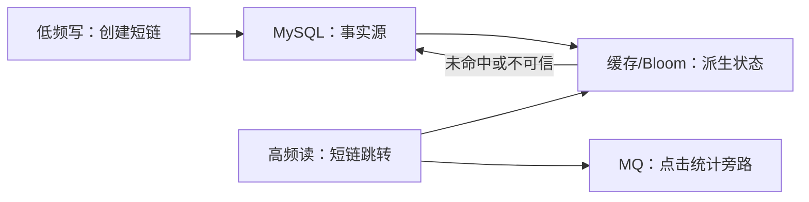
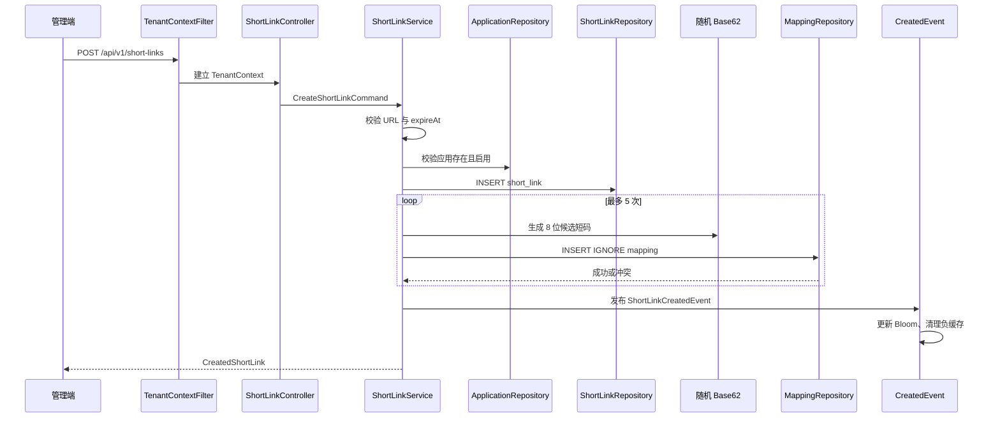
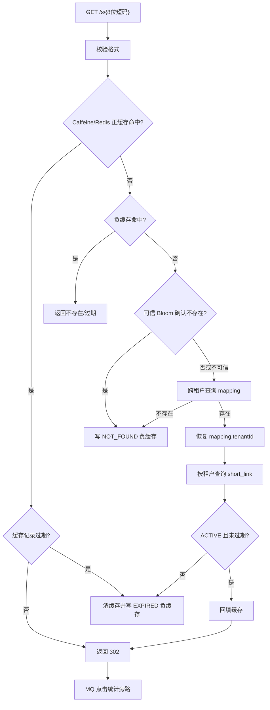
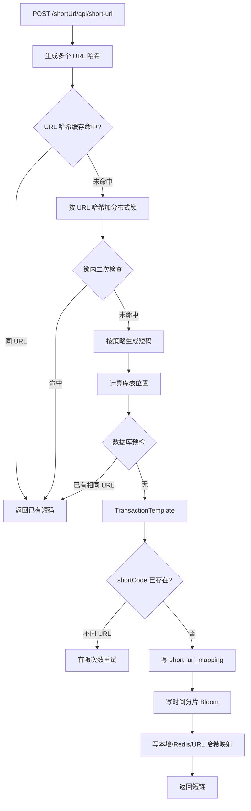
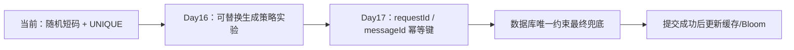

# Day 15：知识星球短链项目反向工程——完整教学版

> 本课只编写教学文档，不修改 `short_link` 或 `notification-platform` 的任何项目文件。
>
> 真实代码目录：
>
> - 通知平台：`/Users/hingfaattam/workspace/learn_workspace/notification-platform`
> - 知识星球短链：`/Users/hingfaattam/workspace/learn_workspace/short_link`
>
> 文中的代码均来自上述真实项目；为方便学习，部分片段增加了“教学注释”，但不改变原逻辑。

## 课程定位

先对齐两份计划。

原《30 天高级 Java 后端自研转岗冲刺计划》的第二周主线是短链、缓存、防穿透、点击统计、限流、弹性治理和压测。通知平台仓库的实际提交已经完成到 Day 14：

| 实际学习日 | 已完成内容 | 仓库证据 |
|---|---|---|
| Day 8 | 短链模型、随机 Base62、创建接口、冲突重试 | `0e3e6b1` |
| Day 9 | 跳转、Cache Aside、Redis 回源、TTL | `51bd3ea` |
| Day 10 | Caffeine、负缓存、Bloom、可信状态、fail-open | `0ed1bb6`—`77f1889` |
| Day 11 | 点击事件、RocketMQ、PV/UV | `6d981f6` |
| Day 12 | Redis Lua 令牌桶、每日配额 | `aa5c9b0`—`50e4bf4` |
| Day 13 | 线程池隔离、超时、熔断、多供应商切换 | `2c0fadb`—`967a440` |
| Day 14 | Prometheus、k6、首轮容量结论 | `c8b76a8`、`41b0b77` |

《多租户统一通知平台补充学习计划》将 Day 15 明确定义为：

> 反向工程知识星球短链项目，画清创建、跳转、缓存、Bloom、分片和扩容六条链路；整理通知平台的已有能力、重复能力、真正增量与风险代码。

因此今天不提前实现 Day 16 的 Snowflake、Day 18 的 Redis Cluster、Day 19 的时间分片 Bloom、Day 23 的 ShardingSphere 或 Day 24—25 的在线迁移。

今天的验收目标：

1. 不看代码讲清两个项目的六条链路。
2. 说明为什么短链读写路径要分开设计。
3. 指出至少 5 个有真实代码证据的风险。
4. 解释为什么通知场景不能按原始 URL 全局复用短码。
5. 输出后续 Day 16—Day 25 的准确改造地图，不从知识星球项目直接复制代码。

---

# 一、原理

## 1.1 反向工程到底要看什么

反向工程不是只沿着 `Controller → Service → DAO` 阅读，而是同时回答四类问题：

| 维度 | 核心问题 |
|---|---|
| 业务语义 | 相同 URL 是否复用？点击归因到租户、活动、消息还是接收人？ |
| 正确性 | 唯一性、幂等性和事务最终由谁保证？ |
| 性能 | 缓存、Bloom、锁和分片分别减少了什么成本？ |
| 可运维性 | 如何预热、重建、扩容、对账、切流、回滚和告警？ |

把组件放进三层，可以避免被“技术栈数量”迷惑：

```text
正确性层：数据库唯一约束、事务、幂等键、状态机、对账
    ↑
协调层：分布式锁、MQ、Outbox、迁移 checkpoint
    ↑
性能层：本地缓存、Redis、Bloom、批处理、分片
```

判断一个设计是否可靠，关键不是“用了多少组件”，而是性能层失效后，正确性层是否仍成立。

## 1.2 为什么短链读写路径必须分开

创建短链是低频写路径，关注：

- 业务幂等；
- 短码冲突；
- 数据库唯一约束；
- 事务边界；
- 缓存和 Bloom 的更新时机。

跳转是高频读路径，关注：

- 极低延迟；
- 热点缓存；
- 防穿透；
- 缓存故障时能否回源；
- 点击统计不能阻塞跳转；
- Redis/Bloom 故障时不能误伤合法短链。



数据库是事实源；缓存和 Bloom 都应该能够重建。

## 1.3 相同 URL 是否复用是业务问题

知识星球短链项目以原 URL 哈希预检，倾向让相同 URL 返回已有短码。这适合“一个 URL 对应一个管理型短链”的场景。

通知平台需要点击归因：

```text
同一个商品页
├── 租户 A / 活动 1
├── 租户 A / 活动 2
├── 租户 B / 活动 1
├── 消息 M1001 / 接收人 U1
└── 消息 M1001 / 接收人 U2
```

如果全部复用一个短码，点击只能归因到 URL，无法归因到租户、活动、消息或接收人。

因此应区分：

- 管理型短链幂等键：`tenantId + applicationId + requestId`；
- 消息追踪短链幂等键：`tenantId + messageId + targetUrl`；
- 需要接收人级归因时，再加入 recipient 维度；
- `originalUrl` 本身不能充当通知业务的全局幂等键。

## 1.4 生成器唯一与数据库唯一是两件事

正确模型是：

```text
生成器产生候选 shortCode
        ↓
INSERT UNIQUE(short_code)
        ├── 成功：占用短码
        └── 冲突：重新生成，有限次数后失败
```

通知平台的 `short_link_mapping.short_code` 是全局唯一，而不是租户内唯一。原因是公共入口只有 `/s/{shortCode}`，请求中没有 tenantId。若短码只在租户内唯一，跳转服务无法确定应该进入哪个租户。

知识星球项目的 `ShortCodeGenerator` 在组装 Snowflake ID 后执行：

```java
return Math.abs(id) % maxValue;
```

后续 `ShortCodeService` 还可能截断字符串。取模与截断都不是一一映射，会把不同 ID 压入同一个固定空间，因此不能再说“Snowflake 保证最终短码唯一”。

## 1.5 Cache Aside 的边界

标准读取链路：

```text
查缓存
├── 命中：返回
└── 未命中：查数据库
             ├── 存在：回填缓存并返回
             └── 不存在：写短 TTL 负缓存并返回 404
```

本地缓存最快，但多节点不会天然一致；Redis 是共享缓存，但仍不是事实源。短链映射适合“创建后基本不可变”，因此短 TTL、失效通知和定时校准通常足够。

## 1.6 Bloom 的“不存在”结论有可信前提

Bloom 算法在完整位图中不会产生假阴性，但工程实现可能处于：

- 启动预热未完成；
- 重建过程中；
- Redis 写入失败；
- 本地副本漏同步；
- 新旧版本哈希算法不一致。

因此需要三态判断：

```text
trusted = true  且 mightContain = false  → 可以快速 404
trusted = false                           → fail-open，查询 DB
Redis/Bloom 异常                          → fail-open，查询 DB
```

通知平台已经实现 `ready/trusted` 和 fail-open。知识星球项目的时间分片思想有增量价值，但本地 Bloom 同步依赖 Redis Stream，存在发布节点漏更新、PEL 未接管等问题，所以补充计划明确不照搬 Stream。

## 1.7 分片要同时满足确定性与均匀性

错误示例：

```text
db    = h % 16
table = h % 64
```

因为 64 是 16 的倍数，table 余数已经决定 db 余数，逻辑上的 16 × 64 并没有形成 1024 个独立组合。

一种修正方向是使用不重叠位段：

```text
table = lowBits(h) % tableCount
db    = highBits(h) % dbCount
```

但公式看起来合理仍不等于分布一定均匀，必须用大样本统计库、表、库表组合和变异系数。

## 1.8 在线扩容不是只增加新库

完整链路至少包含：

```text
路由版本化
→ 新数据可靠双写
→ 历史数据主键游标回填
→ checkpoint 断点续跑
→ 数量/checksum/抽样对账
→ 灰度切读
→ 读新失败读旧 + read-repair
→ 停止旧写
→ 保留回滚窗口
→ 下线旧结构
```

只有类名、脚本或被注释的代码，不能证明这些能力已经完成。

---

# 二、现有数据流

## 2.1 通知平台：创建短链

真实入口：

- `notification-server/src/main/java/com/tam/notification/controller/ShortLinkController.java`
- `notification-shortlink/src/main/java/com/tam/notification/shortlink/service/ShortLinkService.java`
- `notification-infrastructure/src/main/java/com/tam/notification/persistence/repository/ShortLinkMappingRepositoryImpl.java`
- `notification-infrastructure/src/main/resources/db/migration/V6__init_short_link.sql`



真实特点：

1. `short_link` 保存业务实体，`short_link_mapping` 保存公共短码路由。
2. `UNIQUE(short_code)` 保证全局短码唯一。
3. 生成器只给候选值，`INSERT IGNORE` 的结果决定是否冲突。
4. 同一原始 URL 可以创建不同短码，符合通知归因，但当前尚无 requestId 幂等。

## 2.2 通知平台：短链跳转

真实入口：

- `notification-server/src/main/java/com/tam/notification/controller/ShortLinkRedirectController.java`
- `notification-shortlink/src/main/java/com/tam/notification/shortlink/service/ShortLinkRedirectService.java`
- `notification-infrastructure/src/main/java/com/tam/notification/shortlink/RedisShortLinkCache.java`
- `notification-infrastructure/src/main/java/com/tam/notification/shortlink/RedisShortLinkProtection.java`



`ShortLinkClickRecordService` 捕获 MQ 发布异常，因此统计失败不影响 302。

## 2.3 通知平台：缓存、Bloom、点击统计

### 缓存链路

```text
Caffeine 本地热点缓存
    ↓ 未命中
Redis 正缓存
    ↓ 未命中
MySQL 回源
```

Redis 正缓存 TTL 不超过链接剩余有效期，且最多 30 分钟。Redis 读取异常会返回空，继续 DB 回源。

### Bloom 链路

```text
负缓存：NOT_FOUND / EXPIRED，短 TTL + 抖动
Bloom：Redis Bitmap + 多哈希
重建：trusted=false → 重建 → ready 成功 → trusted=true
异常：fail-open
```

### 点击统计链路

```text
302 主链路
  └── ClickEvent → RocketMQ → Worker
                         ├── event_id 唯一约束
                         ├── short_link_click 点击事实
                         ├── daily_visitor 精确 UV
                         └── click_stat_daily 日聚合
```

## 2.4 知识星球项目：创建短链

真实入口：`src/main/java/cn/net/susan/shortlink/service/ShortUrlService.java`



值得学的是“缓存预检 → 细粒度锁 → 锁内二次检查 → 数据库兜底”的层次；不能复制的是按原 URL 全局复用的语义。

## 2.5 知识星球项目：跳转、缓存与 Bloom

```text
GET /{shortCode} 或 /shortUrl/{shortCode}
    ↓
时间分片 Bloom
    ↓ 可能存在
本地缓存
    ↓ 未命中
Redis Cluster
    ↓ 未命中
ShardingSphere/JPA 查询
    ↓
expireDays 与 status 校验
    ↓
301 或 302
    ↓
Redis INCR 访问计数
    ↓ 每 100 次
覆盖数据库 access_count
```

真实问题：

- 两个 Controller 分别使用 301 和 302，语义不一致；
- 只在整百时覆盖 DB，进程故障可能丢失未刷新的尾数；
- 时间分片 Bloom 依赖本地副本与 Redis Stream 同步；
- 发布端不直接写本地，消费端又跳过自己的消息，发布节点可能漏更新；
- 消费只读 `lastConsumed`，没有 PEL 接管、毒消息与死信闭环。

## 2.6 知识星球项目：Redis Cluster

`ClusterAwareCacheService` 使用 Hash Tag：

```text
shortlink:url:{shortCode}
shortlink:count:{shortCode}
```

同一短码的相关 Key 可以落入同槽，并按槽对批量请求分组。这是 Day 18 的有效学习素材。

但当前代码尚不能证明以下实验已经完成：

- 节点故障；
- MOVED/ASK；
- 拓扑刷新；
- 跨槽命令错误；
- 热 Key 与 Big Key；
- Redis 故障降级。

## 2.7 知识星球项目：分片和扩容

| 状态 | 真实证据 | 结论 |
|---|---|---|
| 旧分片 | `sharding.yaml` 中 16 库 × 64 表配置全部注释 | 不能算运行配置 |
| 新分片 | `sharding-new.yaml` 中 32 库 × 256 表，高低位分离 | 只能证明文件存在 |
| 运行引用 | `application.yml` 指向 `classpath:sharding.yaml` | 与新配置不一致 |
| 双写 | `DualWriteService.java` 整文件注释 | 未实现 |
| 回填 | `DataMigrationService.java` 整文件注释 | 未实现 |
| 数据源切换 | `DualWriteDataSourceConfig.java` 整文件注释 | 未实现 |
| 扩容脚本 | `scripts/expansion/*` | 不能代替补偿、对账、切流和回滚 |

所以当前代码不能支持“32 × 256 已上线、能够平滑扩容”的结论。

## 2.8 能力矩阵

| 能力 | 通知平台 | 知识星球项目 | Day 15 结论 |
|---|---|---|---|
| 短码 | 8 位安全随机 Base62 | Snowflake/哈希/随机 | 生成策略实验留 Day 16 |
| 冲突兜底 | 全局唯一索引 + 5 次重试 | 锁、预检、查询、重试 | 数据库仍应最终兜底 |
| URL 复用 | 不复用 | 倾向复用 | 通知平台不能照搬 |
| 跳转缓存 | Caffeine + Redis + DB | 本地 + Redis Cluster + DB | 基础重复，槽位是增量 |
| 负缓存 | 已有 | 分散/不完整 | 通知平台已有 |
| Bloom | trusted + fail-open | 时间分片 + Stream 同步 | 学时间分片，不学 Stream |
| 点击统计 | MQ + 幂等事实 + PV/UV | Redis 计数 | 通知平台已有且更完整 |
| 分库分表 | 未引入 | 配置与代码并存 | 留 Day 22/23 做小型 PoC |
| 在线扩容 | 未引入 | 主要代码被注释 | 真正增量，留 Day 24/25 |
| Redis Stream | 未使用，已有 RocketMQ | 用于本地同步 | 明确排除 |

## 2.9 代码风险清单

1. Snowflake ID 最终被 `% maxValue`，唯一性被破坏。
2. `ShortCodeService` 还可能截断 Base62 字符串。
3. 相同 URL 全局复用不符合通知归因语义。
4. 带秒级时间盐的 URL 哈希不是稳定业务键。
5. Bloom 发布节点可能漏写自己的本地副本。
6. Redis Stream 初始化异常统一记录为“组已存在”，会掩盖真实故障。
7. Stream 没有 PEL 接管、毒消息隔离和死信处理。
8. 同一项目同时存在 301 和 302。
9. 访问计数只在整百时覆盖 DB，尾数可能丢失。
10. 运行配置引用与新分片配置不一致。
11. 双写、迁移和新数据源配置均为整文件注释。
12. “百万 QPS”没有足够的真实测试口径与原始结果支持。
13. 配置内存在明文基础设施地址与凭据，不能复制进通知平台。
14. Spring Cloud Alibaba/Nacos 版本混用并包含旧 Fastjson，需要单独核查兼容性和安全性。

---

# 三、本次需要改动的数据流

这里的“改动”是从 Day 16 起通知平台应如何吸收增量，不代表 Day 15 修改项目代码。

## 3.1 创建链路的后续演进



目标不是按 URL 复用，而是：

```text
同一个业务幂等键重试 → 返回原结果
不同业务对象即使 URL 相同 → 可以生成不同追踪短链
短码碰撞 → 数据库拒绝并重试
Redis/锁失效 → 数据库仍保证正确性
```

## 3.2 跳转与缓存的后续演进

```text
当前：Caffeine → Redis → DB
    ↓ Day 18
Redis Cluster Hash Tag、按槽分组、节点故障恢复
    ↓ Day 19
共享 Redis 时间分片 Bloom + trusted/fail-open
```

不引入 Redis Stream；本地缓存一致性继续依赖短 TTL、RocketMQ 低风险失效事件或定时校准。

## 3.3 分片与扩容的后续演进

```text
Day 22：100 万 Key 纯 Java 路由模拟
    ↓
Day 23：2 库 × 4 表 ShardingSphere PoC
    ↓
Day 24：路由版本化、可靠双写、checkpoint 回填
    ↓
Day 25：三级对账、灰度切读、read-repair、回滚
```

这条演进顺序保证先证明“需要分片且路由均匀”，再承担在线迁移复杂度。

---

# 四、文件位置（复用 / 新增 / 修改）

## 4.1 复用：通知平台真实代码

| 文件 | 用途 |
|---|---|
| `notification-shortlink/.../ShortLinkService.java` | 当前创建语义与冲突重试 |
| `notification-shortlink/.../ShortLinkRedirectService.java` | 跳转读路径 |
| `notification-shortlink/.../Base62RandomShortCodeGenerator.java` | 当前短码策略 |
| `notification-infrastructure/.../ShortLinkMappingRepositoryImpl.java` | `INSERT IGNORE` 冲突兜底 |
| `notification-infrastructure/.../V6__init_short_link.sql` | 全局唯一索引 |
| `notification-infrastructure/.../RedisShortLinkCache.java` | Caffeine + Redis |
| `notification-infrastructure/.../RedisShortLinkProtection.java` | 负缓存、Bloom、trusted |
| `notification-server/.../ShortLinkBloomInitializer.java` | Bloom 启动重建 |
| `notification-shortlink/.../ShortLinkClickRecordService.java` | 点击统计旁路 |

## 4.2 复用：知识星球项目只读参考

| 文件 | 用途 |
|---|---|
| `service/ShortUrlService.java` | 创建、跳转、计数主链路 |
| `service/ShortCodeService.java` | 多策略入口与截断风险 |
| `generator/ShortCodeGenerator.java` | Snowflake、回拨与取模风险 |
| `service/ClusterAwareCacheService.java` | Hash Tag 与按槽批处理 |
| `service/RedisTimeBasedBloomFilterService.java` | 时间分片 Bloom |
| `service/BloomFilterStreamService.java` | 本地同步风险 |
| `service/ShardingStrategyService.java` | CRC16 槽位计算 |
| `resources/sharding.yaml` | 旧分片与当前引用 |
| `resources/sharding-new.yaml` | 高低位路由参考 |
| `service/DualWriteService.java` | 被注释的双写设想 |
| `service/DataMigrationService.java` | 被注释的迁移设想 |

## 4.3 新增

仅新增本教学文档：

```text
Day15-知识星球短链项目反向工程-完整教学版.md
```

## 4.4 修改

```text
short_link：无
notification-platform：无
```

---

# 五、基于现有代码的完整增量代码

## 5.1 本日代码增量结论

Day 15 的计划任务是反向工程，不是功能开发，所以本日 Java/SQL/YAML 增量为：

```text
新增生产代码：0
修改生产代码：0
新增测试代码：0
```

这不是省略“完整增量代码”，而是明确记录：今天没有被授权、也没有必要修改项目。下面只对真实关键代码加教学注释，帮助理解现有行为；这些片段不需要复制回项目。

## 5.2 通知平台：短码冲突由数据库结果确认

来源：`notification-shortlink/.../ShortLinkService.java`

```java
// 最多尝试 5 次，避免生成器异常时无限循环。
for (int attempt = 1; attempt <= MAX_CODE_GENERATE_ATTEMPTS; attempt++) {
    // 生成器只产生“候选短码”，这里还不能认为已经唯一。
    String shortCode = shortCodeGenerator.generate();

    ShortLinkMapping mapping = new ShortLinkMapping();
    mapping.setShortLinkId(shortLink.getId());
    mapping.setShortCode(shortCode);

    // trySave 最终执行 INSERT IGNORE。
    // 返回 true 表示数据库唯一索引占位成功；false 表示发生冲突。
    if (mappingRepository.trySave(mapping)) {
        // 只有数据库提交了映射，才发布“创建成功”事件。
        eventPublisher.publishEvent(new ShortLinkCreatedEvent(shortCode));
        return toResult(shortLink, shortCode);
    }
}

// 所有候选码都冲突时明确失败，不能返回未落库的短码。
throw new BusinessException(
        CommonErrorCode.BUSINESS_ERROR,
        "短码生成冲突次数超过上限，请稍后重试"
);
```

## 5.3 通知平台：Bloom 不可信时放行 DB

来源：`notification-shortlink/.../ShortLinkRedirectService.java` 与 `RedisShortLinkProtection.java`

```java
// 正缓存未命中后，先查精确负缓存。
Optional<ShortLinkNegativeReason> negative =
        shortLinkProtection.getNegative(shortCode);

if (negative.isPresent()) {
    throw exceptionFor(negative.get());
}

// mightContain 只有在 Bloom 已经 ready/trusted 时才会给出可靠否定。
// 重建中或 Redis 异常时，保护层返回 true，即 fail-open。
if (!shortLinkProtection.mightContain(shortCode)) {
    throw cacheNegativeAndCreateException(
            shortCode,
            ShortLinkNegativeReason.NOT_FOUND
    );
}

// Bloom 认为“可能存在”或当前不可信，继续查询数据库事实源。
ShortLinkMapping mapping = mappingRepository
        .findByShortCodeAcrossTenants(shortCode)
        .orElseThrow(() -> cacheNegativeAndCreateException(
                shortCode,
                ShortLinkNegativeReason.NOT_FOUND
        ));
```

## 5.4 通知平台：点击统计失败不阻塞跳转

来源：`notification-shortlink/.../ShortLinkClickRecordService.java`

```java
try {
    // 点击事件走 RocketMQ，避免同步写统计表增加跳转延迟。
    eventPublisher.publish(event);
} catch (Exception e) {
    // 统计是旁路；发送失败只记录日志，用户仍应获得 302。
    log.warn(
            "publish short-link click event failed, eventId={}, shortCode={}",
            event.eventId(),
            event.shortCode(),
            e
    );
}
```

## 5.5 知识星球项目：Snowflake ID 被重新压缩

来源：`src/main/java/cn/net/susan/shortlink/generator/ShortCodeGenerator.java`

```java
// 先按 Snowflake 位布局组装 ID。
long id = ((timestamp - START_TIMESTAMP) << TIMESTAMP_SHIFT)
        | (machineIdService.getMachineId() << MACHINE_ID_SHIFT)
        | sequence.get();

// 为了适配固定短码长度，又把 ID 映射到更小的空间。
// 这是多对一取模：不同 Snowflake ID 可能得到同一个结果。
long maxValue = getMaxValueForCurrentLength();
return Math.abs(id) % maxValue;
```

这段代码的正确结论不是“生成的短码全局唯一”，而是“候选码仍需要唯一索引和冲突重试”。

## 5.6 知识星球项目：本地 Bloom 同步存在漏写窗口

来源：`RedisTimeBasedBloomFilterService.java` 与 `BloomFilterStreamService.java`

```java
// 发布短码时，当前实现没有直接写本节点的本地 Bloom。
// 本地添加依赖后续 Stream 消费。
// localBloomFilterService.addLocal(shortCode);  // 当前未执行

redisSlice.add(shortCode);
streamService.publishNewShortCode(shortCode);
```

消费端：

```java
// 消费端又跳过来源于自己的消息。
if (!nodeId.equals(sourceNode)) {
    if ("ADD".equals(action)) {
        localBloomFilter.addLocal(shortCode);
    }
}
```

两段组合后，发布节点可能没有机会把新短码加入自己的本地 Bloom。若本地 Bloom 被当作可信否定，会误伤合法短链。

## 5.7 知识星球项目：扩容类当前没有生效

来源：

```text
service/DualWriteService.java
service/DataMigrationService.java
config/DualWriteDataSourceConfig.java
```

这三个文件从 `package` 到类定义均以 `//` 注释，因此编译后没有对应 Bean，也不存在可调用的双写或迁移服务。阅读时必须把“需求设想”和“可运行能力”分开。

---

# 六、实验验证

所有实验均为只读检查，不修改两个项目。

## 6.1 确认通知平台真实创建链路

```bash
cd /Users/hingfaattam/workspace/learn_workspace/notification-platform

rg -n \
  "MAX_CODE_GENERATE_ATTEMPTS|shortCodeGenerator.generate|trySave|uk_short_code" \
  notification-shortlink notification-infrastructure
```

需要亲自定位：

```text
ShortLinkService：最多 5 次生成
ShortLinkMappingRepositoryImpl：insertIgnore
V6__init_short_link.sql：UNIQUE KEY uk_short_code (short_code)
```

## 6.2 确认通知平台跳转链路

```bash
rg -n \
  "class ShortLinkRedirectService|getNegative|mightContain|findByShortCodeAcrossTenants" \
  notification-shortlink notification-infrastructure
```

口述顺序必须是：

```text
正缓存 → 负缓存 → Bloom → mapping → 恢复租户 → short_link → 回填 → 302
```

## 6.3 确认知识星球短码风险

```bash
cd /Users/hingfaattam/workspace/learn_workspace/short_link

rg -n \
  "Math.abs\(id\) % maxValue|substring\(0, shortCodeConfig.getLength\(\)\)" \
  src/main/java/cn/net/susan/shortlink
```

必须能解释：无损 Base62 不会引入碰撞，固定长度取模与截断会引入碰撞。

## 6.4 确认 URL 复用语义

```bash
rg -n \
  "getShortCodeByUrlHash|putUrlHashMapping|create_url:" \
  src/main/java/cn/net/susan/shortlink/service
```

找到：缓存预检、URL 哈希锁、锁内二次检查、URL 哈希映射缓存。

## 6.5 确认 Bloom/Stream 风险

```bash
rg -n \
  "本地添加通过Stream消费|nodeId.equals\(sourceNode\)|lastConsumed|acknowledge" \
  src/main/java/cn/net/susan/shortlink/service
```

检查以下事实：

```text
[ ] 发布端不直接写本地 Bloom
[ ] 消费端跳过自己的事件
[ ] 只读取 lastConsumed
[ ] 没有 XAUTOCLAIM/PEL 接管
[ ] 没有毒消息死信闭环
```

## 6.6 确认分片与扩容状态

```bash
rg -n \
  "jdbc:shardingsphere:classpath|actualDataNodes|class DualWriteService|class DataMigrationService" \
  src/main/resources src/main/java scripts
```

检查：

```text
[ ] application.yml 指向 sharding.yaml
[ ] sharding.yaml 的主体被注释
[ ] sharding-new.yaml 存在 32 × 256 配置
[ ] 双写和迁移类整文件注释
```

## 6.7 六条链路口述验收

### 创建

- 两个项目分别如何生成短码？
- 最终唯一性由谁保证？
- 相同 URL 为什么在两个业务中语义不同？

### 跳转

- 两个项目分别返回 301 还是 302？
- 公共短码如何恢复 TenantContext？
- 点击统计失败为何不能让跳转失败？

### 缓存

- 本地缓存、Redis、MySQL 分别是什么角色？
- Redis 故障后应该怎样降级？
- TTL 为什么不能超过链接剩余有效期？

### Bloom

- 什么时候可以相信“不存在”？
- 重建期间为什么必须 fail-open？
- 时间分片解决什么问题？

### 分片

- 同 hash 双取模为什么可能相关？
- 高低位分离为什么仍需百万样本验证？
- 当前通知平台为何不直接做 32 × 256？

### 扩容

- 为什么注释代码不能算实现？
- 异步双写失败如何补偿？
- 如何对账、切流和回滚？

## 6.8 Day 15 验收表

| 验收项 | 验收标准 | 状态 |
|---|---|---|
| 两份计划对齐 | 能解释 Day 15 为什么是反向工程 | 完成 |
| 六条链路 | 创建、跳转、缓存、Bloom、分片、扩容可脱稿讲述 | 完成 |
| 能力矩阵 | 已有、重复、增量、排除边界清晰 | 完成 |
| 风险清单 | 至少 5 项且有真实文件证据 | 完成 |
| 业务语义 | 能解释为何原 URL 不是通知短链幂等键 | 完成 |
| 面试输出 | 可完整回答“短链读写路径为什么分开” | 完成 |

---

# 七、面试追问

## 1. 短链系统的读写路径为什么要分开设计？

创建是低频写路径，主要解决业务幂等、短码冲突、事务和唯一约束；跳转是高频读路径，主要解决低延迟、热点、防穿透和可用性。写路径以数据库不变量保证正确性，读路径用缓存加速并在缓存异常时回源，点击统计走旁路。

## 2. 为什么通知场景不能按原始 URL 全局复用短码？

同一落地页可能属于不同租户、活动、消息或接收人。全局复用会合并点击归因。原 URL 是目标地址，不是通知业务的幂等键。

## 3. 分布式锁和唯一索引分别负责什么？

锁减少同一幂等键的并发竞争，是协调和性能优化；唯一索引在 Redis 故障、锁过期或网络分区时仍维护数据不变量，是最终正确性边界。

## 4. Snowflake 转 Base62 后为什么仍可能重复？

完整 Snowflake ID 做无损 Base62 是一一映射，不引入重复；如果为了固定长度取模、截断或只保留部分位，就重新产生碰撞。

## 5. 为什么公共短码通常需要全局唯一？

`/s/{shortCode}` 没有租户参数，只能凭 shortCode 找到唯一 mapping 和 tenantId。除非 URL 本身带租户路由段，否则租户内唯一无法完成公共跳转。

## 6. Bloom 为什么会出现工程上的假阴性？

完整位图没有假阴性，但预热未完成、重建、写入失败、本地副本漏同步或算法版本不同都会让工程位图不完整，所以需要 trusted 状态和 fail-open。

## 7. 负缓存和 Bloom 是否重复？

不重复。Bloom 概率拦截大量随机非法短码；负缓存精确记录近期已确认不存在或过期的短码，避免 Bloom 误判后反复回源。

## 8. 为什么业务短链通常选择 302？

301 可能被浏览器/CDN 长期缓存，目标变更、撤销和点击统计都会受影响。302 让请求持续经过短链服务，平台保留控制权。

## 9. Redis Cluster 为什么需要 Hash Tag？

Redis Cluster 按 16384 个槽分布 Key。`{shortCode}` 让相关 Key 使用相同哈希片段，支持同槽多 Key 操作。但错误的 Hash Tag 也会制造热槽。

## 10. 分库与分表为什么不能随便对同一个 hash 取模？

库数和表数存在倍数关系时，两个余数相关，库表组合不会充分使用。应使用独立哈希或不重叠位段，再通过大样本验证均匀性。

## 11. 为什么当前通知平台不直接引入 ShardingSphere？

当前瓶颈首先是渠道限流，并无单表容量或数据库吞吐证据。分片会引入跨分片分页、聚合、事务、ID 和扩容复杂度，应先做容量估算与 2 库 × 4 表 PoC。

## 12. 在线迁移为什么不能只做异步双写？

异步写会因进程退出、网络故障或目标库异常而失败。没有持久化补偿、幂等重放、历史回填、对账、灰度切读和回滚，就无法证明一致性。

## 13. 如何证明扩容能力真的完成？

需要可运行的新旧路由、可靠双写、失败补偿、断点回填、三级对账、切流开关、read-repair、回滚流程、指标和故障演练。类名、脚本和注释代码都不够。

## 14. 你从知识星球项目学到了什么？

不是复制 CRUD，而是提取可验证的问题：固定长度 Snowflake 碰撞、Redis Cluster 槽位、可过期 Bloom 生命周期、分片路由均衡性和在线扩容闭环；同时识别 URL 全局复用不适合通知归因、Stream 缺少可靠消费闭环、迁移代码未实际启用等风险。

---

# 本课结论

```text
保留：随机短码、唯一索引、Cache Aside、trusted Bloom、RocketMQ 点击统计

后续实验：Snowflake/Base62、Redis Cluster、时间分片 Bloom、路由均衡

后续工程：业务幂等、ShardingSphere PoC、可靠双写、回填、对账、切流、回滚

明确排除：Redis Stream 同步、未经验证的 32×256、未经实测的百万 QPS
```

Day 15 的真正产出是一张基于真实代码的演进地图，而不是向项目中继续堆组件。
