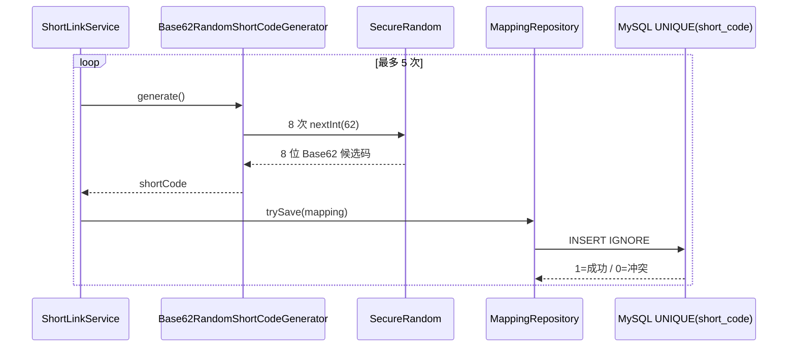
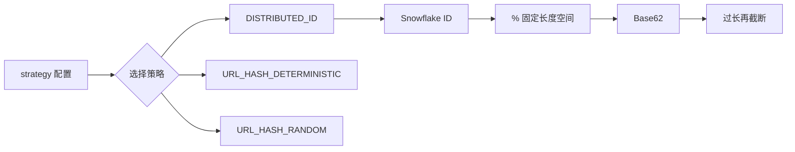
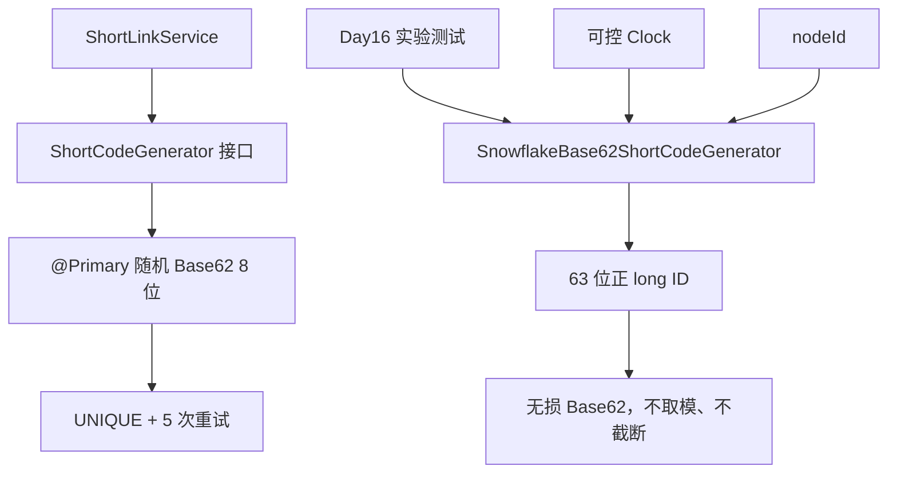

# Day 16：短码生成与分布式 ID 实验——完整教学版

> 本文只生成教学文档，不修改 `notification-platform` 或 `short_link` 项目文件。
>
> 真实代码基线：
>
> - 通知平台：`/Users/hingfaattam/workspace/learn_workspace/notification-platform`
> - 知识星球短链：`/Users/hingfaattam/workspace/learn_workspace/short_link`
> - 通知平台当前 `HEAD = 41b0b77`
>
> 文中的新增/修改代码是你完成 Day 16 时需要手动加入通知平台的完整增量；代码中的注释用于解释设计原因。

## 课程定位

原《30 天高级 Java 后端自研转岗冲刺计划》已完成短链、缓存、防穿透、点击统计、限流、弹性治理和首轮压测。结合《多租户统一通知平台补充学习计划》，Day 16 的任务是：

- 比较随机短码、哈希短码、Snowflake + Base62；
- 为通知平台保留两种可替换生成策略；
- Snowflake 使用可注入 `Clock`；
- 验证 100 万次生成、32 线程并发；
- 验证 5 ms、50 ms、严重时钟回拨；
- 验证同毫秒 4096 序列耗尽；
- 计算 8 位和 10 位 Base62 的生日碰撞概率；
- 形成短码选型 ADR；
- 不凭感觉替换当前生产默认策略。

今天的最终决策先写在前面：

```text
生产默认：继续使用 8 位 SecureRandom Base62

实验策略：新增 Snowflake ID + 无损 Base62

最终唯一性：继续由数据库 UNIQUE(short_code) + 冲突重试保证

禁止做法：为了固定 8/10 位，对 Snowflake ID 取模或截断
```

---

# 一、原理

## 1.1 短码生成要同时考虑哪些问题

一个短码策略不能只看“会不会重复”，还要同时考虑：

| 维度 | 需要回答的问题 |
|---|---|
| 空间 | 码长多少？字符集多少？总空间多大？ |
| 碰撞 | 是概率碰撞，还是理论上一一映射？ |
| 可枚举性 | 攻击者能否根据一个短码猜出前后短码？ |
| 分布式 | 多实例是否需要 nodeId？如何分配和回收？ |
| 时钟 | 回拨、停滞、跨时区是否影响唯一性？ |
| 峰值 | 单节点同一毫秒最多生成多少个？ |
| 运维 | 配置冲突是否能及时发现？ |
| 最终兜底 | 生成器出错时数据库是否仍能拒绝重复？ |

因此“Snowflake 一定比随机好”或“随机一定更安全”都过于简单。正确选型必须结合通知平台的真实业务量、公共 URL 结构和运维能力。

## 1.2 三种常见策略

### 随机 Base62

从以下 62 个字符中独立抽取：

```text
0-9：10 个
a-z：26 个
A-Z：26 个
```

长度为 `L` 时，总空间：

```text
N = 62^L
```

优点：

- 实现简单；
- 不依赖时钟和机器号；
- 不连续，较难枚举；
- 多实例天然可用。

缺点：

- 只能做到概率唯一；
- 必须保留数据库唯一索引和重试；
- 空间占用越高，碰撞概率越大。

通知平台当前正是这个方案：8 位、`SecureRandom`、数据库唯一索引、最多 5 次重试。

### URL 哈希

```text
shortCode = Base62(hash(originalUrl))
```

优点：相同输入可稳定得到相同结果，天然适合 URL 去重。

缺点：

- 固定长度仍需截断或取模，仍会碰撞；
- 相同 URL 会被复用，不符合通知归因；
- URL 规范化非常复杂：参数顺序、大小写、默认端口、Fragment、追踪参数都影响结果；
- 若加入时间盐，又失去确定性。

因此 Day 16 不把 URL 哈希加入通知平台生产策略。

### Snowflake + Base62

经典 Snowflake 使用 63 个有效位：

```text
0 | 41 位时间差 | 10 位 nodeId | 12 位序列号
```

单节点同一毫秒最多生成：

```text
2^12 = 4096 个 ID
```

1024 个节点理论总峰值：

```text
1024 × 4096 × 1000
= 4,194,304,000 ID/s
```

这个数字只是位布局上限，不是应用实测吞吐。真实吞吐还受锁、CPU、数据库和网络约束。

优点：

- nodeId 不冲突、时钟策略正确时，可生成分布式唯一整数；
- 不需要随机碰撞重试；
- 大致时间有序。

缺点：

- nodeId 分配是新的运维问题；
- 时钟回拨会破坏唯一性；
- 同毫秒序列耗尽需要等待或失败；
- 时间有序使短码更容易被枚举和推测业务量；
- 完整 63 位整数无损 Base62 最长需要 11 位，不能硬塞进当前 8 位路由。

## 1.3 Base62 只负责编码，不负责唯一

Base62 是进制转换：

```text
long ID  <──一一映射──> Base62 字符串
```

只要：

- 输入 ID 唯一；
- 编码过程无损；
- 不截断；
- 不取模；

Base62 就不会新增碰撞。

知识星球项目的问题不是使用 Base62，而是在 Snowflake 后又执行：

```java
return Math.abs(id) % maxValue;
```

并且在字符串过长时：

```java
shortCode = shortCode.substring(0, configuredLength);
```

这两步都是多对一映射，会重新产生碰撞。

## 1.4 为什么完整 Snowflake 不能保证 8 位

空间大小：

```text
62^8  = 218,340,105,584,896
62^10 = 839,299,365,868,340,224
62^11 = 52,036,560,358,041,472,000
```

Java 正 `long` 最大值：

```text
9,223,372,036,854,775,807
```

`62^10 < Long.MAX_VALUE < 62^11`，所以完整正 `long` 的 Base62 最长需要 11 位。

通知平台当前：

- Controller 路由只接受 8 位：`/s/{shortCode:[0-9a-zA-Z]{8}}`；
- 当前随机生成器固定 8 位；
- 数据库字段 `VARCHAR(16)` 可以容纳 11 位。

因此本课 Snowflake 只能作为实验策略，不能直接切换生产。若未来启用，需要同时评估 URL 兼容、路由正则、已有数据和缓存 Key；不能通过截断来“兼容”。

## 1.5 随机码的生日碰撞概率

从大小为 `N` 的空间随机生成 `n` 个值，至少发生一次碰撞的近似概率：

```text
p ≈ 1 - exp(-(n × (n - 1)) / (2 × N))
```

计算结果：

| 码长 | 空间 N | 生成量 n | 至少一次碰撞概率 |
|---|---:|---:|---:|
| 8 | 218,340,105,584,896 | 100 万 | 约 0.228738% |
| 8 | 同上 | 1000 万 | 约 20.4672% |
| 8 | 同上 | 1 亿 | 约 99.99999999% |
| 10 | 839,299,365,868,340,224 | 100 万 | 约 0.00005957% |
| 10 | 同上 | 1000 万 | 约 0.005957% |
| 10 | 同上 | 1 亿 | 约 0.593964% |

这里最容易犯两个错误：

1. 认为 8 位有 218 万亿空间，所以生成接近 218 万亿条才会碰撞；
2. 认为碰撞概率不高，所以可以删除唯一索引。

生日问题决定碰撞会远早于空间耗尽出现。即使概率很低，数据库唯一索引仍应作为最终不变量。

## 1.6 Snowflake 的时钟回拨策略

若当前时间小于上次生成时间：

```text
currentTimestamp < lastTimestamp
```

可能生成与历史相同的：

```text
timestamp + nodeId + sequence
```

本课采用明确、可测试的策略：

```text
回拨 <= 50 ms
    → 使用 lastTimestamp 作为逻辑时间
    → 继续增加 sequence

回拨 > 50 ms
    → 立即抛 ClockMovedBackwardsException
    → 不静默生成 ID
```

为什么 5 ms 和 50 ms 不 `sleep`：

- `sleep` 依赖操作系统调度，不精确；
- 测试困难；
- 线程被占用；
- 等待后仍可能没追上。

逻辑时间能处理短暂回拨，但如果回拨期间同一逻辑毫秒生成超过 4096 个 ID，序列仍会耗尽。此时生成器必须等待物理时间追上，并设置等待上限，不能永久自旋。

## 1.7 nodeId 为什么是运维问题

10 位 nodeId 范围：

```text
0 ～ 1023
```

如果两个实例在同一时间使用同一个 nodeId，它们可能生成相同 ID。生产常见分配方式：

- 配置中心租约；
- 数据库唯一占位；
- ZooKeeper/etcd 临时节点；
- Kubernetes StatefulSet ordinal；
- 数据中心 ID + 机器 ID 分段。

本课为了实验使用配置值 `node-id: 1`，但 ADR 必须明确：未完成可靠 nodeId 分配前，不启用生产 Snowflake。

## 1.8 数据库唯一索引为什么仍然保留

即使选择 Snowflake，也可能出现：

- nodeId 配置重复；
- 代码 Bug；
- epoch 或位移配置变化；
- 数据迁移导入重复；
- 人工写入错误；
- 未来有人再次加入截断或取模。

数据库唯一索引是成本很低但价值很高的最后防线。生成器保证正常路径高效，数据库保证最终数据不变量。

---

# 二、现有数据流

## 2.1 通知平台当前生成链路

真实文件：

- `notification-core/.../ShortCodeGenerator.java`
- `notification-shortlink/.../Base62RandomShortCodeGenerator.java`
- `notification-shortlink/.../ShortLinkService.java`
- `notification-infrastructure/.../ShortLinkMappingRepositoryImpl.java`
- `notification-infrastructure/.../V6__init_short_link.sql`



当前优点：

- 已有领域接口 `ShortCodeGenerator`，不用重新发明策略抽象；
- 使用 `SecureRandom`，不是可预测的普通 `Random`；
- 8 位格式与 Controller 正则一致；
- `UNIQUE(short_code)` 全局兜底；
- 最多 5 次重试，避免无限循环。

当前缺口：

- 只有一种实现，无法做受控策略对比；
- 时钟实验无法进行；
- 测试只验证 1000 次格式，没有百万生成和并发数据；
- 没有碰撞概率计算与选型 ADR。

## 2.2 知识星球项目当前生成链路

真实文件：

- `src/main/java/cn/net/susan/shortlink/service/ShortCodeService.java`
- `src/main/java/cn/net/susan/shortlink/generator/ShortCodeGenerator.java`
- `src/main/java/cn/net/susan/shortlink/config/ShortCodeConfig.java`



值得学习：

- 策略可替换思想；
- nodeId；
- 序列号；
- 小/中/严重回拨分级；
- 状态监控。

不能照搬：

- `% maxValue`；
- `substring`；
- 默认宣称最终短码唯一；
- 使用 `Instant.now()`，导致回拨测试只能依赖真实系统时钟；
- 用 `Thread.sleep` 处理回拨；
- 并行批量生成最终仍争用同一把锁，却没有实测依据。

## 2.3 当前数据库兜底链路

通知平台的最终正确性已经存在：

```text
ShortLinkService
    ↓ 候选 shortCode
ShortLinkMappingRepository.trySave
    ↓
INSERT IGNORE short_link_mapping
    ↓
UNIQUE KEY uk_short_code(short_code)
```

Day 16 不修改这个链路，也不把唯一性责任从数据库移交给生成器。

---

# 三、本次需要改动的数据流

## 3.1 生产与实验分流



关键点：

- `ShortLinkService` 仍自动注入 `@Primary` 随机实现；
- Snowflake 以命名 Bean 存在，供实验或显式 `@Qualifier` 使用；
- 不增加“切换到 Snowflake”的生产配置；
- 不修改 8 位跳转正则；
- 不修改数据库表；
- Snowflake 测试直接调用实验实现。

## 3.2 Snowflake 内部数据流

```text
Clock.millis()
    ↓
检查 epoch 和 41 位上限
    ↓
与 lastTimestamp 比较
    ├── 未回拨：正常处理
    ├── 回拨 <= 50ms：使用逻辑时间 lastTimestamp
    └── 回拨 > 50ms：抛异常
    ↓
同毫秒 sequence + 1
    ├── <= 4095：继续
    └── 溢出：有限等待下一毫秒
    ↓
组装 63 位正 long
    ↓
Base62Codec.encode(id)
    ↓
返回 1～11 位无损编码
```

## 3.3 自动化验证数据流

```text
顺序生成 100 万次 → Set 检查重复

32 线程并发 → Concurrent Set 检查重复

MutableClock → -5ms → 唯一
             → -50ms → 唯一
             → -51ms → 明确失败

SequenceExhaustionClock
    → 同一毫秒提供 4096 个序列
    → 第 4097 个等待到下一毫秒
    → 全部唯一
```

---

# 四、文件位置（复用 / 新增 / 修改）

## 4.1 复用

| 文件 | 复用原因 |
|---|---|
| `notification-core/.../ShortCodeGenerator.java` | 已有正确的策略接口 |
| `notification-shortlink/.../ShortLinkService.java` | 继续通过接口生成候选码 |
| `notification-shortlink/.../Base62RandomShortCodeGeneratorTest.java` | 保留现有格式测试 |
| `notification-shortlink/.../ShortLinkServiceTest.java` | 已验证数据库冲突触发重试 |
| `notification-infrastructure/.../ShortLinkMappingRepositoryImpl.java` | 继续 `INSERT IGNORE` |
| `notification-infrastructure/.../V6__init_short_link.sql` | 继续使用全局唯一索引 |

## 4.2 新增

```text
notification-shortlink/src/main/java/com/tam/notification/shortlink/algorithm/
├── Base62Codec.java
├── ClockMovedBackwardsException.java
└── SnowflakeBase62ShortCodeGenerator.java

notification-shortlink/src/main/java/com/tam/notification/shortlink/config/
└── ShortCodeClockConfig.java

notification-shortlink/src/test/java/com/tam/notification/shortlink/algorithm/
├── Base62CodecTest.java
└── SnowflakeBase62ShortCodeGeneratorTest.java

notification-shortlink/src/test/java/com/tam/notification/shortlink/
└── ShortCodeGeneratorExperimentTest.java

docs/
└── short-code-strategy-adr.md
```

## 4.3 修改

| 文件 | 修改内容 |
|---|---|
| `Base62RandomShortCodeGenerator.java` | 增加 `@Primary`，明确生产默认策略 |
| `notification-server/src/main/resources/application.yml` | 增加 Snowflake 实验参数；不增加生产切换开关 |

## 4.4 明确不改

```text
ShortCodeGenerator 接口：不改
ShortLinkService：不改
ShortLinkController：不改
ShortLinkRedirectController：不改
V6 数据库表：不改
Redis/Bloom：不改
```

---

# 五、基于现有代码的完整增量代码

## 5.1 修改：`Base62RandomShortCodeGenerator.java`

完整文件：

```java
package com.tam.notification.shortlink.algorithm;

import com.tam.notification.domain.shortlink.ShortCodeGenerator;
import org.springframework.context.annotation.Primary;
import org.springframework.stereotype.Component;

import java.security.SecureRandom;

/**
 * 生产默认的 8 位随机 Base62 短码生成器。
 *
 * <p>随机生成不能从数学上保证零碰撞，因此最终仍依赖：
 * short_link_mapping.short_code 唯一索引 + ShortLinkService 有限重试。</p>
 */
@Primary
@Component
public class Base62RandomShortCodeGenerator implements ShortCodeGenerator {

    private static final char[] BASE62 =
            "0123456789abcdefghijklmnopqrstuvwxyzABCDEFGHIJKLMNOPQRSTUVWXYZ"
                    .toCharArray();

    private static final int CODE_LENGTH = 8;

    /**
     * 使用 SecureRandom，避免普通 Random 的可预测序列。
     */
    private final SecureRandom secureRandom = new SecureRandom();

    @Override
    public String generate() {
        char[] result = new char[CODE_LENGTH];

        for (int index = 0; index < CODE_LENGTH; index++) {
            int randomIndex = secureRandom.nextInt(BASE62.length);
            result[index] = BASE62[randomIndex];
        }

        return new String(result);
    }
}
```

为什么只增加 `@Primary`：新增 Snowflake Bean 后，Spring 会看到两个 `ShortCodeGenerator`。`@Primary` 让没有写 `@Qualifier` 的现有 `ShortLinkService` 继续注入随机实现，避免生产行为被实验代码改变。

## 5.2 新增：`Base62Codec.java`

```java
package com.tam.notification.shortlink.algorithm;

/**
 * 无损 Base62 编解码器。
 *
 * <p>这里只做进制转换，不负责生成唯一 ID，也绝不为了固定长度
 * 对结果取模或截断。</p>
 */
public final class Base62Codec {

    private static final char[] ALPHABET =
            "0123456789abcdefghijklmnopqrstuvwxyzABCDEFGHIJKLMNOPQRSTUVWXYZ"
                    .toCharArray();

    private static final int RADIX = ALPHABET.length;

    private Base62Codec() {
    }

    /**
     * 把非负 long 无损编码为 Base62。
     */
    public static String encode(long value) {
        if (value < 0) {
            throw new IllegalArgumentException("Base62 只接受非负整数");
        }

        if (value == 0) {
            return "0";
        }

        // 正 long 的 Base62 最长为 11 位，固定数组可避免循环扩容。
        char[] buffer = new char[11];
        int position = buffer.length;

        long remaining = value;
        while (remaining > 0) {
            int digit = (int) (remaining % RADIX);
            buffer[--position] = ALPHABET[digit];
            remaining /= RADIX;
        }

        return new String(buffer, position, buffer.length - position);
    }

    /**
     * 解码用于证明编码是一一映射；生产跳转链路并不依赖反解。
     */
    public static long decode(String value) {
        if (value == null || value.isBlank()) {
            throw new IllegalArgumentException("Base62 字符串不能为空");
        }

        long result = 0L;

        for (int index = 0; index < value.length(); index++) {
            int digit = indexOf(value.charAt(index));
            if (digit < 0) {
                throw new IllegalArgumentException(
                        "非法 Base62 字符: " + value.charAt(index)
                );
            }

            // 使用精确算术，防止非法超长输入静默溢出。
            result = Math.addExact(
                    Math.multiplyExact(result, RADIX),
                    digit
            );
        }

        return result;
    }

    private static int indexOf(char target) {
        for (int index = 0; index < ALPHABET.length; index++) {
            if (ALPHABET[index] == target) {
                return index;
            }
        }
        return -1;
    }
}
```

## 5.3 新增：`ClockMovedBackwardsException.java`

```java
package com.tam.notification.shortlink.algorithm;

/**
 * 时钟回拨超过容忍阈值时抛出。
 *
 * <p>严重回拨必须显式失败，不能静默生成可能重复的 ID。</p>
 */
public class ClockMovedBackwardsException extends IllegalStateException {

    private final long backwardMillis;

    public ClockMovedBackwardsException(long backwardMillis) {
        super("系统时钟严重回拨: " + backwardMillis + "ms");
        this.backwardMillis = backwardMillis;
    }

    public long getBackwardMillis() {
        return backwardMillis;
    }
}
```

## 5.4 新增：`ShortCodeClockConfig.java`

```java
package com.tam.notification.shortlink.config;

import org.springframework.context.annotation.Bean;
import org.springframework.context.annotation.Configuration;

import java.time.Clock;

/**
 * Snowflake 的时间源配置。
 *
 * <p>生产使用 UTC 系统时钟；测试直接向生成器注入可控 Clock，
 * 不需要修改操作系统时间。</p>
 */
@Configuration
public class ShortCodeClockConfig {

    @Bean("shortCodeClock")
    public Clock shortCodeClock() {
        return Clock.systemUTC();
    }
}
```

## 5.5 新增：`SnowflakeBase62ShortCodeGenerator.java`

```java
package com.tam.notification.shortlink.algorithm;

import com.tam.notification.domain.shortlink.ShortCodeGenerator;
import org.springframework.beans.factory.annotation.Qualifier;
import org.springframework.beans.factory.annotation.Value;
import org.springframework.stereotype.Component;

import java.time.Clock;
import java.time.Instant;
import java.util.concurrent.TimeUnit;
import java.util.concurrent.locks.ReentrantLock;

/**
 * Snowflake ID + 无损 Base62 实验生成器。
 *
 * <p>位布局：41 位时间差 + 10 位 nodeId + 12 位序列号。
 * 本实现不取模、不截断，因此输出可能超过当前生产路由的 8 位限制。
 * 它是实验 Bean，不是生产默认 Bean。</p>
 */
@Component("snowflakeBase62ShortCodeGenerator")
public class SnowflakeBase62ShortCodeGenerator
        implements ShortCodeGenerator {

    private static final long NODE_ID_BITS = 10L;
    private static final long SEQUENCE_BITS = 12L;

    private static final long MAX_NODE_ID =
            (1L << NODE_ID_BITS) - 1L;
    private static final long MAX_SEQUENCE =
            (1L << SEQUENCE_BITS) - 1L;
    private static final long MAX_TIMESTAMP_DELTA =
            (1L << 41L) - 1L;

    private static final long NODE_ID_SHIFT = SEQUENCE_BITS;
    private static final long TIMESTAMP_SHIFT =
            NODE_ID_BITS + SEQUENCE_BITS;

    /**
     * 自定义 epoch 越新，当前编码越短；但完整生命周期仍可能达到 11 位。
     */
    private static final long EPOCH_MILLIS =
            Instant.parse("2026-01-01T00:00:00Z").toEpochMilli();

    private final Clock clock;
    private final long nodeId;
    private final long maxBackwardMillis;
    private final long sequenceWaitTimeoutNanos;

    /**
     * 单个生成器内串行修改 lastTimestamp 和 sequence，避免竞态。
     */
    private final ReentrantLock lock = new ReentrantLock();

    private long lastTimestamp = -1L;
    private long sequence = 0L;

    public SnowflakeBase62ShortCodeGenerator(
            @Qualifier("shortCodeClock") Clock clock,
            @Value("${notification.shortlink.snowflake.node-id:1}")
            long nodeId,
            @Value("${notification.shortlink.snowflake.max-backward-ms:50}")
            long maxBackwardMillis,
            @Value("${notification.shortlink.snowflake.sequence-wait-timeout-ms:10}")
            long sequenceWaitTimeoutMillis
    ) {
        if (nodeId < 0 || nodeId > MAX_NODE_ID) {
            throw new IllegalArgumentException(
                    "nodeId 必须在 0～" + MAX_NODE_ID + " 之间"
            );
        }
        if (maxBackwardMillis < 0) {
            throw new IllegalArgumentException(
                    "maxBackwardMillis 不能小于 0"
            );
        }
        if (sequenceWaitTimeoutMillis <= 0) {
            throw new IllegalArgumentException(
                    "sequenceWaitTimeoutMillis 必须大于 0"
            );
        }

        this.clock = clock;
        this.nodeId = nodeId;
        this.maxBackwardMillis = maxBackwardMillis;
        this.sequenceWaitTimeoutNanos =
                TimeUnit.MILLISECONDS.toNanos(sequenceWaitTimeoutMillis);
    }

    @Override
    public String generate() {
        // Base62 只做无损编码，不改变 nextId() 的唯一性。
        return Base62Codec.encode(nextId());
    }

    /**
     * 生成 Snowflake long ID。
     * 包级可见是为了让同包测试验证位布局与序列边界。
     */
    long nextId() {
        lock.lock();
        try {
            long timestamp = clock.millis();
            validateTimestampRange(timestamp);

            if (timestamp < lastTimestamp) {
                long backwardMillis = lastTimestamp - timestamp;

                if (backwardMillis > maxBackwardMillis) {
                    throw new ClockMovedBackwardsException(backwardMillis);
                }

                // 小幅回拨使用逻辑时间，避免 sleep 后仍未追上。
                timestamp = lastTimestamp;
            }

            if (timestamp == lastTimestamp) {
                sequence = (sequence + 1L) & MAX_SEQUENCE;

                if (sequence == 0L) {
                    // 同毫秒 4096 个序列已经用完，有限等待下一毫秒。
                    timestamp = waitUntilNextMillis(lastTimestamp);
                }
            } else {
                // 新毫秒从序列 0 开始。
                sequence = 0L;
            }

            lastTimestamp = timestamp;

            long timestampDelta = timestamp - EPOCH_MILLIS;

            return (timestampDelta << TIMESTAMP_SHIFT)
                    | (nodeId << NODE_ID_SHIFT)
                    | sequence;
        } finally {
            lock.unlock();
        }
    }

    private void validateTimestampRange(long timestamp) {
        long delta = timestamp - EPOCH_MILLIS;

        if (delta < 0) {
            throw new IllegalStateException(
                    "当前时间早于 Snowflake 自定义 epoch"
            );
        }

        if (delta > MAX_TIMESTAMP_DELTA) {
            throw new IllegalStateException(
                    "41 位时间戳空间已经耗尽"
            );
        }
    }

    private long waitUntilNextMillis(long previousTimestamp) {
        long deadline = System.nanoTime() + sequenceWaitTimeoutNanos;
        long timestamp;

        do {
            timestamp = clock.millis();

            if (System.nanoTime() >= deadline) {
                throw new IllegalStateException(
                        "同毫秒序列已耗尽，等待下一毫秒超时"
                );
            }

            Thread.onSpinWait();
        } while (timestamp <= previousTimestamp);

        validateTimestampRange(timestamp);
        sequence = 0L;
        return timestamp;
    }
}
```

### 这份实现与知识星球版本的关键差异

| 问题 | 知识星球版本 | 本课实验版本 |
|---|---|---|
| 时间源 | `Instant.now()` 写死 | 构造器注入 `Clock` |
| 固定长度 | 取模、截断 | 不取模、不截断 |
| 5/50 ms 回拨 | sleep 或逻辑时间 | 统一逻辑时间 |
| 严重回拨 | 备用时间源 | 明确抛异常 |
| 序列耗尽 | 无限等待下一毫秒 | 有限等待，超时失败 |
| 生产启用 | 配置策略可直接切 | 仅实验 Bean，随机仍 `@Primary` |

## 5.6 修改：`application.yml`

在现有 `notification.shortlink` 下增加：

```yaml
notification:
  shortlink:
    # 现有 hot-cache / negative-cache / bloom / click 配置保持不变。

    snowflake:
      # Day 16 仅供实验 Bean 使用，生产默认仍是随机 Base62。
      # 多实例生产启用前必须实现可靠、互斥的 nodeId 分配。
      node-id: ${SHORT_LINK_SNOWFLAKE_NODE_ID:1}

      # 5ms 与 50ms 回拨实验均应被逻辑时间吸收；超过 50ms 明确失败。
      max-backward-ms: 50

      # 同毫秒 4096 个序列耗尽后，最多等待 10ms。
      sequence-wait-timeout-ms: 10
```

注意：不要增加类似下面的生产切换配置：

```yaml
# 今天不要添加
strategy: SNOWFLAKE
```

因为当前公共路由只接受 8 位，Snowflake 无损 Base62 可能达到 10～11 位。

## 5.7 新增：`Base62CodecTest.java`

```java
package com.tam.notification.shortlink.algorithm;

import org.junit.jupiter.api.Test;

import static org.junit.jupiter.api.Assertions.assertEquals;
import static org.junit.jupiter.api.Assertions.assertThrows;

class Base62CodecTest {

    @Test
    void shouldRoundTripRepresentativeLongValues() {
        long[] values = {
                0L,
                1L,
                61L,
                62L,
                63L,
                1_000_000L,
                Long.MAX_VALUE
        };

        for (long value : values) {
            String encoded = Base62Codec.encode(value);
            long decoded = Base62Codec.decode(encoded);

            assertEquals(value, decoded);
        }
    }

    @Test
    void positiveLongShouldNeedAtMostElevenCharacters() {
        String encoded = Base62Codec.encode(Long.MAX_VALUE);

        assertEquals(11, encoded.length());
        assertEquals(Long.MAX_VALUE, Base62Codec.decode(encoded));
    }

    @Test
    void shouldRejectNegativeOrInvalidInput() {
        assertThrows(
                IllegalArgumentException.class,
                () -> Base62Codec.encode(-1L)
        );
        assertThrows(
                IllegalArgumentException.class,
                () -> Base62Codec.decode("abc-123")
        );
    }
}
```

## 5.8 新增：`SnowflakeBase62ShortCodeGeneratorTest.java`

```java
package com.tam.notification.shortlink.algorithm;

import org.junit.jupiter.api.Test;

import java.time.Clock;
import java.time.Instant;
import java.time.ZoneId;
import java.time.ZoneOffset;
import java.util.HashSet;
import java.util.Set;
import java.util.concurrent.ConcurrentHashMap;
import java.util.concurrent.CountDownLatch;
import java.util.concurrent.ExecutorService;
import java.util.concurrent.Executors;
import java.util.concurrent.Future;
import java.util.concurrent.atomic.AtomicLong;

import static org.junit.jupiter.api.Assertions.assertEquals;
import static org.junit.jupiter.api.Assertions.assertNotEquals;
import static org.junit.jupiter.api.Assertions.assertThrows;

class SnowflakeBase62ShortCodeGeneratorTest {

    private static final long BASE_MILLIS =
            Instant.parse("2026-08-15T00:00:00Z").toEpochMilli();

    @Test
    void shouldGenerateOneMillionUniqueCodesSequentially() {
        SnowflakeBase62ShortCodeGenerator generator =
                generator(Clock.systemUTC());

        int sampleSize = 1_000_000;
        Set<String> codes = new HashSet<>(1_400_000);

        for (int index = 0; index < sampleSize; index++) {
            String code = generator.generate();

            if (!codes.add(code)) {
                throw new AssertionError("发现重复短码: " + code);
            }
        }

        assertEquals(sampleSize, codes.size());
    }

    @Test
    void shouldGenerateUniqueCodesWithThirtyTwoThreads()
            throws Exception {
        SnowflakeBase62ShortCodeGenerator generator =
                generator(Clock.systemUTC());

        int threadCount = 32;
        int codesPerThread = 10_000;
        int expectedTotal = threadCount * codesPerThread;

        Set<String> codes = ConcurrentHashMap.newKeySet();
        ExecutorService executor =
                Executors.newFixedThreadPool(threadCount);
        CountDownLatch startGate = new CountDownLatch(1);

        try {
            Future<?>[] futures = new Future<?>[threadCount];

            for (int thread = 0; thread < threadCount; thread++) {
                futures[thread] = executor.submit(() -> {
                    startGate.await();

                    for (int index = 0;
                         index < codesPerThread;
                         index++) {
                        String code = generator.generate();

                        if (!codes.add(code)) {
                            throw new AssertionError(
                                    "并发生成重复短码: " + code
                            );
                        }
                    }

                    return null;
                });
            }

            startGate.countDown();

            for (Future<?> future : futures) {
                // get 会把工作线程中的断言失败传播到主测试线程。
                future.get();
            }
        } finally {
            executor.shutdownNow();
        }

        assertEquals(expectedTotal, codes.size());
    }

    @Test
    void shouldKeepUniqueForFiveAndFiftyMillisecondRollback() {
        MutableClock clock = new MutableClock(BASE_MILLIS);
        SnowflakeBase62ShortCodeGenerator generator = generator(clock);

        String beforeRollback = generator.generate();

        clock.setMillis(BASE_MILLIS - 5L);
        String fiveMillisRollback = generator.generate();

        clock.setMillis(BASE_MILLIS - 50L);
        String fiftyMillisRollback = generator.generate();

        assertNotEquals(beforeRollback, fiveMillisRollback);
        assertNotEquals(fiveMillisRollback, fiftyMillisRollback);
        assertNotEquals(beforeRollback, fiftyMillisRollback);
    }

    @Test
    void shouldRejectRollbackGreaterThanFiftyMilliseconds() {
        MutableClock clock = new MutableClock(BASE_MILLIS);
        SnowflakeBase62ShortCodeGenerator generator = generator(clock);

        generator.generate();
        clock.setMillis(BASE_MILLIS - 51L);

        ClockMovedBackwardsException exception = assertThrows(
                ClockMovedBackwardsException.class,
                generator::generate
        );

        assertEquals(51L, exception.getBackwardMillis());
    }

    @Test
    void shouldMoveToNextMillisAfterSequenceExhaustion() {
        /*
         * 前 4097 次读取都返回同一毫秒：
         * - 第 1 个 ID 使用 sequence=0；
         * - 随后使用 sequence=1...4095；
         * - 第 4097 个 ID 触发等待；
         * - 等待中的下一次读取返回 base+1ms。
         */
        Clock clock = new FixedThenAdvanceClock(
                BASE_MILLIS,
                4097L
        );

        SnowflakeBase62ShortCodeGenerator generator = generator(clock);
        Set<String> codes = new HashSet<>();

        for (int index = 0; index < 4097; index++) {
            String code = generator.generate();

            if (!codes.add(code)) {
                throw new AssertionError(
                        "序列耗尽实验发现重复短码: " + code
                );
            }
        }

        assertEquals(4097, codes.size());
    }

    private SnowflakeBase62ShortCodeGenerator generator(Clock clock) {
        return new SnowflakeBase62ShortCodeGenerator(
                clock,
                1L,
                50L,
                10L
        );
    }

    /**
     * 可手动前进或回拨的测试时钟。
     */
    private static final class MutableClock extends Clock {

        private final AtomicLong currentMillis;

        private MutableClock(long initialMillis) {
            this.currentMillis = new AtomicLong(initialMillis);
        }

        void setMillis(long millis) {
            currentMillis.set(millis);
        }

        @Override
        public ZoneId getZone() {
            return ZoneOffset.UTC;
        }

        @Override
        public Clock withZone(ZoneId zone) {
            return this;
        }

        @Override
        public Instant instant() {
            return Instant.ofEpochMilli(currentMillis.get());
        }

        @Override
        public long millis() {
            return currentMillis.get();
        }
    }

    /**
     * 前 sameMillisReadCount 次读取固定时间，之后自动前进 1ms。
     * 用它可确定性验证同毫秒 4096 序列耗尽，不依赖 sleep。
     */
    private static final class FixedThenAdvanceClock extends Clock {

        private final long baseMillis;
        private final long sameMillisReadCount;
        private final AtomicLong readCount = new AtomicLong();

        private FixedThenAdvanceClock(
                long baseMillis,
                long sameMillisReadCount
        ) {
            this.baseMillis = baseMillis;
            this.sameMillisReadCount = sameMillisReadCount;
        }

        @Override
        public ZoneId getZone() {
            return ZoneOffset.UTC;
        }

        @Override
        public Clock withZone(ZoneId zone) {
            return this;
        }

        @Override
        public Instant instant() {
            return Instant.ofEpochMilli(millis());
        }

        @Override
        public long millis() {
            long currentRead = readCount.incrementAndGet();
            return currentRead <= sameMillisReadCount
                    ? baseMillis
                    : baseMillis + 1L;
        }
    }
}
```

## 5.9 新增：`ShortCodeGeneratorExperimentTest.java`

这个测试对当前随机策略做 100 万次观测，并校验理论概率。随机实验不能断言“必须零碰撞”，否则测试本身有约 0.2287% 的概率偶发失败。

```java
package com.tam.notification.shortlink;

import com.tam.notification.shortlink.algorithm.Base62RandomShortCodeGenerator;
import org.junit.jupiter.api.Test;

import java.util.HashSet;
import java.util.Set;

import static org.junit.jupiter.api.Assertions.assertEquals;
import static org.junit.jupiter.api.Assertions.assertTrue;

class ShortCodeGeneratorExperimentTest {

    @Test
    void shouldObserveOneMillionRandomBase62Codes() {
        Base62RandomShortCodeGenerator generator =
                new Base62RandomShortCodeGenerator();

        int sampleSize = 1_000_000;
        Set<String> uniqueCodes = new HashSet<>(1_400_000);
        int collisions = 0;

        for (int index = 0; index < sampleSize; index++) {
            String code = generator.generate();

            assertEquals(8, code.length());
            assertTrue(code.matches("[0-9a-zA-Z]{8}"));

            if (!uniqueCodes.add(code)) {
                collisions++;
            }
        }

        System.out.printf(
                "randomBase62 sample=%d, unique=%d, collisions=%d%n",
                sampleSize,
                uniqueCodes.size(),
                collisions
        );

        // 随机实验只记录实际碰撞数，不把“零碰撞”写成必然断言。
        assertEquals(sampleSize, uniqueCodes.size() + collisions);
    }

    @Test
    void shouldCalculateBirthdayCollisionProbability() {
        double oneMillionEight = probability(8, 1_000_000L);
        double oneMillionTen = probability(10, 1_000_000L);

        assertEquals(
                0.002287382958,
                oneMillionEight,
                1.0e-12
        );
        assertEquals(
                0.000000595734,
                oneMillionTen,
                1.0e-12
        );
    }

    private double probability(int codeLength, long sampleSize) {
        double space = Math.pow(62.0, codeLength);
        double exponent = -(
                (double) sampleSize * (sampleSize - 1L)
                        / (2.0 * space)
        );

        // -expm1(x) 在概率很小时比 1-exp(x) 更稳定。
        return -Math.expm1(exponent);
    }
}
```

## 5.10 新增：`docs/short-code-strategy-adr.md`

```markdown
# ADR：通知平台短码生成策略

- 状态：Accepted
- 日期：2026-08-15
- 决策范围：通知平台短链候选码生成

## 背景

当前系统使用 8 位 SecureRandom Base62，通过
UNIQUE(short_code) 和最多 5 次重试保证最终不重复。
Day 16 对比随机、URL 哈希和 Snowflake + Base62。

## 约束

1. 公共跳转路由当前只接受 8 位短码。
2. short_link_mapping.short_code 已全局唯一。
3. 通知归因不允许按 originalUrl 全局复用短码。
4. 当前没有可靠的多实例 nodeId 分配服务。
5. 生产策略变更必须兼容已有短链。

## 候选方案

### 方案 A：8 位 SecureRandom Base62

- 优点：简单、不可顺序枚举、不依赖时钟和 nodeId。
- 缺点：概率碰撞，需要唯一索引和重试。
- 100 万次至少一次碰撞概率约 0.228738%。

### 方案 B：URL 哈希 + Base62

- 优点：相同 URL 可确定性复用。
- 缺点：固定长度仍碰撞，且破坏通知归因。
- 结论：不采用。

### 方案 C：Snowflake + 无损 Base62

- 优点：nodeId 和时钟正确时，输入 ID 唯一；时间有序。
- 缺点：依赖 nodeId、时钟和序列治理；可枚举；最长 11 位；
  与当前 8 位路由不兼容。

## 决策

生产继续使用方案 A：8 位 SecureRandom Base62。

方案 C 仅作为实验实现保留，不接入生产 ShortLinkService。
不得为了固定长度对 Snowflake ID 取模或截断。

无论未来选择哪种策略，数据库 UNIQUE(short_code)
和有限冲突重试都必须保留。

## 实验证据

- 随机 100 万次：填写实际 unique/collision/耗时。
- Snowflake 100 万次：应无重复，填写耗时。
- 32 线程 32 万次：应无重复，填写吞吐。
- 5ms/50ms 回拨：逻辑时间处理，无重复。
- 51ms 回拨：明确抛 ClockMovedBackwardsException。
- 4096 序列耗尽：第 4097 个等待下一毫秒，无重复。

## 后果

### 正面

- 不改变现有生产 URL 与缓存兼容性。
- 获得可测试的分布式 ID 实验实现。
- 明确数据库是最终正确性边界。

### 负面

- 8 位随机码在大规模增长后碰撞概率会上升。
- 若未来启用 Snowflake，还需解决 nodeId、路由长度、监控和迁移。

## 重新评估条件

满足任一条件时重新评估：

1. 8 位短码碰撞重试率持续超过约定阈值；
2. 单日创建量或累计数据量显著增长；
3. 已实现可靠 nodeId 分配；
4. 已完成 8 位到可变长度路由兼容方案；
5. 安全评估接受 Snowflake 的可枚举性。
```

---

# 六、实验验证

## 6.1 运行编解码与边界测试

```bash
cd /Users/hingfaattam/workspace/learn_workspace/notification-platform

mvn \
  -pl notification-shortlink \
  -am \
  -Dtest=Base62CodecTest,SnowflakeBase62ShortCodeGeneratorTest \
  -Dsurefire.failIfNoSpecifiedTests=false \
  test
```

必须通过：

```text
Base62 代表值往返一致
Long.MAX_VALUE 编码长度为 11
100 万顺序生成无重复
32 线程并发无重复
5 ms 回拨无重复
50 ms 回拨无重复
51 ms 回拨明确失败
第 4097 个同毫秒请求进入下一毫秒
```

## 6.2 运行随机策略百万观测

```bash
mvn \
  -pl notification-shortlink \
  -am \
  -Dtest=ShortCodeGeneratorExperimentTest \
  -Dsurefire.failIfNoSpecifiedTests=false \
  test
```

记录实际输出：

```text
sample=1000000
unique=1000000
collisions=0
elapsedMs=
JDK=
CPU=
```

一次实验没碰撞不代表随机策略不会碰撞；发生一次碰撞也不代表实现错误。要用理论概率解释观测，并由数据库唯一索引处理真实冲突。

## 6.3 单独观察 32 线程实验

测试中的并发总量：

```text
32 × 10,000 = 320,000
```

除唯一性外，还要记录：

```text
总耗时
生成吞吐 codes/s
CPU
线程数
锁竞争情况
```

Snowflake 实现内部有一把锁，因此 32 线程不代表吞吐会线性增长。实验目的是验证正确性并观察争用，不是预设结论。

## 6.4 验证生产默认策略没有被替换

启动 Server 后检查 Spring Bean：

```text
ShortCodeGenerator Bean：2 个

Base62RandomShortCodeGenerator：@Primary
SnowflakeBase62ShortCodeGenerator：命名实验 Bean
```

调用现有创建接口：

```bash
curl -X POST 'http://localhost:8080/api/v1/short-links' \
  -H 'Content-Type: application/json' \
  -H 'X-Tenant-Id: 10001' \
  -d '{
    "applicationId": 20001,
    "originalUrl": "https://example.com/day16",
    "expireAt": "2026-09-15T00:00:00"
  }'
```

预期：

```text
shortCode 仍为 8 位 [0-9a-zA-Z]
GET /s/{shortCode} 仍可 302
```

如果返回 10～11 位，说明生产 Bean 选择被误改，Day 16 不能验收。

## 6.5 验证数据库冲突兜底没有退化

运行已有测试：

```bash
mvn \
  -pl notification-shortlink \
  -am \
  -Dtest=ShortLinkServiceTest \
  -Dsurefire.failIfNoSpecifiedTests=false \
  test
```

`shouldRetryWhenFirstShortCodeCollides` 必须继续通过，证明新增实验策略没有绕过 `trySave()` 和唯一索引。

## 6.6 完整回归

```bash
mvn test
```

重点关注：

- Spring 是否因两个 `ShortCodeGenerator` Bean 启动失败；
- 当前短链创建是否仍返回 8 位；
- 跳转正则是否仍匹配；
- 原有缓存、Bloom、点击统计测试是否通过。

## 6.7 实验报告表

| 实验 | 样本/条件 | 预期 | 实际 |
|---|---|---|----|
| 随机顺序生成 | 100 万 | 记录碰撞，不强制为 0 | 通过 |
| Snowflake 顺序 | 100 万 | 0 重复 | 通过 |
| Snowflake 并发 | 32 线程 × 1 万 | 0 重复 | 通过 |
| 小幅回拨 | 5 ms | 逻辑时间，无重复 | 通过 |
| 阈值回拨 | 50 ms | 逻辑时间，无重复 | 通过 |
| 严重回拨 | 51 ms | 明确抛异常 | 通过 |
| 序列耗尽 | 同毫秒第 4097 个 | 等待下一毫秒 | 通过 |
| 生产创建 | 真实接口 | 仍是 8 位随机码 | 通过 |
| 冲突重试 | 已有单测 | 数据库冲突后重试 | 通过 |
| 完整回归 | `mvn test` | 全部通过 | 通过 |

## 6.8 Day 16 验收标准

```text
[ ] 生产随机策略仍为 @Primary
[ ] Snowflake 使用注入 Clock
[ ] Snowflake 不取模、不截断
[ ] 100 万顺序生成实验完成
[ ] 32 线程并发实验完成
[ ] 5ms/50ms/51ms 回拨边界完成
[ ] 序列耗尽实验完成
[ ] 8 位/10 位碰撞概率能够手算并解释
[ ] 数据库唯一索引与 5 次重试保留
[ ] ADR 已填写真实实验数据
[ ] 没有把未经实测的吞吐写进简历
```

---

# 七、面试追问

## 1. Snowflake 转 Base62 后为什么仍可能重复？

完整 Snowflake ID 做无损 Base62 是一一映射，本身不会新增重复。但如果为了固定 8 位或 10 位对 ID 取模、截断字符串或只保留部分位，不同 ID 会映射到同一短码，重新产生碰撞。

## 2. Base62 能保证唯一吗？

不能。Base62 只是编码。输入 ID 唯一且编码无损时，输出才唯一；随机输入、哈希截断或取模输入都可能重复。

## 3. 为什么当前继续选择随机 8 位？

它与现有 8 位 URL、缓存和数据兼容，不依赖 nodeId 和时钟，也更难顺序枚举。系统已经有全局唯一索引和重试。Snowflake 当前只是实验，因为完整编码可能达到 11 位，且 nodeId 分配尚未工程化。

## 4. 8 位 Base62 有 218 万亿空间，为什么 100 万条就可能碰撞？

因为关注的是任意两条是否相同，比较对数约为 `n(n-1)/2`，不是只比较新值与某一个固定值。100 万个值大约形成 5000 亿对比较，生日效应使碰撞远早于空间耗尽出现。

> 8位的base62的218亿是：对每一位都有62种变化，总量就是62的8次方（即218亿）。
> 
> 生日悖论：样本之间两两成对，总对比数为N*(N-1)/2，
> 生日悖论近似公式（碰撞概率简易估算）：当n<<N，随机均匀分布下，至少发生一次碰撞的概率为：P=1-exp(-N*(N-1)/(2N))。
> 
> 代入n=100万，N=218亿，计算得P=0.00228738，即：随机生成 100 万条 8 位 Base62，发生至少一次碰撞概率大约 0.23%。
> 
> 通俗比喻：一年365天（相当于总空间N=365），直觉是要366人才容易碰撞生日，但现实却是23个人就有50%的概率出现同生日，因为23个人两两配对有253对，大量对比机会

## 5. 8 位随机短码生成 100 万次的碰撞概率是多少？

`N=62^8`，代入 `1-exp(-n(n-1)/(2N))`，约为 `0.00228738`，即 `0.228738%`。

## 6. 为什么随机生成器要使用 SecureRandom？

普通 `Random` 的内部状态可预测，攻击者观察部分输出后可能推测后续短码。`SecureRandom` 更适合公开 URL 标识，但它仍不替代唯一索引。

## 7. Snowflake 的 41/10/12 位分别代表什么？

41 位是相对 epoch 的毫秒时间，10 位是节点标识，12 位是同节点同毫秒序列。单节点每毫秒最多 4096 个，nodeId 范围 0～1023。

## 8. 两个实例配置相同 nodeId 会怎样？

如果时间戳和序列也相同，就会生成相同 ID。生产启用前必须用配置中心租约、数据库占位、协调服务或 StatefulSet ordinal 保证 nodeId 互斥。

## 9. 为什么要注入 Clock？

把时间从静态系统调用变成依赖，才能确定性测试 5 ms、50 ms、严重回拨和序列耗尽，不需要修改机器时间，也不会靠不稳定的 `sleep` 制造场景。

## 10. 为什么小幅回拨使用逻辑时间，而不是 sleep？

sleep 不精确，线程调度后仍可能没追上，还会增加延迟。逻辑时间保持 `lastTimestamp` 并推进序列，可以在阈值内维持单调性；若序列耗尽，再有限等待物理时间恢复。

## 11. 严重回拨为什么选择失败，而不是继续使用逻辑时间？

长时间依赖单一逻辑毫秒会快速耗尽 4096 个序列，并掩盖基础设施故障。明确失败可以触发告警、流量摘除或切换，避免静默生成风险 ID。

## 12. 序列号耗尽怎么办？

等待时钟进入下一毫秒后把序列重置为 0。等待必须有上限；时钟停滞或持续回拨时应失败，而不是永久自旋占满 CPU。

## 13. Snowflake 已经唯一，为什么还保留数据库唯一索引？

nodeId 冲突、实现 Bug、配置变化、人工导入和未来错误截断都可能破坏生成器假设。数据库唯一索引维护最终不变量，成本远低于重复短链造成的数据污染。

## 14. 为什么不使用 URL 哈希作为通知短码？

相同 URL 在不同租户、活动、消息和接收人中需要独立归因。URL 哈希会倾向复用；固定长度仍要截断或取模，也无法消除碰撞。

## 15. Snowflake 是否会泄露业务信息？

会泄露大致时间顺序，连续 ID 还可能帮助攻击者估算创建量。Base62 只改变表示形式，不提供加密。若采用 Snowflake，需要鉴权、不可预测映射或额外混淆，但混淆也不能破坏一一映射。

## 16. 百万次测试无重复能证明永不重复吗？

不能。它只能证明本次样本和测试条件下没有发现重复。随机策略要结合理论概率，Snowflake 要证明 nodeId、时钟和序列不变量，所有策略仍需要数据库约束。

## 17. 32 线程测试的主要目的是什么？

验证共享状态 `lastTimestamp/sequence` 在线程竞争下仍正确，并观察锁竞争。它不是为了制造一个漂亮吞吐数字；测试机器、JDK、样本量和持续时间必须一起记录。

## 18. 如果以后真的要切换 Snowflake，必须再改什么？

至少包括：可靠 nodeId 分配、10～11 位路由兼容、缓存/Bloom Key 兼容、OpenAPI 校验、旧短链兼容、监控告警、灰度开关、回滚方案和安全枚举评估。

---

# 本课结论

Day 16 不是把随机策略替换成 Snowflake，而是用真实实验建立选型依据：

```text
随机 Base62
    → 简单、不可预测、概率碰撞

URL 哈希
    → 可复用，但不符合通知归因

Snowflake + 无损 Base62
    → 分布式唯一假设更强，但依赖 nodeId、时钟和更长 URL

数据库 UNIQUE + 重试
    → 所有策略共同的最终正确性边界
```

本课验收后，生产行为应保持不变，但你已经能够用数据回答：为什么暂不替换、Snowflake 在什么条件下才安全、固定长度为什么会重新引入碰撞。
