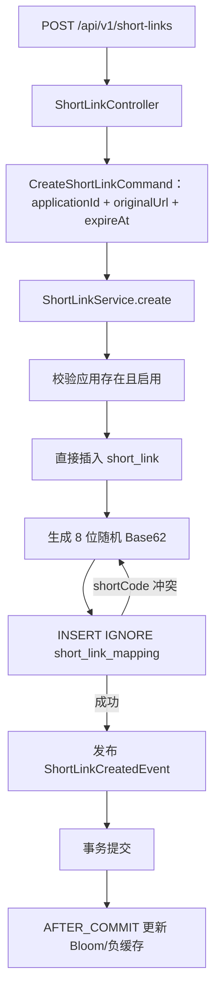
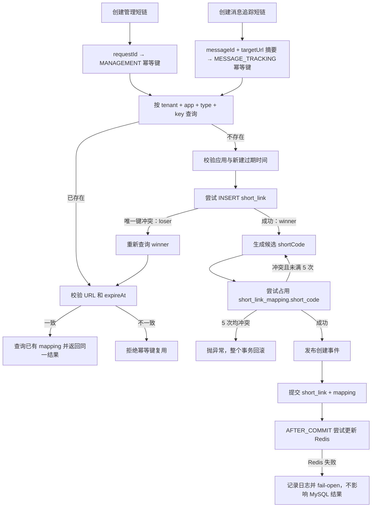

# Day 17：通知短链的幂等与并发正确性——完整教学版

> 本文只生成教学文档，不修改 `notification-platform` 或 `short_link` 项目源码。
>
> 真实代码基线：
>
> - 通知平台：`/Users/hingfaattam/workspace/learn_workspace/notification-platform`
> - 通知平台基线提交：`b7da86b148564fc9b215ba76ba2d608f6835732d`
> - 知识星球短链：`/Users/hingfaattam/workspace/learn_workspace/short_link`
> - 学习计划：当前项目中的《多租户统一通知平台-补充学习计划》以及 Day16 文档保留的原 30 天计划进度说明
>
> 文中的“新增/修改代码”是你学习 Day17 时需要手动加入通知平台的完整增量。所有代码都基于上述真实代码结构编写，并带有解释设计原因的注释。

## 课程定位

补充学习计划对 Day17 的定义是：

```text
主题：通知短链的幂等与并发正确性

目标：
把知识星球项目的“锁 + 双检 + 唯一约束”转成符合通知业务的模型。

动手任务：
1. 定义管理短链和消息追踪短链的不同幂等键；
2. 使用数据库唯一约束兜底；
3. 增加同 requestId 并发、短码冲突、事务回滚集成测试；
4. 按需要增加细粒度分布式锁。

验收：
50—100 个并发请求下没有重复业务记录；
锁失效或 Redis 不可用时，正确性仍由数据库保证。

面试输出：
分布式锁和唯一索引各负责什么？
```

Day16 解决的是“候选短码怎么生成”；Day17 解决的是另一个问题：

```text
同一个业务请求被调用 100 次，系统应该生成几个业务短链？
```

答案不是“100 个不同短码也不重复”。正确答案是：

```text
同一个幂等请求只生成 1 条 short_link 和 1 条 short_link_mapping，
所有调用都得到同一个 shortLinkId 和 shortCode。
```

今天最终采用的设计先写在前面：

```text
管理短链幂等键：
tenantId + applicationId + MANAGEMENT + requestId

消息追踪短链幂等键：
tenantId + applicationId + MESSAGE_TRACKING
+ messageId + SHA-256(trim(targetUrl))

并发裁决者：
数据库 UNIQUE(tenant_id, application_id, business_type, idempotency_key)

短码唯一性：
继续使用 UNIQUE(short_code) + 最多 5 次候选码重试

Redis/分布式锁：
本日不加入创建正确性主链；未来只能作为减少竞争的优化层
```

---

# 一、原理

## 1.1 幂等、唯一与去重不是同一个概念

这三个词经常被混用，但它们解决的问题不同。

### 唯一性

唯一性回答：

```text
数据库中能否同时存在两个相同 shortCode？
```

通知平台当前已经通过以下约束保证短码唯一：

```sql
UNIQUE KEY uk_short_code (short_code)
```

它只能保证两个业务记录不会占用同一个短码，却不能阻止同一个业务请求生成两个不同短码。

例如同一个请求并发两次：

```text
请求 A → shortLinkId=101 → shortCode=Ab12Cd34
请求 A → shortLinkId=102 → shortCode=Xy98Mn76
```

两个短码都唯一，但业务已经重复。

### 去重

去重回答：

```text
根据某些字段判断两份数据是不是重复内容？
```

知识星球项目使用原 URL 哈希去重，相同 URL 尽量复用同一短链。这个规则适合通用短链工具，却不一定适合通知业务。

### 幂等

幂等回答：

```text
同一个业务意图重复执行多次，最终业务结果是否与执行一次相同？
```

幂等必须先定义“同一个业务意图”的身份，也就是幂等键。

因此：

```text
短码唯一索引 != 创建请求幂等
原 URL 相同 != 通知业务相同
```

## 1.2 为什么通知平台不能按 originalUrl 全局复用

假设两个通知都跳到同一个订单页：

```text
消息 90001 → https://example.com/orders/100
消息 90002 → https://example.com/orders/100
```

如果只按 URL 复用短链，两条消息会共享一个 shortLinkId。后续点击统计只能知道“订单页被点击”，无法准确回答：

- 点击来自哪条消息；
- 属于哪个通知任务；
- 哪个渠道或模板带来的转化；
- 是否应该给某一条消息记一次点击。

因此通知追踪短链的业务身份必须包含消息维度。

但管理端手工创建短链又不同。用户可能因为网络超时重复提交同一个创建请求，这时应该使用客户端 requestId 幂等，而不是 messageId。

所以必须区分两种业务类型：

| 业务类型 | 幂等键 | 原因 |
|---|---|---|
| 管理短链 `MANAGEMENT` | `requestId` | 同一次 API 创建重试必须返回同一结果 |
| 消息追踪 `MESSAGE_TRACKING` | `messageId + targetUrl 摘要` | 同一消息中的同一目标只创建一次，不同消息不能错误复用 |

唯一约束还必须带上 `tenantId` 和 `applicationId`：不同租户、不同应用可以合法使用相同 requestId。

## 1.3 为什么消息追踪键不能只有 messageId

一条消息正文中可能有多个链接：

```text
查看订单：https://example.com/orders/100
申请售后：https://example.com/orders/100/refund
```

如果只使用 `messageId`，第二个链接会错误复用第一个短链。

因此消息追踪键使用：

```text
messageId + SHA-256(trim(targetUrl))
```

URL 摘要的作用只是把最长 2048 字符的 URL 压缩为固定长度键，不用于判断 URL 内容相等。真正返回已有结果时，仍然比较数据库中的 `originalUrl` 和请求 URL，防止调用方错误复用幂等键。

本日只执行 `trim`，不擅自做 URL canonicalization。参数顺序、大小写、追踪参数可能具有业务意义，错误规范化反而会把不同目标合并。

## 1.4 “先查再插”为什么挡不住并发

下面的代码只能减少普通重复请求，不能保证并发正确性：

```java
if (repository.findByIdempotencyKey(key).isEmpty()) {
    repository.save(entity);
}
```

两个线程可能同时执行：

```text
线程 A：查询，不存在
线程 B：查询，不存在
线程 A：插入
线程 B：插入
```

这叫 check-then-act 竞态。查询和插入不是一个不可分割的原子动作。

正确做法是：

1. 查询作为快速路径，减少无谓插入；
2. 数据库唯一约束作为最终原子裁决；
3. 插入成功者成为 winner；
4. 唯一键冲突者成为 loser，重新查询 winner 的结果；
5. loser 校验请求载荷一致后返回同一个结果。

## 1.5 数据库唯一约束为什么是正确性边界

唯一索引和业务数据处在同一个 MySQL 中，可以和业务写入参加同一事务：

```text
插入 short_link
插入 short_link_mapping
提交事务
```

如果 5 次短码都冲突：

```text
抛出异常
→ 整个事务回滚
→ short_link 的幂等占位也被删除
→ 后续重试仍可重新创建
```

这比“先在 Redis 写一个幂等标记，再写 MySQL”更容易保证一致性。Redis 标记和 MySQL 不是同一事务，可能出现：

```text
Redis 标记成功，MySQL 失败 → 请求永远被误判为已经完成
MySQL 成功，Redis 标记失败 → 后续又重复执行
```

## 1.6 分布式锁和唯一索引各负责什么

这是 Day17 最重要的面试结论：

| 机制 | 负责什么 | 不负责什么 |
|---|---|---|
| 分布式锁 | 降低同一热点键的并发竞争、减少重复查询和唯一键冲突 | 不能替代数据库最终正确性 |
| 数据库唯一索引 | 对所有实例、所有线程执行最终原子裁决 | 不负责减少锁等待与热点压力 |

分布式锁可能因为以下原因失效：

- Redis 故障；
- 网络分区；
- 锁租期到期但业务尚未完成；
- 进程长时间 GC；
- 锁 Key 设计错误；
- 两套 Redis 集群发生脑裂或切换。

所以即使使用锁，也必须保留数据库唯一约束。

本日选择不新增 Redisson，原因是：

1. 当前创建量没有证据表明数据库唯一键竞争已经成为瓶颈；
2. 项目已有 Redis 用于缓存和 Bloom，但创建正确性不应新增 Redis 依赖；
3. 先证明无锁情况下 100 并发仍然正确，更能说明数据库才是最终边界；
4. 未来监控到热点竞争后，再增加 fail-open 的细粒度锁。

## 1.7 幂等重放必须校验请求载荷

客户端可能错误地重复使用 requestId：

```text
第一次：requestId=req-001，URL=/orders/1
第二次：requestId=req-001，URL=/orders/2
```

如果系统直接返回第一次结果，客户端会以为第二个 URL 创建成功，实际上拿到的是错误短链。

因此命中已有幂等记录后必须比较：

- `originalUrl`；
- `expireAt`；
- 业务类型已经由查询条件保证；
- `tenantId + applicationId` 已经由唯一键和租户拦截器保证。

载荷不一致时应明确报错：

```text
idempotencyKey 已被不同请求使用
```

## 1.8 为什么要把 DATETIME(3) 精度纳入比较

数据库字段是：

```sql
expire_at DATETIME(3)
```

它只保存毫秒，但 Java `LocalDateTime` 可以保存纳秒。如果第一次请求携带纳秒，写入数据库后会被截为毫秒；重试时拿原始纳秒与数据库值直接比较，可能被误判为不同载荷。

因此进入幂等逻辑前统一截断到毫秒：

```java
value.withNano((value.getNano() / 1_000_000) * 1_000_000)
```

## 1.9 事务提交后再更新 Redis

当前通知平台发布 `ShortLinkCreatedEvent`，由 `ShortLinkCacheConsistencyListener` 在 `AFTER_COMMIT` 阶段更新 Bloom 和负缓存。

这个顺序是正确的：

```text
MySQL 未提交 → 不能把短码提前加入 Bloom
MySQL 已提交 → 再尝试更新 Redis
Redis 失败 → RedisShortLinkProtection 捕获异常并让 Bloom fail-open
```

所以 Redis 故障只影响缓存和防穿透性能，不应回滚已经正确提交的短链。

---

# 二、现有数据流

## 2.1 当前管理短链创建链路

当前真实代码的数据流是：



对应真实文件：

- `notification-server/.../ShortLinkController.java`
- `notification-shortlink/.../CreateShortLinkCommand.java`
- `notification-shortlink/.../ShortLinkService.java`
- `notification-infrastructure/.../ShortLinkRepositoryImpl.java`
- `notification-infrastructure/.../ShortLinkMappingRepositoryImpl.java`
- `notification-infrastructure/.../V6__init_short_link.sql`

## 2.2 当前已经正确的部分

当前代码已有以下正确性基础，本日复用，不重写：

1. `short_link_mapping.short_code` 是全局唯一索引；
2. `trySave` 使用数据库原子插入结果判断短码是否被占用；
3. 短码冲突最多重试 5 次；
4. `ShortLinkService.create` 已有 `@Transactional`；
5. Bloom 更新发生在事务提交后；
6. Redis 写入异常会被捕获，Bloom 转为不可信并 fail-open；
7. MyBatis-Plus 租户拦截器自动为普通查询增加 `tenant_id` 条件。

## 2.3 当前缺失的部分

`CreateShortLinkRequest` 没有 requestId，`short_link` 也没有业务幂等字段。

因此同一 HTTP 请求重复两次会得到：

```text
short_link：插入两条
short_link_mapping：插入两条不同 shortCode
```

短码唯一没有被破坏，但业务幂等失败。

另外，当前单元测试只验证“第一次短码冲突后第二次成功”，没有使用真实 MySQL 验证：

- 100 个线程同时创建相同 requestId；
- 唯一约束竞争时 loser 是否返回 winner；
- 5 次短码冲突后 `short_link` 是否一起回滚；
- Redis 不可用是否影响数据库提交。

## 2.4 知识星球项目真实链路

知识星球项目的 `ShortUrlService#createShortUrl` 使用：

```text
URL 多重哈希
→ 缓存第一次检查
→ Redisson 按 URL Hash 加锁
→ 锁内第二次检查缓存
→ 查询数据库
→ 事务 + 唯一索引
```

其中值得吸收的是：

- 锁必须按业务键细化，不能使用一把全局锁；
- 获取锁后必须再次检查，因为等待锁期间 winner 可能已经完成；
- 唯一索引仍需保留。

不能照搬的是：

- 按原 URL 全局复用；
- 把 Redis 锁变成创建成功的必要条件；
- 将 URL 哈希当成通知归因身份；
- 捕获异常文本判断 `Duplicate entry`；
- 同时叠加多重哈希、缓存、锁、DAO 预查而没有先证明必要性。

---

# 三、本次需要改动的数据流

## 3.1 新的数据流



## 3.2 两层唯一约束分别解决什么

本次完成后有两层完全不同的唯一约束：

```sql
-- 业务幂等：同一业务意图只能有一条 short_link
UNIQUE (
    tenant_id,
    application_id,
    business_type,
    idempotency_key
)

-- 路由唯一：一个 shortCode 只能指向一条映射
UNIQUE (short_code)
```

第一层发生冲突时返回已有结果；第二层发生冲突时重新生成候选短码。两类冲突不能使用同一套处理逻辑。

## 3.3 为什么本日不加入分布式锁

修改后的数据库链路已经能在多实例并发下保证正确。加入锁只能改变性能路径：

```text
无锁：100 个请求可能一起竞争唯一索引，结果仍正确
有锁：大部分 loser 在锁内双检时直接返回，数据库竞争更少
```

只有当监控证明同一幂等键成为热点、唯一键等待明显升高时，才值得新增锁。

未来若增加，必须遵守：

```text
锁 Key = hash(tenantId + applicationId + businessType + idempotencyKey)
Redis 异常 = 跳过锁，继续走数据库
锁内 = 再查一次数据库
数据库唯一索引 = 永远保留
```

---

# 四、文件位置（复用 / 新增 / 修改）

## 4.1 复用，不修改

| 文件 | 复用原因 |
|---|---|
| `domain/shortlink/ShortCodeGenerator.java` | 继续生成候选码 |
| `algorithm/Base62RandomShortCodeGenerator.java` | 继续作为生产 `@Primary` |
| `domain/shortlink/ShortLinkCreatedEvent.java` | 新建成功后发布事件 |
| `shortlink/ShortLinkCacheConsistencyListener.java` | 事务提交后更新 Bloom |
| `shortlink/RedisShortLinkProtection.java` | Redis 故障时捕获异常并 fail-open |
| `persistence/mapper/ShortLinkMappingMapper.java` | 已有 `INSERT IGNORE` 可原子占用短码 |
| `db/migration/V6__init_short_link.sql` | 历史迁移不可修改，新增 V8 演进 |

## 4.2 新增

| 文件 | 作用 |
|---|---|
| `notification-core/.../ShortLinkBusinessType.java` | 区分管理短链与消息追踪短链 |
| `notification-shortlink/.../ShortLinkIdempotencyKeys.java` | 生成两类业务幂等键 |
| `notification-infrastructure/.../V8__add_short_link_idempotency.sql` | 新增字段、回填历史数据、建立唯一约束 |
| `notification-shortlink/.../ShortLinkIdempotencyKeysTest.java` | 验证幂等键稳定且不误合并 |
| `notification-server/.../ShortLinkIdempotencyIntegrationTest.java` | 真实 MySQL 并发、冲突、回滚、Redis 故障实验 |

## 4.3 修改

| 文件 | 改动 |
|---|---|
| `CreateShortLinkRequest.java` | 增加管理端 requestId；移除 Controller 层 `@Future`，由 Service 在幂等查询后判断 |
| `ShortLinkController.java` | 使用管理短链命令工厂 |
| `CreateShortLinkCommand.java` | 携带 businessType 与 idempotencyKey，提供两类工厂方法 |
| `ShortLink.java` | 增加业务类型和幂等键 |
| `ShortLinkRepository.java` | 增加原子尝试保存和按幂等键查询 |
| `ShortLinkMappingRepository.java` | 增加按 shortLinkId 查询已有映射 |
| `ShortLinkDO.java` | 映射新字段 |
| `ShortLinkRepositoryImpl.java` | 捕获数据库唯一键冲突并区分 winner/loser |
| `ShortLinkMappingRepositoryImpl.java` | 查询已有业务记录对应的 shortCode |
| `ShortLinkService.java` | 实现查询快路径、唯一键裁决、载荷校验和事务回滚 |
| `ShortLinkServiceTest.java` | 适配新接口并验证幂等返回与短码重试 |
| `notification-server/pom.xml` | 增加 Testcontainers 测试依赖 |

---

# 五、基于现有代码的完整增量代码

> 以下代码按依赖方向排列：数据库 → 领域 → 基础设施 → 应用服务 → HTTP → 测试。

## 5.1 新增数据库迁移 V8

文件：

```text
notification-infrastructure/src/main/resources/db/migration/
V8__add_short_link_idempotency.sql
```

完整代码：

```sql
-- 业务类型用于隔离不同幂等语义：
-- MANAGEMENT 使用客户端 requestId；
-- MESSAGE_TRACKING 使用 messageId + targetUrl 摘要。
ALTER TABLE short_link
    ADD COLUMN business_type VARCHAR(32) NOT NULL DEFAULT 'MANAGEMENT'
        AFTER application_id,
    ADD COLUMN idempotency_key VARCHAR(128) NULL
        AFTER business_type;

-- 历史数据创建时没有 requestId。
-- 每条历史记录使用自己的主键生成唯一占位值，避免迁移时错误合并数据。
UPDATE short_link
SET idempotency_key = CONCAT('legacy:', id)
WHERE idempotency_key IS NULL;

-- 完成历史回填后再改成 NOT NULL，保证未来每条短链都有明确业务身份。
ALTER TABLE short_link
    MODIFY COLUMN idempotency_key VARCHAR(128) NOT NULL;

-- 数据库是并发幂等的最终裁决者。
-- 相同 requestId 可以在不同租户或不同应用下合法使用。
ALTER TABLE short_link
    ADD UNIQUE KEY uk_short_link_idempotency
        (tenant_id, application_id, business_type, idempotency_key);
```

不要修改 V6。Flyway 已执行过的历史迁移必须保持不可变。

## 5.2 新增 ShortLinkBusinessType

文件：

```text
notification-core/src/main/java/com/tam/notification/domain/shortlink/
ShortLinkBusinessType.java
```

完整代码：

```java
package com.tam.notification.domain.shortlink;

/**
 * 短链的业务用途。
 *
 * <p>不同用途拥有不同的幂等语义，不能只按照 originalUrl 去重。</p>
 */
public enum ShortLinkBusinessType {

    /** 管理端主动创建，使用客户端 requestId 幂等。 */
    MANAGEMENT,

    /** 通知消息中的追踪链接，使用 messageId + targetUrl 摘要幂等。 */
    MESSAGE_TRACKING
}
```

## 5.3 新增 ShortLinkIdempotencyKeys

文件：

```text
notification-shortlink/src/main/java/com/tam/notification/shortlink/idempotency/
ShortLinkIdempotencyKeys.java
```

完整代码：

```java
package com.tam.notification.shortlink.idempotency;

import java.nio.charset.StandardCharsets;
import java.security.MessageDigest;
import java.security.NoSuchAlgorithmException;
import java.util.HexFormat;

/**
 * 短链业务幂等键工厂。
 *
 * <p>tenantId、applicationId 和 businessType 已经进入数据库唯一索引，
 * 因此这里生成的只是业务类型内部的 key。</p>
 */
public final class ShortLinkIdempotencyKeys {

    private static final int MAX_MANAGEMENT_REQUEST_ID_LENGTH = 64;

    private ShortLinkIdempotencyKeys() {
    }

    /**
     * 管理端创建直接使用客户端 requestId。
     * requestId 区分大小写，只去除首尾空格，不擅自改变客户端语义。
     */
    public static String management(String requestId) {
        if (requestId == null || requestId.isBlank()) {
            throw new IllegalArgumentException("requestId不能为空");
        }

        String normalized = requestId.trim();
        if (normalized.length() > MAX_MANAGEMENT_REQUEST_ID_LENGTH) {
            throw new IllegalArgumentException("requestId长度不能超过64个字符");
        }
        return normalized;
    }

    /**
     * 同一条消息可能包含多个目标链接，因此 messageId 不能单独作为幂等键。
     * 对 URL 做 SHA-256 只是为了得到固定长度键；真正复用时仍会比较原始 URL。
     */
    public static String messageTracking(Long messageId, String targetUrl) {
        if (messageId == null || messageId <= 0L) {
            throw new IllegalArgumentException("messageId必须大于0");
        }
        if (targetUrl == null || targetUrl.isBlank()) {
            throw new IllegalArgumentException("targetUrl不能为空");
        }

        return messageId + ":" + sha256(targetUrl.trim());
    }

    private static String sha256(String value) {
        try {
            MessageDigest digest = MessageDigest.getInstance("SHA-256");
            byte[] bytes = digest.digest(value.getBytes(StandardCharsets.UTF_8));
            return HexFormat.of().formatHex(bytes);
        } catch (NoSuchAlgorithmException exception) {
            // Java 运行时必须提供 SHA-256；缺失说明运行环境异常。
            throw new IllegalStateException("当前JDK不支持SHA-256", exception);
        }
    }
}
```

## 5.4 修改 CreateShortLinkCommand

文件：

```text
notification-shortlink/src/main/java/com/tam/notification/shortlink/dto/
CreateShortLinkCommand.java
```

完整替换为：

```java
package com.tam.notification.shortlink.dto;

import com.tam.notification.domain.shortlink.ShortLinkBusinessType;
import com.tam.notification.shortlink.idempotency.ShortLinkIdempotencyKeys;

import java.time.LocalDateTime;

/**
 * 创建短链命令。
 *
 * <p>HTTP 管理端和内部消息追踪使用不同工厂方法，避免调用方拼错幂等键。</p>
 */
public record CreateShortLinkCommand(
        Long applicationId,
        String originalUrl,
        LocalDateTime expireAt,
        ShortLinkBusinessType businessType,
        String idempotencyKey
) {

    public static CreateShortLinkCommand management(
            Long applicationId,
            String requestId,
            String originalUrl,
            LocalDateTime expireAt
    ) {
        return new CreateShortLinkCommand(
                applicationId,
                originalUrl,
                expireAt,
                ShortLinkBusinessType.MANAGEMENT,
                ShortLinkIdempotencyKeys.management(requestId)
        );
    }

    public static CreateShortLinkCommand messageTracking(
            Long applicationId,
            Long messageId,
            String targetUrl,
            LocalDateTime expireAt
    ) {
        return new CreateShortLinkCommand(
                applicationId,
                targetUrl,
                expireAt,
                ShortLinkBusinessType.MESSAGE_TRACKING,
                ShortLinkIdempotencyKeys.messageTracking(messageId, targetUrl)
        );
    }
}
```

## 5.5 修改 ShortLink 领域对象

文件：

```text
notification-core/src/main/java/com/tam/notification/domain/shortlink/ShortLink.java
```

完整替换为：

```java
package com.tam.notification.domain.shortlink;

import com.tam.notification.domain.enums.ShortLinkStatus;
import lombok.Data;

import java.time.LocalDateTime;

@Data
public class ShortLink {
    private Long id;

    private Long tenantId;

    private Long applicationId;

    /** 区分管理短链和消息追踪短链。 */
    private ShortLinkBusinessType businessType;

    /**
     * 业务类型内部的幂等键。
     * 数据库会联合 tenantId、applicationId、businessType 建立唯一约束。
     */
    private String idempotencyKey;

    private String originalUrl;

    private LocalDateTime expireAt;

    private ShortLinkStatus status;

    private Integer version;

    private LocalDateTime createdAt;

    private LocalDateTime updatedAt;

    public boolean isExpired(LocalDateTime now) {
        return expireAt != null && !expireAt.isAfter(now);
    }

    public boolean isAvailable(LocalDateTime now) {
        return status == ShortLinkStatus.ACTIVE && !isExpired(now);
    }
}
```

## 5.6 修改 ShortLinkRepository

文件：

```text
notification-core/src/main/java/com/tam/notification/domain/shortlink/
ShortLinkRepository.java
```

完整替换为：

```java
package com.tam.notification.domain.shortlink;

import java.util.Optional;

public interface ShortLinkRepository {

    /**
     * 尝试创建业务短链。
     *
     * @return true 表示当前事务赢得唯一键竞争；false 表示已有并发 winner
     */
    boolean trySave(ShortLink shortLink);

    Optional<ShortLink> findById(Long id);

    /**
     * MyBatis-Plus 租户拦截器会自动追加 tenant_id 条件，
     * 因此这里只需要显式传 applicationId、businessType 和 idempotencyKey。
     */
    Optional<ShortLink> findByIdempotencyKey(
            Long applicationId,
            ShortLinkBusinessType businessType,
            String idempotencyKey
    );
}
```

## 5.7 修改 ShortLinkMappingRepository

文件：

```text
notification-core/src/main/java/com/tam/notification/domain/shortlink/
ShortLinkMappingRepository.java
```

完整替换为：

```java
package com.tam.notification.domain.shortlink;

import java.util.List;
import java.util.Optional;

public interface ShortLinkMappingRepository {

    /** 尝试占用全局 shortCode；冲突时返回 false。 */
    boolean trySave(ShortLinkMapping mapping);

    /**
     * 幂等重放需要根据已有 shortLinkId 找回第一次创建的 shortCode。
     * 普通租户查询会自动带 tenant_id。
     */
    Optional<ShortLinkMapping> findByShortLinkId(Long shortLinkId);

    /** 公共跳转入口没有租户上下文，必须通过全局唯一短码跨租户查询。 */
    Optional<ShortLinkMapping> findByShortCodeAcrossTenants(String shortCode);

    /** 仅用于 Bloom 初始化，不能用于普通租户业务查询。 */
    List<String> findAllShortCodesAcrossTenants();
}
```

## 5.8 修改 ShortLinkDO

文件：

```text
notification-infrastructure/src/main/java/com/tam/notification/persistence/entity/
ShortLinkDO.java
```

完整替换为：

```java
package com.tam.notification.persistence.entity;

import com.baomidou.mybatisplus.annotation.FieldFill;
import com.baomidou.mybatisplus.annotation.IdType;
import com.baomidou.mybatisplus.annotation.TableField;
import com.baomidou.mybatisplus.annotation.TableId;
import com.baomidou.mybatisplus.annotation.TableName;
import com.baomidou.mybatisplus.annotation.Version;
import lombok.Data;

import java.time.LocalDateTime;

@Data
@TableName("short_link")
public class ShortLinkDO {

    @TableId(type = IdType.ASSIGN_ID)
    private Long id;

    @TableField(fill = FieldFill.INSERT)
    private Long tenantId;

    private Long applicationId;

    private String businessType;

    private String idempotencyKey;

    private String originalUrl;

    private LocalDateTime expireAt;

    private String status;

    @Version
    private Integer version;

    private LocalDateTime createdAt;

    private LocalDateTime updatedAt;
}
```

## 5.9 修改 ShortLinkRepositoryImpl

文件：

```text
notification-infrastructure/src/main/java/com/tam/notification/persistence/repository/
ShortLinkRepositoryImpl.java
```

完整替换为：

```java
package com.tam.notification.persistence.repository;

import com.baomidou.mybatisplus.core.toolkit.IdWorker;
import com.baomidou.mybatisplus.core.toolkit.Wrappers;
import com.tam.notification.common.tenant.TenantContext;
import com.tam.notification.domain.enums.ShortLinkStatus;
import com.tam.notification.domain.shortlink.ShortLink;
import com.tam.notification.domain.shortlink.ShortLinkBusinessType;
import com.tam.notification.domain.shortlink.ShortLinkRepository;
import com.tam.notification.persistence.entity.ShortLinkDO;
import com.tam.notification.persistence.mapper.ShortLinkMapper;
import lombok.RequiredArgsConstructor;
import org.springframework.dao.DuplicateKeyException;
import org.springframework.stereotype.Repository;

import java.util.Optional;

@Repository
@RequiredArgsConstructor
public class ShortLinkRepositoryImpl implements ShortLinkRepository {

    private final ShortLinkMapper shortLinkMapper;

    @Override
    public boolean trySave(ShortLink shortLink) {
        ShortLinkDO data = toDO(shortLink);

        /*
         * 自定义业务幂等插入需要在执行 SQL 前就得到 tenantId 和 id。
         * 不依赖“先查再插”，直接让数据库唯一索引裁决并发 winner。
         */
        data.setId(IdWorker.getId());
        data.setTenantId(TenantContext.requireTenantId());

        try {
            shortLinkMapper.insert(data);

            shortLink.setId(data.getId());
            shortLink.setTenantId(data.getTenantId());
            shortLink.setVersion(data.getVersion());
            return true;
        } catch (DuplicateKeyException exception) {
            /*
             * 唯一键冲突表示当前请求没有赢得插入竞争。
             * Service 随后会按业务幂等键查询 winner，并校验请求载荷。
             *
             * 这里只捕获 DuplicateKeyException；连接失败、SQL 语法错误、
             * 字段超长等异常必须继续抛出，不能伪装成幂等命中。
             */
            return false;
        }
    }

    @Override
    public Optional<ShortLink> findById(Long id) {
        ShortLinkDO data = shortLinkMapper.selectById(id);
        return Optional.ofNullable(data).map(this::toDomain);
    }

    @Override
    public Optional<ShortLink> findByIdempotencyKey(
            Long applicationId,
            ShortLinkBusinessType businessType,
            String idempotencyKey
    ) {
        ShortLinkDO data = shortLinkMapper.selectOne(
                Wrappers.<ShortLinkDO>lambdaQuery()
                        .eq(ShortLinkDO::getApplicationId, applicationId)
                        .eq(ShortLinkDO::getBusinessType, businessType.name())
                        .eq(ShortLinkDO::getIdempotencyKey, idempotencyKey)
        );

        return Optional.ofNullable(data).map(this::toDomain);
    }

    private ShortLinkDO toDO(ShortLink shortLink) {
        ShortLinkDO data = new ShortLinkDO();

        data.setId(shortLink.getId());
        data.setTenantId(shortLink.getTenantId());
        data.setApplicationId(shortLink.getApplicationId());
        data.setIdempotencyKey(shortLink.getIdempotencyKey());
        data.setOriginalUrl(shortLink.getOriginalUrl());
        data.setExpireAt(shortLink.getExpireAt());
        data.setVersion(shortLink.getVersion());

        if (shortLink.getBusinessType() != null) {
            data.setBusinessType(shortLink.getBusinessType().name());
        }

        if (shortLink.getStatus() != null) {
            data.setStatus(shortLink.getStatus().name());
        }

        return data;
    }

    private ShortLink toDomain(ShortLinkDO data) {
        ShortLink shortLink = new ShortLink();

        shortLink.setId(data.getId());
        shortLink.setTenantId(data.getTenantId());
        shortLink.setApplicationId(data.getApplicationId());
        shortLink.setIdempotencyKey(data.getIdempotencyKey());
        shortLink.setOriginalUrl(data.getOriginalUrl());
        shortLink.setExpireAt(data.getExpireAt());
        shortLink.setVersion(data.getVersion());
        shortLink.setCreatedAt(data.getCreatedAt());
        shortLink.setUpdatedAt(data.getUpdatedAt());

        if (data.getBusinessType() != null) {
            shortLink.setBusinessType(
                    ShortLinkBusinessType.valueOf(data.getBusinessType())
            );
        }

        if (data.getStatus() != null) {
            shortLink.setStatus(ShortLinkStatus.valueOf(data.getStatus()));
        }

        return shortLink;
    }
}
```

### 为什么不使用 `INSERT IGNORE` 保存 short_link

现有 `short_link_mapping` 使用 `INSERT IGNORE`，因为它只承担“尝试占用随机短码”的窄职责。

业务表 `short_link` 需要更严格：只有重复键可以转成 loser，连接失败、字段非法、SQL 错误必须暴露。因此这里使用普通 `INSERT`，只捕获 Spring 翻译后的 `DuplicateKeyException`。

## 5.10 修改 ShortLinkMappingRepositoryImpl

文件：

```text
notification-infrastructure/src/main/java/com/tam/notification/persistence/repository/
ShortLinkMappingRepositoryImpl.java
```

完整替换为：

```java
package com.tam.notification.persistence.repository;

import com.baomidou.mybatisplus.core.toolkit.IdWorker;
import com.baomidou.mybatisplus.core.toolkit.Wrappers;
import com.tam.notification.common.tenant.TenantContext;
import com.tam.notification.domain.shortlink.ShortLinkMapping;
import com.tam.notification.domain.shortlink.ShortLinkMappingRepository;
import com.tam.notification.persistence.entity.ShortLinkMappingDO;
import com.tam.notification.persistence.mapper.ShortLinkMappingMapper;
import lombok.RequiredArgsConstructor;
import org.springframework.stereotype.Repository;

import java.util.List;
import java.util.Optional;

@Repository
@RequiredArgsConstructor
public class ShortLinkMappingRepositoryImpl
        implements ShortLinkMappingRepository {

    private final ShortLinkMappingMapper mappingMapper;

    @Override
    public boolean trySave(ShortLinkMapping mapping) {
        ShortLinkMappingDO data = new ShortLinkMappingDO();

        data.setId(IdWorker.getId());
        data.setTenantId(TenantContext.requireTenantId());
        data.setShortLinkId(mapping.getShortLinkId());
        data.setShortCode(mapping.getShortCode());

        int affectedRows = mappingMapper.insertIgnore(data);

        if (affectedRows == 1) {
            mapping.setId(data.getId());
            mapping.setTenantId(data.getTenantId());
            return true;
        }
        return false;
    }

    @Override
    public Optional<ShortLinkMapping> findByShortLinkId(Long shortLinkId) {
        ShortLinkMappingDO data = mappingMapper.selectOne(
                Wrappers.<ShortLinkMappingDO>lambdaQuery()
                        .eq(ShortLinkMappingDO::getShortLinkId, shortLinkId)
        );

        return Optional.ofNullable(data).map(this::toDomain);
    }

    @Override
    public Optional<ShortLinkMapping> findByShortCodeAcrossTenants(
            String shortCode
    ) {
        ShortLinkMappingDO data =
                mappingMapper.selectByShortCodeAcrossTenants(shortCode);

        return Optional.ofNullable(data).map(this::toDomain);
    }

    @Override
    public List<String> findAllShortCodesAcrossTenants() {
        return mappingMapper.selectAllShortCodesAcrossTenants();
    }

    private ShortLinkMapping toDomain(ShortLinkMappingDO data) {
        ShortLinkMapping mapping = new ShortLinkMapping();

        mapping.setId(data.getId());
        mapping.setTenantId(data.getTenantId());
        mapping.setShortLinkId(data.getShortLinkId());
        mapping.setShortCode(data.getShortCode());
        mapping.setCreatedAt(data.getCreatedAt());

        return mapping;
    }
}
```

## 5.11 修改 ShortLinkService

文件：

```text
notification-shortlink/src/main/java/com/tam/notification/shortlink/service/
ShortLinkService.java
```

完整替换为：

```java
package com.tam.notification.shortlink.service;

import com.tam.notification.common.exception.BusinessException;
import com.tam.notification.common.exception.CommonErrorCode;
import com.tam.notification.domain.application.ApplicationRepository;
import com.tam.notification.domain.enums.ShortLinkStatus;
import com.tam.notification.domain.shortlink.ShortCodeGenerator;
import com.tam.notification.domain.shortlink.ShortLink;
import com.tam.notification.domain.shortlink.ShortLinkCreatedEvent;
import com.tam.notification.domain.shortlink.ShortLinkMapping;
import com.tam.notification.domain.shortlink.ShortLinkMappingRepository;
import com.tam.notification.domain.shortlink.ShortLinkRepository;
import com.tam.notification.shortlink.dto.CreateShortLinkCommand;
import com.tam.notification.shortlink.dto.CreatedShortLink;
import lombok.RequiredArgsConstructor;
import lombok.extern.slf4j.Slf4j;
import org.springframework.context.ApplicationEventPublisher;
import org.springframework.stereotype.Service;
import org.springframework.transaction.annotation.Isolation;
import org.springframework.transaction.annotation.Transactional;

import java.net.URI;
import java.net.URISyntaxException;
import java.time.LocalDateTime;
import java.util.Objects;

@Slf4j
@Service
@RequiredArgsConstructor
public class ShortLinkService {

    private static final int MAX_CODE_GENERATE_ATTEMPTS = 5;
    private static final int MAX_ORIGINAL_URL_LENGTH = 2048;
    private static final int MAX_IDEMPOTENCY_KEY_LENGTH = 128;

    private final ApplicationRepository applicationRepository;
    private final ShortLinkRepository shortLinkRepository;
    private final ShortLinkMappingRepository mappingRepository;
    private final ShortCodeGenerator shortCodeGenerator;
    private final ApplicationEventPublisher eventPublisher;

    @Transactional(isolation = Isolation.READ_COMMITTED)
    public CreatedShortLink create(CreateShortLinkCommand command) {
        /*
         * 第一阶段只校验字段形状，不校验“过期时间必须晚于现在”。
         * 原因是幂等重放可能发生在原短链过期之后，重放仍应返回第一次结果，
         * 而不是创建第二条记录。
         */
        validateCommandShape(command);

        String originalUrl = command.originalUrl().trim();
        String idempotencyKey = command.idempotencyKey().trim();
        LocalDateTime expireAt = truncateToMillis(command.expireAt());

        /*
         * 查询是优化快路径，不承担最终并发正确性。
         * 并发请求可能在这里同时查询不到，后面的唯一索引仍会裁决 winner。
         */
        var existing = shortLinkRepository.findByIdempotencyKey(
                command.applicationId(),
                command.businessType(),
                idempotencyKey
        );

        if (existing.isPresent()) {
            return reuseExisting(existing.get(), originalUrl, expireAt);
        }

        validateApplication(command.applicationId());

        // 只有真正创建新记录时，才要求过期时间晚于当前时间。
        if (!expireAt.isAfter(LocalDateTime.now())) {
            throw invalidParameter("过期时间必须晚于当前时间");
        }

        ShortLink candidate = new ShortLink();
        candidate.setApplicationId(command.applicationId());
        candidate.setBusinessType(command.businessType());
        candidate.setIdempotencyKey(idempotencyKey);
        candidate.setOriginalUrl(originalUrl);
        candidate.setExpireAt(expireAt);
        candidate.setStatus(ShortLinkStatus.ACTIVE);

        boolean winner = shortLinkRepository.trySave(candidate);

        if (!winner) {
            /*
             * 当前事务输掉唯一键竞争。
             * InnoDB 会等待 winner 提交或回滚：
             * - winner 提交：trySave 返回 false，然后可以读到已有记录；
             * - winner 回滚：当前 INSERT 可以继续成功，trySave 会返回 true。
             */
            ShortLink concurrentWinner = shortLinkRepository
                    .findByIdempotencyKey(
                            command.applicationId(),
                            command.businessType(),
                            idempotencyKey
                    )
                    .orElseThrow(() -> new BusinessException(
                            CommonErrorCode.INTERNAL_ERROR,
                            "幂等唯一键冲突后未找到已有短链"
                    ));

            return reuseExisting(concurrentWinner, originalUrl, expireAt);
        }

        String shortCode = allocateShortCode(candidate);

        // 事件由 AFTER_COMMIT 监听器处理，事务回滚时不会污染 Bloom。
        eventPublisher.publishEvent(new ShortLinkCreatedEvent(shortCode));
        return toResult(candidate, shortCode);
    }

    /**
     * 为已经赢得业务幂等竞争的 short_link 分配全局唯一 shortCode。
     */
    private String allocateShortCode(ShortLink shortLink) {
        for (int attempt = 1;
             attempt <= MAX_CODE_GENERATE_ATTEMPTS;
             attempt++) {

            String shortCode = shortCodeGenerator.generate();

            ShortLinkMapping mapping = new ShortLinkMapping();
            mapping.setShortLinkId(shortLink.getId());
            mapping.setShortCode(shortCode);

            if (mappingRepository.trySave(mapping)) {
                return shortCode;
            }

            log.warn(
                    "short code collision, attempt={}, shortLinkId={}, shortCode={}",
                    attempt,
                    shortLink.getId(),
                    shortCode
            );
        }

        /*
         * 方法处于 @Transactional 事务中。
         * 抛出运行时异常会同时回滚 short_link 和已执行的所有写操作，
         * 不会留下“有业务幂等记录但没有 mapping”的半成品。
         */
        throw new BusinessException(
                CommonErrorCode.BUSINESS_ERROR,
                "短码生成冲突次数超过上限，请稍后重试"
        );
    }

    /**
     * 返回第一次创建结果，并防止同一个幂等键被不同请求载荷复用。
     */
    private CreatedShortLink reuseExisting(
            ShortLink existing,
            String requestedUrl,
            LocalDateTime requestedExpireAt
    ) {
        if (!Objects.equals(existing.getOriginalUrl(), requestedUrl)
                || !Objects.equals(
                        truncateToMillis(existing.getExpireAt()),
                        requestedExpireAt
                )) {
            throw new BusinessException(
                    CommonErrorCode.BUSINESS_ERROR,
                    "idempotencyKey已被不同请求使用"
            );
        }

        ShortLinkMapping mapping = mappingRepository
                .findByShortLinkId(existing.getId())
                .orElseThrow(() -> new BusinessException(
                        CommonErrorCode.INTERNAL_ERROR,
                        "已有短链缺少短码映射"
                ));

        return toResult(existing, mapping.getShortCode());
    }

    private void validateApplication(Long applicationId) {
        var application = applicationRepository
                .findById(applicationId)
                .orElseThrow(() -> new BusinessException(
                        CommonErrorCode.BUSINESS_ERROR,
                        "应用不存在"
                ));

        if (!Objects.equals(application.getStatus(), 1)) {
            throw new BusinessException(
                    CommonErrorCode.BUSINESS_ERROR,
                    "应用未启用"
            );
        }
    }

    private void validateCommandShape(CreateShortLinkCommand command) {
        if (command == null) {
            throw invalidParameter("短链创建参数不能为空");
        }
        if (command.applicationId() == null) {
            throw invalidParameter("applicationId不能为空");
        }
        if (command.businessType() == null) {
            throw invalidParameter("businessType不能为空");
        }
        if (command.idempotencyKey() == null
                || command.idempotencyKey().isBlank()) {
            throw invalidParameter("idempotencyKey不能为空");
        }
        if (command.idempotencyKey().trim().length()
                > MAX_IDEMPOTENCY_KEY_LENGTH) {
            throw invalidParameter("idempotencyKey长度不能超过128个字符");
        }

        String originalUrl = command.originalUrl();
        if (originalUrl == null || originalUrl.isBlank()) {
            throw invalidParameter("原始URL不能为空");
        }
        if (originalUrl.length() > MAX_ORIGINAL_URL_LENGTH) {
            throw invalidParameter("原始URL长度不能超过2048个字符");
        }
        validateOriginalUrl(originalUrl.trim());

        if (command.expireAt() == null) {
            throw invalidParameter("过期时间不能为空");
        }
    }

    private void validateOriginalUrl(String originalUrl) {
        try {
            URI uri = new URI(originalUrl);
            String scheme = uri.getScheme();

            boolean supportedScheme =
                    "http".equalsIgnoreCase(scheme)
                            || "https".equalsIgnoreCase(scheme);

            if (!supportedScheme
                    || uri.getHost() == null
                    || uri.getHost().isBlank()) {
                throw invalidParameter(
                        "原始URL必须是合法的HTTP或HTTPS地址"
                );
            }
        } catch (URISyntaxException exception) {
            throw invalidParameter("原始URL必须是合法的HTTP或HTTPS地址");
        }
    }

    /** 将 Java 纳秒精度统一为数据库 DATETIME(3) 的毫秒精度。 */
    private LocalDateTime truncateToMillis(LocalDateTime value) {
        if (value == null) {
            return null;
        }

        int millisAsNanos =
                (value.getNano() / 1_000_000) * 1_000_000;
        return value.withNano(millisAsNanos);
    }

    private BusinessException invalidParameter(String message) {
        return new BusinessException(
                CommonErrorCode.INVALID_PARAMETER,
                message
        );
    }

    private CreatedShortLink toResult(
            ShortLink shortLink,
            String shortCode
    ) {
        return new CreatedShortLink(
                shortLink.getId(),
                shortLink.getTenantId(),
                shortLink.getApplicationId(),
                shortCode,
                shortLink.getOriginalUrl(),
                shortLink.getExpireAt(),
                shortLink.getStatus()
        );
    }
}
```

### 一个重要的事务细节

`trySave` 的 loser 在唯一索引处等待 winner。winner 的 `short_link` 和 `short_link_mapping` 位于同一事务：

- winner 正常提交后，loser 才收到重复键并查询到完整记录；
- winner 因 5 次短码冲突回滚后，唯一键释放，等待中的请求可以继续插入并成为新 winner。

这正是把幂等键和业务数据放在同一数据库事务中的价值。

这里显式使用 `READ_COMMITTED` 也不是装饰。MySQL 默认通常是 `REPEATABLE_READ`：如果事务第一次幂等查询已经建立一致性快照，那么等待 winner 提交后再次执行普通查询，仍可能看不到刚提交的数据。`READ_COMMITTED` 会让第二次查询读取当时已经提交的 winner。

另一种做法是为冲突后的查询单独提供 `SELECT ... FOR UPDATE` 当前读，但不能在这里既保留默认 RR 快照读，又想当然地认为第二次普通 SELECT 一定看得到 winner。

## 5.12 修改 CreateShortLinkRequest

文件：

```text
notification-server/src/main/java/com/tam/notification/dto/
CreateShortLinkRequest.java
```

完整替换为：

```java
package com.tam.notification.dto;

import jakarta.validation.constraints.NotBlank;
import jakarta.validation.constraints.NotNull;
import jakarta.validation.constraints.Positive;
import jakarta.validation.constraints.Size;

import java.time.LocalDateTime;

public record CreateShortLinkRequest(
        /** 客户端为一次业务创建生成，并在超时重试时保持不变。 */
        @NotBlank(message = "requestId不能为空")
        @Size(max = 64, message = "requestId长度不能超过64个字符")
        String requestId,

        @NotNull(message = "applicationId不能为空")
        @Positive(message = "applicationId必须大于0")
        Long applicationId,

        @NotBlank(message = "原始URL不能为空")
        @Size(max = 2048, message = "原始URL长度不能超过2048个字符")
        String originalUrl,

        /*
         * 不在 Controller 使用 @Future。
         * Service 必须先查询已有幂等结果，再决定新建请求是否要求未来时间；
         * 否则原请求过期后的幂等重放会在到达 Service 前被错误拒绝。
         */
        @NotNull(message = "过期时间不能为空")
        LocalDateTime expireAt
) {
}
```

## 5.13 修改 ShortLinkController

文件：

```text
notification-server/src/main/java/com/tam/notification/controller/
ShortLinkController.java
```

完整替换为：

```java
package com.tam.notification.controller;

import com.tam.notification.common.web.ApiResponse;
import com.tam.notification.dto.CreateShortLinkRequest;
import com.tam.notification.shortlink.dto.CreateShortLinkCommand;
import com.tam.notification.shortlink.dto.CreatedShortLink;
import com.tam.notification.shortlink.service.ShortLinkService;
import com.tam.notification.vo.ShortLinkResponse;
import jakarta.validation.Valid;
import lombok.RequiredArgsConstructor;
import org.springframework.web.bind.annotation.PostMapping;
import org.springframework.web.bind.annotation.RequestBody;
import org.springframework.web.bind.annotation.RequestMapping;
import org.springframework.web.bind.annotation.RestController;

@RestController
@RequestMapping("/api/v1/short-links")
@RequiredArgsConstructor
public class ShortLinkController {

    private final ShortLinkService shortLinkService;

    @PostMapping
    public ApiResponse<ShortLinkResponse> create(
            @Valid @RequestBody CreateShortLinkRequest request
    ) {
        CreateShortLinkCommand command =
                CreateShortLinkCommand.management(
                        request.applicationId(),
                        request.requestId(),
                        request.originalUrl(),
                        request.expireAt()
                );

        CreatedShortLink created = shortLinkService.create(command);
        return ApiResponse.success(ShortLinkResponse.from(created));
    }
}
```

管理端请求示例变为：

```json
{
  "requestId": "req-day17-0001",
  "applicationId": 20001,
  "originalUrl": "https://example.com/orders/100",
  "expireAt": "2026-08-22T20:00:00"
}
```

重试时必须复用同一个 `requestId`，不能每次自动生成新值。

## 5.14 新增 ShortLinkIdempotencyKeysTest

文件：

```text
notification-shortlink/src/test/java/com/tam/notification/shortlink/idempotency/
ShortLinkIdempotencyKeysTest.java
```

完整代码：

```java
package com.tam.notification.shortlink.idempotency;

import org.junit.jupiter.api.Test;

import static org.junit.jupiter.api.Assertions.assertEquals;
import static org.junit.jupiter.api.Assertions.assertNotEquals;
import static org.junit.jupiter.api.Assertions.assertThrows;

class ShortLinkIdempotencyKeysTest {

    @Test
    void shouldNormalizeManagementRequestId() {
        assertEquals(
                "req-001",
                ShortLinkIdempotencyKeys.management("  req-001  ")
        );
    }

    @Test
    void shouldBuildStableMessageTrackingKey() {
        String first = ShortLinkIdempotencyKeys.messageTracking(
                90001L,
                "https://example.com/orders/100"
        );
        String repeated = ShortLinkIdempotencyKeys.messageTracking(
                90001L,
                "  https://example.com/orders/100  "
        );

        assertEquals(first, repeated);
    }

    @Test
    void shouldNotMergeDifferentMessagesOrTargets() {
        String base = ShortLinkIdempotencyKeys.messageTracking(
                90001L,
                "https://example.com/orders/100"
        );

        String anotherMessage = ShortLinkIdempotencyKeys.messageTracking(
                90002L,
                "https://example.com/orders/100"
        );

        String anotherTarget = ShortLinkIdempotencyKeys.messageTracking(
                90001L,
                "https://example.com/orders/100/refund"
        );

        assertNotEquals(base, anotherMessage);
        assertNotEquals(base, anotherTarget);
    }

    @Test
    void shouldRejectInvalidInput() {
        assertThrows(
                IllegalArgumentException.class,
                () -> ShortLinkIdempotencyKeys.management(" ")
        );

        assertThrows(
                IllegalArgumentException.class,
                () -> ShortLinkIdempotencyKeys.messageTracking(
                        null,
                        "https://example.com"
                )
        );
    }
}
```

## 5.15 修改 ShortLinkServiceTest

文件：

```text
notification-shortlink/src/test/java/com/tam/notification/shortlink/
ShortLinkServiceTest.java
```

完整替换为：

```java
package com.tam.notification.shortlink;

import com.tam.notification.domain.application.Application;
import com.tam.notification.domain.application.ApplicationRepository;
import com.tam.notification.domain.enums.ShortLinkStatus;
import com.tam.notification.domain.shortlink.ShortCodeGenerator;
import com.tam.notification.domain.shortlink.ShortLink;
import com.tam.notification.domain.shortlink.ShortLinkBusinessType;
import com.tam.notification.domain.shortlink.ShortLinkCreatedEvent;
import com.tam.notification.domain.shortlink.ShortLinkMapping;
import com.tam.notification.domain.shortlink.ShortLinkMappingRepository;
import com.tam.notification.domain.shortlink.ShortLinkRepository;
import com.tam.notification.shortlink.dto.CreateShortLinkCommand;
import com.tam.notification.shortlink.dto.CreatedShortLink;
import com.tam.notification.shortlink.service.ShortLinkService;
import org.junit.jupiter.api.Test;
import org.junit.jupiter.api.extension.ExtendWith;
import org.mockito.ArgumentCaptor;
import org.mockito.InjectMocks;
import org.mockito.Mock;
import org.mockito.junit.jupiter.MockitoExtension;
import org.springframework.context.ApplicationEventPublisher;

import java.time.LocalDateTime;
import java.util.List;
import java.util.Optional;

import static org.junit.jupiter.api.Assertions.assertEquals;
import static org.mockito.ArgumentMatchers.any;
import static org.mockito.Mockito.never;
import static org.mockito.Mockito.times;
import static org.mockito.Mockito.verify;
import static org.mockito.Mockito.when;

@ExtendWith(MockitoExtension.class)
class ShortLinkServiceTest {

    @Mock
    private ApplicationRepository applicationRepository;

    @Mock
    private ShortLinkRepository shortLinkRepository;

    @Mock
    private ShortLinkMappingRepository mappingRepository;

    @Mock
    private ShortCodeGenerator shortCodeGenerator;

    @Mock
    private ApplicationEventPublisher eventPublisher;

    @InjectMocks
    private ShortLinkService shortLinkService;

    @Test
    void shouldRetryWhenFirstShortCodeCollides() {
        LocalDateTime expireAt = LocalDateTime
                .now()
                .plusDays(7)
                .withNano(123_000_000);

        when(shortLinkRepository.findByIdempotencyKey(
                20001L,
                ShortLinkBusinessType.MANAGEMENT,
                "req-001"
        )).thenReturn(Optional.empty());

        when(applicationRepository.findById(20001L))
                .thenReturn(Optional.of(enabledApplication()));

        when(shortLinkRepository.trySave(any(ShortLink.class)))
                .thenAnswer(invocation -> {
                    ShortLink shortLink = invocation.getArgument(0);
                    shortLink.setId(30001L);
                    shortLink.setTenantId(10001L);
                    return true;
                });

        when(shortCodeGenerator.generate())
                .thenReturn("collision", "aZ8k2LmP");

        when(mappingRepository.trySave(any(ShortLinkMapping.class)))
                .thenReturn(false, true);

        CreatedShortLink result = shortLinkService.create(
                CreateShortLinkCommand.management(
                        20001L,
                        "req-001",
                        "https://example.com/orders/1",
                        expireAt
                )
        );

        assertEquals("aZ8k2LmP", result.shortCode());
        assertEquals(expireAt, result.expiredAt());

        ArgumentCaptor<ShortLinkMapping> captor =
                ArgumentCaptor.forClass(ShortLinkMapping.class);

        verify(mappingRepository, times(2))
                .trySave(captor.capture());

        List<String> attemptedCodes = captor
                .getAllValues()
                .stream()
                .map(ShortLinkMapping::getShortCode)
                .toList();

        assertEquals(
                List.of("collision", "aZ8k2LmP"),
                attemptedCodes
        );

        verify(eventPublisher).publishEvent(
                new ShortLinkCreatedEvent("aZ8k2LmP")
        );
    }

    @Test
    void shouldReturnExistingResultForIdempotentReplay() {
        LocalDateTime expireAt = LocalDateTime
                .now()
                .plusDays(7)
                .withNano(0);

        ShortLink existing = new ShortLink();
        existing.setId(30001L);
        existing.setTenantId(10001L);
        existing.setApplicationId(20001L);
        existing.setBusinessType(ShortLinkBusinessType.MANAGEMENT);
        existing.setIdempotencyKey("req-001");
        existing.setOriginalUrl("https://example.com/orders/1");
        existing.setExpireAt(expireAt);
        existing.setStatus(ShortLinkStatus.ACTIVE);

        ShortLinkMapping mapping = new ShortLinkMapping();
        mapping.setShortLinkId(30001L);
        mapping.setShortCode("aZ8k2LmP");

        when(shortLinkRepository.findByIdempotencyKey(
                20001L,
                ShortLinkBusinessType.MANAGEMENT,
                "req-001"
        )).thenReturn(Optional.of(existing));

        when(mappingRepository.findByShortLinkId(30001L))
                .thenReturn(Optional.of(mapping));

        CreatedShortLink result = shortLinkService.create(
                CreateShortLinkCommand.management(
                        20001L,
                        "req-001",
                        "https://example.com/orders/1",
                        expireAt
                )
        );

        assertEquals(30001L, result.id());
        assertEquals("aZ8k2LmP", result.shortCode());

        // 幂等重放不会创建新记录、生成新短码或重复发布事件。
        verify(shortLinkRepository, never()).trySave(any());
        verify(shortCodeGenerator, never()).generate();
        verify(eventPublisher, never()).publishEvent(any());
    }

    private Application enabledApplication() {
        Application application = new Application();
        application.setId(20001L);
        application.setTenantId(10001L);
        application.setStatus(1);
        return application;
    }
}
```

## 5.16 修改 notification-server/pom.xml

在现有 `<dependencies>` 内增加以下完整测试依赖块：

```xml
<!-- Day17：真实 MySQL 并发、唯一约束和事务回滚集成测试 -->
<dependency>
    <groupId>org.testcontainers</groupId>
    <artifactId>testcontainers</artifactId>
    <scope>test</scope>
</dependency>
<dependency>
    <groupId>org.testcontainers</groupId>
    <artifactId>mysql</artifactId>
    <scope>test</scope>
</dependency>
<dependency>
    <groupId>org.testcontainers</groupId>
    <artifactId>junit-jupiter</artifactId>
    <scope>test</scope>
</dependency>
```

根 POM 已经通过 Testcontainers BOM 管理版本，不要在子模块重复写版本号。

## 5.17 新增真实 MySQL 集成测试

文件：

```text
notification-server/src/test/java/com/tam/notification/shortlink/
ShortLinkIdempotencyIntegrationTest.java
```

完整代码：

```java
package com.tam.notification.shortlink;

import com.tam.notification.ServerApplication;
import com.tam.notification.common.exception.BusinessException;
import com.tam.notification.common.tenant.TenantContext;
import com.tam.notification.config.ShortLinkBloomInitializer;
import com.tam.notification.domain.application.Application;
import com.tam.notification.domain.application.ApplicationRepository;
import com.tam.notification.domain.shortlink.ShortCodeGenerator;
import com.tam.notification.outbox.OutboxScheduler;
import com.tam.notification.shortlink.dto.CreateShortLinkCommand;
import com.tam.notification.shortlink.dto.CreatedShortLink;
import com.tam.notification.shortlink.service.ShortLinkService;
import org.junit.jupiter.api.AfterEach;
import org.junit.jupiter.api.BeforeEach;
import org.junit.jupiter.api.Test;
import org.springframework.beans.factory.annotation.Autowired;
import org.springframework.boot.test.context.SpringBootTest;
import org.springframework.jdbc.core.JdbcTemplate;
import org.springframework.test.context.DynamicPropertyRegistry;
import org.springframework.test.context.DynamicPropertySource;
import org.springframework.test.context.bean.override.mockito.MockitoBean;
import org.testcontainers.containers.MySQLContainer;
import org.testcontainers.junit.jupiter.Container;
import org.testcontainers.junit.jupiter.Testcontainers;

import java.time.LocalDateTime;
import java.util.ArrayList;
import java.util.HashSet;
import java.util.List;
import java.util.Set;
import java.util.concurrent.CountDownLatch;
import java.util.concurrent.ExecutorService;
import java.util.concurrent.Executors;
import java.util.concurrent.Future;
import java.util.concurrent.TimeUnit;
import java.util.concurrent.atomic.AtomicInteger;

import static org.junit.jupiter.api.Assertions.assertEquals;
import static org.junit.jupiter.api.Assertions.assertThrows;
import static org.mockito.ArgumentMatchers.anyLong;
import static org.mockito.Mockito.reset;
import static org.mockito.Mockito.when;

@Testcontainers
@SpringBootTest(
        classes = ServerApplication.class,
        webEnvironment = SpringBootTest.WebEnvironment.NONE,
        properties = {
                // Redis 故意指向不可用端口，验证创建正确性不依赖 Redis。
                "spring.data.redis.host=127.0.0.1",
                "spring.data.redis.port=1",
                "spring.data.redis.timeout=50ms",
                // 本测试不发送 MQ，只需让配置绑定完整。
                "rocketmq.name-server=127.0.0.1:9876"
        }
)
class ShortLinkIdempotencyIntegrationTest {

    private static final long TENANT_ID = 10001L;
    private static final long APPLICATION_ID = 20001L;

    @Container
    static final MySQLContainer<?> MYSQL =
            new MySQLContainer<>("mysql:8.4")
                    .withDatabaseName("notification_platform")
                    .withUsername("notification")
                    .withPassword("notification123");

    @DynamicPropertySource
    static void mysqlProperties(DynamicPropertyRegistry registry) {
        registry.add("spring.datasource.url", MYSQL::getJdbcUrl);
        registry.add("spring.datasource.username", MYSQL::getUsername);
        registry.add("spring.datasource.password", MYSQL::getPassword);
        registry.add("spring.datasource.driver-class-name", MYSQL::getDriverClassName);
        registry.add("spring.flyway.enabled", () -> true);
    }

    @Autowired
    private ShortLinkService shortLinkService;

    @Autowired
    private JdbcTemplate jdbcTemplate;

    /*
     * 替换生产随机生成器，使冲突实验完全可重复。
     * 只替换 @Primary Bean，Snowflake 实验 Bean 不参与创建链路。
     */
    @MockitoBean(name = "base62RandomShortCodeGenerator")
    private ShortCodeGenerator shortCodeGenerator;

    @MockitoBean
    private ApplicationRepository applicationRepository;

    /* 禁止与本实验无关的启动重建和定时 Outbox 任务干扰测试。 */
    @MockitoBean
    private ShortLinkBloomInitializer shortLinkBloomInitializer;

    @MockitoBean
    private OutboxScheduler outboxScheduler;

    @BeforeEach
    void setUp() {
        reset(shortCodeGenerator, applicationRepository);

        Application application = new Application();
        application.setId(APPLICATION_ID);
        application.setTenantId(TENANT_ID);
        application.setStatus(1);

        when(applicationRepository.findById(anyLong()))
                .thenReturn(java.util.Optional.of(application));

        // 外键尚未建立，但仍按依赖顺序清理，保持测试意图清晰。
        jdbcTemplate.update("DELETE FROM short_link_mapping");
        jdbcTemplate.update("DELETE FROM short_link");
    }

    @AfterEach
    void tearDown() {
        TenantContext.clear();
    }

    @Test
    void shouldCreateOnlyOneBusinessRecordForOneHundredConcurrentRequests()
            throws Exception {
        int concurrency = 100;
        AtomicInteger sequence = new AtomicInteger();

        when(shortCodeGenerator.generate()).thenAnswer(invocation ->
                String.format("D17%05d", sequence.incrementAndGet())
        );

        LocalDateTime expireAt = LocalDateTime
                .now()
                .plusDays(7)
                .withNano(123_000_000);

        CreateShortLinkCommand command =
                CreateShortLinkCommand.management(
                        APPLICATION_ID,
                        "req-concurrent-001",
                        "https://example.com/orders/100",
                        expireAt
                );

        ExecutorService executor =
                Executors.newFixedThreadPool(concurrency);
        CountDownLatch startGate = new CountDownLatch(1);

        try {
            List<Future<CreatedShortLink>> futures = new ArrayList<>();

            for (int index = 0; index < concurrency; index++) {
                futures.add(executor.submit(() -> {
                    TenantContext.setTenantId(TENANT_ID);
                    try {
                        startGate.await();
                        return shortLinkService.create(command);
                    } finally {
                        TenantContext.clear();
                    }
                }));
            }

            startGate.countDown();

            Set<Long> shortLinkIds = new HashSet<>();
            Set<String> shortCodes = new HashSet<>();

            for (Future<CreatedShortLink> future : futures) {
                CreatedShortLink result = future.get(30, TimeUnit.SECONDS);
                shortLinkIds.add(result.id());
                shortCodes.add(result.shortCode());
            }

            assertEquals(1, shortLinkIds.size());
            assertEquals(1, shortCodes.size());
        } finally {
            executor.shutdownNow();
        }

        assertEquals(1, countShortLinks("req-concurrent-001"));
        assertEquals(1, countMappings());
    }

    @Test
    void shouldRetryWhenDatabaseRejectsCollidingShortCode() {
        insertOccupiedShortCode("COLLIDE1");

        when(shortCodeGenerator.generate())
                .thenReturn("COLLIDE1", "UNIQUE01");

        TenantContext.setTenantId(TENANT_ID);

        CreatedShortLink result = shortLinkService.create(
                CreateShortLinkCommand.management(
                        APPLICATION_ID,
                        "req-code-collision",
                        "https://example.com/orders/101",
                        LocalDateTime.now().plusDays(7)
                )
        );

        assertEquals("UNIQUE01", result.shortCode());
        assertEquals(1, countShortLinks("req-code-collision"));
    }

    @Test
    void shouldRollbackBusinessRecordWhenAllShortCodesCollide() {
        insertOccupiedShortCode("COLLIDE1");
        when(shortCodeGenerator.generate()).thenReturn("COLLIDE1");

        TenantContext.setTenantId(TENANT_ID);

        assertThrows(
                BusinessException.class,
                () -> shortLinkService.create(
                        CreateShortLinkCommand.management(
                                APPLICATION_ID,
                                "req-rollback",
                                "https://example.com/orders/102",
                                LocalDateTime.now().plusDays(7)
                        )
                )
        );

        /*
         * 如果 @Transactional 生效，最先插入的 short_link 会随异常回滚。
         * 不允许留下只有幂等键、没有 shortCode 的半成品。
         */
        assertEquals(0, countShortLinks("req-rollback"));
    }

    @Test
    void shouldRejectSameIdempotencyKeyWithDifferentPayload() {
        when(shortCodeGenerator.generate()).thenReturn("PAYLOAD1");
        TenantContext.setTenantId(TENANT_ID);

        LocalDateTime expireAt = LocalDateTime.now().plusDays(7);

        shortLinkService.create(
                CreateShortLinkCommand.management(
                        APPLICATION_ID,
                        "req-payload-conflict",
                        "https://example.com/orders/200",
                        expireAt
                )
        );

        BusinessException exception = assertThrows(
                BusinessException.class,
                () -> shortLinkService.create(
                        CreateShortLinkCommand.management(
                                APPLICATION_ID,
                                "req-payload-conflict",
                                "https://example.com/orders/201",
                                expireAt
                        )
                )
        );

        assertEquals(
                "idempotencyKey已被不同请求使用",
                exception.getMessage()
        );
        assertEquals(1, countShortLinks("req-payload-conflict"));
        assertEquals(1, countMappings());
    }

    @Test
    void shouldCommitToMySqlWhenRedisIsUnavailable() {
        when(shortCodeGenerator.generate()).thenReturn("REDIS001");
        TenantContext.setTenantId(TENANT_ID);

        CreatedShortLink result = shortLinkService.create(
                CreateShortLinkCommand.management(
                        APPLICATION_ID,
                        "req-redis-down",
                        "https://example.com/orders/103",
                        LocalDateTime.now().plusDays(7)
                )
        );

        /*
         * Redis 端口被配置为 1，AFTER_COMMIT 更新会失败。
         * RedisShortLinkProtection 会记录日志并 fail-open，MySQL 结果仍然成立。
         */
        assertEquals("REDIS001", result.shortCode());
        assertEquals(1, countShortLinks("req-redis-down"));
        assertEquals(1, countMappings());
    }

    private int countShortLinks(String idempotencyKey) {
        Integer count = jdbcTemplate.queryForObject(
                """
                SELECT COUNT(*)
                FROM short_link
                WHERE tenant_id = ?
                  AND application_id = ?
                  AND business_type = 'MANAGEMENT'
                  AND idempotency_key = ?
                """,
                Integer.class,
                TENANT_ID,
                APPLICATION_ID,
                idempotencyKey
        );
        return count == null ? 0 : count;
    }

    private int countMappings() {
        Integer count = jdbcTemplate.queryForObject(
                "SELECT COUNT(*) FROM short_link_mapping",
                Integer.class
        );
        return count == null ? 0 : count;
    }

    private void insertOccupiedShortCode(String shortCode) {
        jdbcTemplate.update(
                """
                INSERT INTO short_link_mapping
                    (id, tenant_id, short_link_id, short_code)
                VALUES (?, ?, ?, ?)
                """,
                90001L,
                TENANT_ID,
                99999L,
                shortCode
        );
    }
}
```

### 关于 `@MockitoBean`

项目使用 Spring Boot 3.5.2，对应 Spring Framework 已提供 `@MockitoBean`。它比旧的 `@MockBean` 更适合新版本测试上下文。

如果你当前依赖解析后没有该注解，先确认实际 Spring Framework 版本；不要为了让代码变绿而同时保留两个同类型 `@Primary` Bean。

---

# 六、实验验证

## 6.1 实验前准备

必须启动 Docker，因为并发和事务回滚必须在真实 MySQL 唯一索引上验证，Mockito 不能证明数据库竞争行为。

```bash
docker version
```

确认 Docker 可用后执行 Flyway 和集成测试。Testcontainers 会自动创建并销毁 MySQL 8.4 容器。

## 6.2 先跑幂等键与单元测试

```bash
mvn -pl notification-shortlink -am \
  -Dtest=ShortLinkIdempotencyKeysTest,ShortLinkServiceTest \
  -Dsurefire.failIfNoSpecifiedTests=false \
  test
```

预期：

```text
ShortLinkIdempotencyKeysTest：全部通过
ShortLinkServiceTest：全部通过
```

## 6.3 真实 MySQL 集成测试

```bash
mvn -pl notification-server -am \
  -Dtest=ShortLinkIdempotencyIntegrationTest \
  -Dsurefire.failIfNoSpecifiedTests=false \
  test
```

五个核心实验预期如下：

| 实验 | 条件 | 必须结果 |
|---|---|---|
| 同 requestId 并发 | 100 个线程同时开始 | 100 个结果只有 1 个 id、1 个 shortCode；数据库各 1 条 |
| 短码冲突 | 第一次返回已占用 `COLLIDE1` | 第二次 `UNIQUE01` 成功 |
| 事务回滚 | 5 次都返回 `COLLIDE1` | 抛异常；`req-rollback` 对应 short_link 为 0 条 |
| 载荷冲突 | 同 requestId 改变 URL | 明确拒绝；原记录和 mapping 仍各 1 条 |
| Redis 不可用 | Redis 指向 127.0.0.1:1 | MySQL 仍提交 1 条 short_link 和 mapping |

## 6.4 验证请求载荷冲突

启动服务后，先创建：

```bash
curl -X POST 'http://localhost:8080/api/v1/short-links' \
  -H 'Content-Type: application/json' \
  -H 'X-Tenant-Id: 10001' \
  -d '{
    "requestId": "req-day17-payload",
    "applicationId": 20001,
    "originalUrl": "https://example.com/orders/100",
    "expireAt": "2026-08-22T20:00:00"
  }'
```

完全相同地重试，必须返回相同 `id` 和 `shortCode`。

然后只改变 URL，但继续使用同一个 requestId：

```bash
curl -X POST 'http://localhost:8080/api/v1/short-links' \
  -H 'Content-Type: application/json' \
  -H 'X-Tenant-Id: 10001' \
  -d '{
    "requestId": "req-day17-payload",
    "applicationId": 20001,
    "originalUrl": "https://example.com/orders/999",
    "expireAt": "2026-08-22T20:00:00"
  }'
```

预期失败信息：

```text
idempotencyKey已被不同请求使用
```

## 6.5 验证数据库约束

```sql
SHOW CREATE TABLE short_link;
```

必须看到：

```text
UNIQUE KEY uk_short_link_idempotency
(tenant_id, application_id, business_type, idempotency_key)
```

查询并发实验结果：

```sql
SELECT
    tenant_id,
    application_id,
    business_type,
    idempotency_key,
    COUNT(*) AS record_count
FROM short_link
WHERE idempotency_key = 'req-concurrent-001'
GROUP BY
    tenant_id,
    application_id,
    business_type,
    idempotency_key;
```

预期：

```text
record_count = 1
```

## 6.6 验证跨租户和跨应用不会误去重

唯一键中包含租户和应用，因此以下请求都是不同业务身份：

```text
tenant=10001, app=20001, requestId=req-001
tenant=10002, app=20001, requestId=req-001
tenant=10001, app=20002, requestId=req-001
```

实验时分别设置租户上下文和 applicationId，三组都应成功，各自只有一条记录。

这也说明为什么不能只对 `idempotency_key` 建全局唯一索引。

## 6.7 完整回归

```bash
mvn test
```

必须重点确认：

- Day16 的 Base62/Snowflake 测试仍通过；
- 原短链跳转、缓存、Bloom、点击统计测试仍通过；
- NotificationTask、Outbox、Worker 测试仍通过；
- Flyway V1—V8 在全新 MySQL 上可以从零执行；
- 没有修改生产默认短码生成策略；
- 没有要求 Redis 必须在线才能创建短链。

## 6.8 Day17 验收清单

```text
[ ] 管理短链使用 requestId 幂等
[ ] 消息追踪短链使用 messageId + targetUrl 摘要幂等
[ ] 唯一键包含 tenantId、applicationId、businessType、idempotencyKey
[ ] 相同幂等键、相同载荷返回第一次结果
[ ] 相同幂等键、不同载荷明确失败
[ ] 100 并发只生成 1 条 short_link 和 1 条 mapping
[ ] 短码冲突由 UNIQUE(short_code) + 5 次重试处理
[ ] 5 次冲突后 short_link 随事务回滚
[ ] Redis 不可用时 MySQL 创建仍成功
[ ] 没有把分布式锁当作最终正确性边界
[ ] mvn test 完整回归通过
```

## 6.9 实验记录模板

```markdown
### Day17 幂等与并发实验记录

- 日期：
- Git Commit：
- JDK：
- Docker / MySQL：
- 并发数：100
- 所有调用成功数：
- distinct shortLinkId：
- distinct shortCode：
- short_link 行数：
- short_link_mapping 行数：
- 短码冲突重试结果：
- 事务回滚后残留行数：
- Redis 不可用时结果：
- 完整 mvn test 结果：
```

---

# 七、面试追问

## 1. 分布式锁和唯一索引各负责什么？

参考回答：

> 分布式锁是优化层，用于把同一业务键的并发请求尽量串行化，降低数据库唯一键竞争、重复查询和无效写入。唯一索引是正确性层，由数据库对所有实例进行最终原子裁决。锁可能因为 Redis 故障、网络分区、租期到期或 GC 暂停失效，因此即使有锁，也必须保留唯一索引。

## 2. 为什么“先查询是否存在，再插入”仍然会重复？

查询和插入是两个独立动作。两个线程可能同时查询到不存在，然后同时插入，这就是 check-then-act 竞态。必须依靠唯一索引或原子写操作裁决。

## 3. 唯一键冲突后为什么要重新查询？

唯一键冲突说明另一个并发请求已经赢得相同业务身份。loser 不应该简单报错，而应读取 winner 创建的记录，校验请求载荷一致后返回同一结果，这才是幂等。

## 4. 为什么不能只按 originalUrl 去重？

通用短链工具可以选择按 URL 复用，但通知平台需要消息级归因。不同消息即使目标 URL 相同，也可能属于不同任务、模板和渠道。全局 URL 去重会丢失归因维度。

## 5. 管理短链和消息追踪短链为什么使用不同幂等键？

管理短链的重复来自客户端超时重试，所以使用客户端 requestId；消息追踪短链的业务身份来自消息和目标链接，所以使用 messageId 加 targetUrl 摘要。两者语义不同，不能共享一套 URL 去重规则。

## 6. 为什么消息追踪键需要 targetUrl，只有 messageId 不行吗？

一条消息可能包含多个链接。只用 messageId 会把同一消息中的多个目标错误合并，因此需要 messageId 和目标 URL 共同组成身份。

## 7. 为什么不能先写 Redis 幂等键，再写 MySQL？

Redis 和 MySQL 不在同一事务中，会出现 Redis 成功而 MySQL 失败、或 MySQL 成功而 Redis 失败的双写不一致。Redis 可以作为快速拦截或锁，但最终完成状态应由数据库业务记录表达。

## 8. 同一个 requestId 携带不同 URL 怎么处理？

不能静默返回旧结果，也不能覆盖旧记录。应该比较原 URL、过期时间等关键载荷，发现不一致后明确拒绝，提示调用方 requestId 被错误复用。

## 9. 为什么幂等重放时不能再次要求 expireAt 必须晚于当前时间？

幂等重放的目标是返回第一次执行结果。第一次创建的短链可能已经过期，但重放不能因此创建第二条记录。应该先查询已有幂等结果；只有确定是新建时，才校验过期时间必须在未来。

## 10. 为什么要处理 LocalDateTime 与 DATETIME(3) 的精度差异？

Java 可以保存纳秒，而 MySQL `DATETIME(3)` 只保存毫秒。第一次写库后精度会被截断，若重试直接比较可能误判载荷不同。进入持久化和比较前应统一到毫秒精度。

## 11. 唯一键应该只包含 requestId 吗？

不应该。不同租户、不同应用可以合法使用相同 requestId；管理短链与消息追踪短链也可能出现文本相同的键。因此唯一键至少包含 tenantId、applicationId、businessType 和 idempotencyKey。

## 12. 100 个并发请求时数据库内部会发生什么？

多个事务可能都先查询不到，然后竞争同一个唯一索引记录。一个事务插入成功成为 winner，其余事务等待 winner 提交或回滚。winner 提交后 loser 收到重复键并查询已有结果；winner 回滚后等待者中的某一个可以继续插入成为新 winner。

## 13. 短码冲突和业务幂等冲突有什么区别？

业务幂等冲突表示“同一个业务请求已经有人创建”，应该返回已有结果；短码冲突表示“候选路由码被另一条业务占用”，应该生成新的候选码重试。两者的唯一索引和处理动作不同。

## 14. 为什么短码连续冲突时要回滚 short_link？

如果保留 short_link 却没有 mapping，幂等重试会命中一条无法返回 shortCode 的半成品。把两张表放在同一事务中，分配短码失败时整体回滚，才能保持业务不变量。

## 15. Redis 在事务提交后更新失败怎么办？

数据库已经是事实来源，不能回滚。应记录日志、让 Bloom 进入不可信状态并 fail-open，使跳转继续查询数据库；之后通过重建或补偿恢复缓存。

## 16. 什么时候才需要给创建链路增加分布式锁？

当监控显示相同幂等键存在明显热点、唯一索引锁等待或重复查询已经影响容量时再增加。锁必须按业务幂等键细化，锁内双检，Redis 故障时绕过锁继续走数据库，并永久保留唯一索引。

## 17. 如果获取锁失败，应该直接返回“系统繁忙”吗？

如果锁只承担优化职责，Redis 故障或获取锁失败不应该让正确业务不可用。可以在容量允许时绕过锁走数据库唯一约束；若为保护数据库必须拒绝，则这是明确的可用性降级策略，不能再宣称“Redis 不影响创建”。

## 18. 幂等记录需要单独建表吗？

不一定。如果幂等身份与业务记录生命周期一致，把业务幂等键直接放在 `short_link` 中最简单，也能与业务数据同事务。只有需要保存请求响应快照、处理中状态、跨多聚合编排或独立过期策略时，才考虑通用幂等表。

## 19. 为什么集成测试不能只用 Mockito？

Mockito 可以验证 Service 调用顺序，却不能证明 InnoDB 唯一索引等待、重复键异常翻译、事务回滚和 Flyway 迁移真实有效。并发正确性必须至少用一次真实数据库集成测试。

## 20. 如何证明实现真正幂等？

至少要提供三类证据：相同请求串行重放返回同一结果；50—100 并发最终只有一条业务记录；winner 在中途失败回滚后，没有半成品且后续请求可以重新成功。再补充不同载荷复用同一键被拒绝、Redis 故障不破坏 MySQL 结果，证据才完整。

---

# 八、Day17 最终总结

Day17 不是给创建方法机械地套一把 Redis 锁，而是建立清晰的正确性层次：

```text
业务身份：
管理 requestId / 消息 messageId + targetUrl

快速路径：
先查询已有幂等结果

并发裁决：
MySQL 业务唯一索引

路由唯一：
shortCode 唯一索引 + 有限重试

事务不变量：
short_link 和 mapping 要么一起提交，要么一起回滚

缓存一致性：
提交后更新 Redis；失败时 fail-open

分布式锁：
有性能证据后再加，只优化竞争，不承担最终正确性
```

你在面试中应能够完整说出：

> 我没有直接照搬通用短链项目按 URL 哈希加锁复用的模型，因为通知平台需要消息级归因。我把管理短链定义为 tenant、application、requestId 幂等，把消息追踪短链定义为 tenant、application、messageId 加目标 URL 摘要幂等。Service 先查只是快路径，真实并发由 MySQL 联合唯一索引裁决，loser 读取 winner 并校验载荷。短码本身仍由全局唯一索引和 5 次重试保证。如果分配短码失败，事务会把业务记录一起回滚。Redis 只在提交后更新，故障时 fail-open；分布式锁只有在竞争数据证明有必要时才加入，而且永远不能替代唯一索引。
