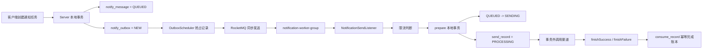
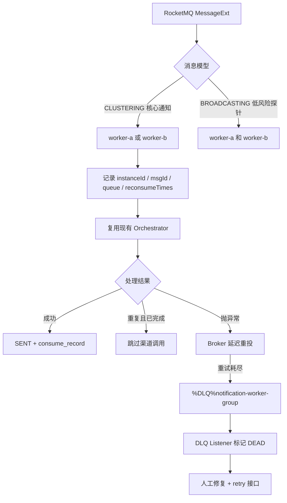

# Day20：RocketMQ 消息模型与可靠性实战（完整教学版）

> 真实代码基线：`59e3199fbc104cdb9d6bdc11801efaf94bf14887`
>
> 学习范围：基于现有 RocketMQ、Outbox、消费幂等、渠道重试和人工恢复能力，完成双 Worker、集群消费、广播消费、Rebalance、重复投递、消费重试和死信实验；不引入 Redis Stream，也不重做 Day15～Day19 已完成的功能。

**学习计划对齐**

开始编写前，先对齐两份计划：

1. **30 天主计划**：前半程已经完成短链、缓存、布隆过滤器、点击统计、RocketMQ 基础、可靠性、限流、熔断和压测等内容；Day20 不再从零搭建 MQ，而是进入多实例可靠性验证。
2. **《多租户统一通知平台-补充学习计划》Day20**：要求启动两个 Worker，验证集群消费、广播消费、Rebalance、重复投递、消费异常、进程退出、重试、DLQ 和人工恢复。

本日最终要回答的面试题是：

> RocketMQ 集群消费与广播消费有什么区别，重复消费如何处理？

---

## 一、原理

### 1.1 集群消费不是“每个实例都消费一次”

同一个 `consumerGroup` 下的多个消费者构成一个消费组。使用 `MessageModel.CLUSTERING` 时，一条消息在这个消费组内只会分配给一个实例处理。

```text
notification-worker-group
├── worker-a：消费队列 0、2
└── worker-b：消费队列 1、3
```

RocketMQ 的负载均衡单位是 **MessageQueue**，不是单条消息。因此：

- Topic 有 4 个读队列、消费组有 2 个实例时，通常每个实例分到约 2 个队列；
- Topic 只有 2 个读队列、消费组有 3 个实例时，可能有 1 个实例空闲；
- 同组实例扩容、缩容或失联时，会触发 Rebalance，重新分配队列；
- Rebalance 期间，正在处理但尚未提交消费进度的消息可能被再次投递。

集群消费保证的是“同一消费组内分摊消息”，不是数据库意义上的“绝对只执行一次”。

### 1.2 广播消费是“在线实例各收到一份”

使用 `MessageModel.BROADCASTING` 时，每个在线实例都处理一遍消息：

```text
probe message
├── worker-a：处理一次
└── worker-b：处理一次
```

| 对比项 | 集群消费 | 广播消费 |
|---|---|---|
| 同一组内一条消息由几个实例处理 | 1 个 | 每个在线实例 |
| 是否分摊吞吐 | 是 | 否 |
| 典型用途 | 订单、通知发送、异步任务 | 本地配置刷新、低风险缓存提示、探针 |
| 实例离线时 | 其他实例可接管队列 | 离线实例可能错过广播 |
| 是否适合核心可靠业务 | 适合，但仍需幂等 | 不适合 |

因此，广播通知最多只能提示“本地缓存可能过期”。缓存正确性仍要由版本号、短 TTL、主动回源或定时校准兜底，不能把广播当作唯一真相。

### 1.3 RocketMQ 默认是至少一次，不是恰好一次

消费者完成业务后才返回成功，Broker 才能推进消费进度。下面这个窗口无法由 MQ 单独消除：

```text
调用供应商成功
    ↓
消费者还没把 SENT 写入数据库
    ↓
进程崩溃
    ↓
RocketMQ 再次投递同一事件
```

因此可靠消费必须接受“消息可能重复”，并在业务侧实现幂等。本项目已有三层防线：

1. **事件完成账本**：`notify_consume_record` 唯一键 `(consumer_group, event_id)`，拦截已经完整完成的事件；
2. **消息状态机与乐观锁**：`QUEUED -> SENDING -> SENT/RETRY_WAIT/DEAD`，阻止两个线程同时把同一消息推进到发送阶段；
3. **发送尝试幂等键**：`notify_send_record` 唯一键 `(tenant_id, message_id, attempt_no)`，同一次尝试复用 `messageNo:attemptNo`。

但还要明确一个边界：如果供应商已经成功，而本地最终事务尚未提交就宕机，消费者仍可能再次调用供应商。生产环境必须把 `idempotencyKey` 传给供应商，或在结果未知时按该键查询供应商状态。MQ、数据库唯一键都无法撤销一次已经发生的外部调用。

### 1.4 消费失败、重试与退避

当前 `NotificationSendListener` 的 `maxReconsumeTimes = 3`。监听器抛出异常后，RocketMQ Spring 会把本次消费标记为失败，Broker 稍后重新投递。

要区分两个数字：

- 首次投递：`reconsumeTimes = 0`；
- 最多重新消费 3 次：总尝试数最多是“首次 1 次 + 重试 3 次”。

当前代码没有显式指定下一次消费的 delay level，因此退避时间由 Broker 的重试策略决定。实验中应记录每次日志时间并计算间隔，不应把某一组秒数硬编码成业务承诺。

### 1.5 DLQ 与毒消息

消息在正常消费组内重试耗尽后，会进入：

```text
%DLQ%notification-worker-group
```

当前项目已经有 `NotificationDeadLetterListener`：它消费 DLQ，把仍处于 `SENDING` 的消息置为 `DEAD`，再由人工修正数据并调用手动重试接口。

本日选择的毒消息必须是**结构合法、业务处理持续失败**的事件，例如接收人以 `exception-always:` 开头。不要用乱码 JSON 做主实验，因为当前 DLQ 监听器也需要先反序列化 `NotificationSendEvent`；乱码进入 DLQ 后，它仍会反序列化失败，并可能继续进入 DLQ 消费组自己的死信队列。

生产级演进可以新增“原始死信隔离表”，按 `msgId + 原始 body + 异常信息` 落库，不依赖业务对象反序列化，但不属于 Day20 的必做范围。

### 1.6 Worker 实例名为什么要显式设置

RocketMQ Spring 2.3.3 在集群模式下会为默认实例名追加进程 PID，两个独立 JVM 通常不会冲突；广播模式不会依赖这套自动处理。为了让日志、Dashboard 和实验结果都能明确区分 `worker-a`、`worker-b`，本次通过生命周期回调给每个监听器显式设置唯一实例名。

不要直接在 `@RocketMQMessageListener(instanceName = "${...}")` 中写占位符：当前项目所用版本不会像 `topic`、`consumerGroup` 那样解析该属性。应在 `prepareStart` 中调用 `DefaultMQPushConsumer#setInstanceName`。

### 1.7 本地环境的可靠性边界

`deploy/docker-compose.yml` 当前只有单 Nameserver、单 Broker，且 Broker 是 `ASYNC_MASTER + ASYNC_FLUSH`。Day20 验证的是**消费者多实例行为与业务幂等**，不代表 Broker 已经具备主从切换、同步刷盘或生产级高可用能力。

---

## 二、现有数据流

### 2.1 正常通知发送数据流



关键点：Server 创建 `notify_message` 和 `notify_outbox` 在同一数据库事务中；Outbox 发布成功后才改为 `PUBLISHED`；Worker 的渠道调用位于数据库事务之外。

### 2.2 当前重复投递数据流

```text
同一 eventId 再次到达
    ├── consume_record 已存在
    │      └── prepare 返回 Optional.empty，不再调用渠道
    └── consume_record 不存在且 message = SENDING
           └── 复用原 PROCESSING send_record 和相同 idempotencyKey
```

这正是 Day20 可以复用的幂等基础，不需要再发明一套 Redis 消费锁。

### 2.3 当前重试和死信数据流

```text
监听器抛异常
    ↓
RocketMQ 重新投递同一 event
    ↓ 超过 maxReconsumeTimes
%DLQ%notification-worker-group
    ↓
NotificationDeadLetterListener
    ↓
message: SENDING -> DEAD
send_record: PROCESSING -> FAILED
    ↓ 修正故障原因
POST /api/v1/notification-messages/{messageId}/retry
    ↓
DEAD -> QUEUED，并创建新 Outbox、新 eventId
```

### 2.4 当前代码缺少的观测证据

现有监听器只接收 `String`，日志只能看到 payload，缺少：

- 哪个 Worker 实例消费；
- RocketMQ `msgId`；
- `queueId` 和 `queueOffset`；
- `reconsumeTimes`；
- 广播模式对照组。

所以本日不是修改核心事务，而是补齐“能看见、能比较、能验收”的实验能力。

---

## 三、本次需要改动的数据流

### 3.1 改动后的整体数据流



### 3.2 集群消费数据流

两个 Worker 使用同一个 `notification-worker-group`：

```text
event-1 -> worker-a
event-2 -> worker-b
event-3 -> worker-a
event-4 -> worker-b
```

同一条消息不会因为有两个实例就正常执行两遍；如果某个实例处理中退出，未提交进度的消息会在 Rebalance 后被重新投递，业务幂等负责吸收重复。

### 3.3 广播探针数据流

新增独立 Topic 和独立 Group，只打印低风险探针，不写业务表、不刷新关键缓存：

```text
notification-worker-probe-topic
    ├── worker-a：打印 probe
    └── worker-b：打印 probe
```

它与核心通知 Topic 完全隔离，避免误把广播模式用于通知发送。

### 3.4 重复与毒消息数据流

```text
复制已成功事件再次发送
    -> consume_record 命中
    -> 日志显示“重复投递已拦截”
    -> 不出现第二次“开始调用渠道”

exception-always 合法事件
    -> 同一 eventId 多次投递
    -> reconsumeTimes 递增
    -> 重试耗尽进入 DLQ
    -> message = DEAD
    -> 修正 receiver
    -> 人工 retry 创建新 eventId
    -> 最终 SENT
```

---

## 四、文件位置（复用 / 新增 / 修改）

| 类型 | 文件 | 作用 |
|---|---|---|
| 复用 | `notification-server/src/main/java/com/tam/notification/outbox/OutboxScheduler.java` | 继续负责 Outbox 发布，不修改 |
| 复用 | `notification-worker/src/main/java/com/tam/notification/service/MessageSendTransactionService.java` | 复用消费完成账本、状态机、发送尝试幂等和 DLQ 落库 |
| 复用 | `notification-worker/src/main/java/com/tam/notification/service/NotificationRateLimitService.java` | 保留现有限流顺序 |
| 复用 | `notification-server/src/main/java/com/tam/notification/service/NotificationManualRetryService.java` | 复用 DEAD 人工恢复能力 |
| 复用 | `notification-channel/src/main/java/com/tam/notification/channel/AbstractMockChannelSender.java` | 复用 `provider-slow:`、`exception-once:`、`exception-always:` 故障注入 |
| 新增 | `notification-worker/src/main/java/com/tam/notification/listener/WorkerIdentity.java` | 统一 Worker 实例身份并配置 RocketMQ instanceName |
| 修改 | `notification-worker/src/main/java/com/tam/notification/listener/NotificationSendListener.java` | 改为接收 `MessageExt`，输出实例和重试元数据 |
| 修改 | `notification-worker/src/main/java/com/tam/notification/listener/NotificationDeadLetterListener.java` | 输出 DLQ 元数据并配置唯一实例名 |
| 修改 | `notification-worker/src/main/java/com/tam/notification/service/NotificationSendOrchestrator.java` | 增加“开始渠道调用”和“重复投递拦截”证据日志 |
| 新增 | `notification-worker/src/main/java/com/tam/notification/listener/WorkerProbeBroadcastListener.java` | 可开关的广播探针，不修改业务数据 |
| 修改 | `notification-worker/src/main/resources/application.yml` | 增加 Worker 身份和广播探针配置 |
| 新增 | `notification-worker/src/test/java/com/tam/notification/listener/NotificationSendListenerTest.java` | 验证 MessageExt 解析、上下文清理和生命周期配置 |
| 新增 | `notification-worker/src/test/java/com/tam/notification/service/NotificationSendOrchestratorTest.java` | 验证已完成重复事件不会调用渠道 |

---

## 五、基于现有代码的完整增量代码

### 5.1 新增 WorkerIdentity

文件：`notification-worker/src/main/java/com/tam/notification/listener/WorkerIdentity.java`

```java
package com.tam.notification.listener;

import org.apache.rocketmq.client.consumer.DefaultMQPushConsumer;
import org.springframework.beans.factory.annotation.Value;
import org.springframework.stereotype.Component;
import org.springframework.util.StringUtils;

/**
 * Worker 实例身份。
 *
 * 一个 Worker JVM 内有普通、DLQ、广播等多个 Consumer，
 * 因此最终 instanceName 使用“实例 ID + 监听器角色”，避免同进程内重名。
 */
@Component
public class WorkerIdentity {

    private final String instanceId;

    public WorkerIdentity(
            @Value("${notification.worker.instance-id}") String instanceId
    ) {
        if (!StringUtils.hasText(instanceId)) {
            // 身份为空时直接启动失败，比两个实例悄悄使用同名更容易排查。
            throw new IllegalArgumentException("notification.worker.instance-id 不能为空");
        }
        this.instanceId = instanceId.trim();
    }

    public String instanceId() {
        return instanceId;
    }

    /**
     * RocketMQ Spring 2.3.3 不会解析注解 instanceName 中的占位符，
     * 所以必须在 Consumer 启动前通过生命周期回调设置。
     */
    public void configure(
            DefaultMQPushConsumer consumer,
            String listenerRole
    ) {
        consumer.setInstanceName(instanceId + "-" + listenerRole);
    }
}
```

### 5.2 完整修改 NotificationSendListener

文件：`notification-worker/src/main/java/com/tam/notification/listener/NotificationSendListener.java`

```java
package com.tam.notification.listener;

import com.fasterxml.jackson.core.JsonProcessingException;
import com.fasterxml.jackson.databind.ObjectMapper;
import com.tam.notification.common.tenant.TenantContext;
import com.tam.notification.common.trace.TraceContext;
import com.tam.notification.domain.outbox.NotificationSendEvent;
import com.tam.notification.service.NotificationSendOrchestrator;
import lombok.RequiredArgsConstructor;
import lombok.extern.slf4j.Slf4j;
import org.apache.rocketmq.client.consumer.DefaultMQPushConsumer;
import org.apache.rocketmq.common.message.MessageExt;
import org.apache.rocketmq.spring.annotation.ConsumeMode;
import org.apache.rocketmq.spring.annotation.MessageModel;
import org.apache.rocketmq.spring.annotation.RocketMQMessageListener;
import org.apache.rocketmq.spring.core.RocketMQListener;
import org.apache.rocketmq.spring.core.RocketMQPushConsumerLifecycleListener;
import org.springframework.stereotype.Component;

import java.nio.charset.StandardCharsets;

@Slf4j
@Component
@RequiredArgsConstructor
@RocketMQMessageListener(
        topic = "${notification.mq.topic}",
        consumerGroup = "${notification.mq.consumer-group}",
        messageModel = MessageModel.CLUSTERING,
        consumeMode = ConsumeMode.CONCURRENTLY,
        maxReconsumeTimes = 3
)
public class NotificationSendListener implements
        RocketMQListener<MessageExt>,
        RocketMQPushConsumerLifecycleListener {

    private final ObjectMapper objectMapper;
    private final NotificationSendOrchestrator sendOrchestrator;
    private final WorkerIdentity workerIdentity;

    @Override
    public void prepareStart(DefaultMQPushConsumer consumer) {
        // 显式设置实例名，Dashboard 和日志都能区分 worker-a / worker-b。
        workerIdentity.configure(consumer, "notification-send");
    }

    @Override
    public void onMessage(final MessageExt message) {
        String payload = new String(message.getBody(), StandardCharsets.UTF_8);
        NotificationSendEvent event = deserialize(payload);

        log.info(
                "收到通知消息，worker={}, eventId={}, messageId={}, mqMsgId={}, "
                        + "queueId={}, queueOffset={}, reconsumeTimes={}",
                workerIdentity.instanceId(),
                event.eventId(),
                event.messageId(),
                message.getMsgId(),
                message.getQueueId(),
                message.getQueueOffset(),
                message.getReconsumeTimes()
        );

        try {
            TenantContext.setTenantId(event.tenantId());
            if (event.traceId() != null) {
                TraceContext.setTraceId(event.traceId());
            }

            // 不吞异常：异常必须继续抛给 RocketMQ，才能触发重投和 DLQ。
            sendOrchestrator.send(event);
        } finally {
            // MQ 消费线程会复用，不清理会造成跨租户、跨 Trace 串线。
            TenantContext.clear();
            TraceContext.clear();
        }
    }

    private NotificationSendEvent deserialize(final String payload) {
        try {
            return objectMapper.readValue(payload, NotificationSendEvent.class);
        } catch (JsonProcessingException exception) {
            throw new IllegalArgumentException("Invalid MQ message", exception);
        }
    }
}
```

为什么改成 `MessageExt`：业务 body 仍然是原来的 JSON，但现在可以同时读取 `msgId`、队列、偏移量和重试次数。不要在这里 `catch (Exception)` 后只打印日志，否则 RocketMQ 会把失败误判为成功。

### 5.3 完整修改 NotificationDeadLetterListener

文件：`notification-worker/src/main/java/com/tam/notification/listener/NotificationDeadLetterListener.java`

```java
package com.tam.notification.listener;

import com.fasterxml.jackson.core.JsonProcessingException;
import com.fasterxml.jackson.databind.ObjectMapper;
import com.tam.notification.common.tenant.TenantContext;
import com.tam.notification.common.trace.TraceContext;
import com.tam.notification.domain.outbox.NotificationSendEvent;
import com.tam.notification.service.MessageSendTransactionService;
import lombok.RequiredArgsConstructor;
import lombok.extern.slf4j.Slf4j;
import org.apache.rocketmq.client.consumer.DefaultMQPushConsumer;
import org.apache.rocketmq.common.message.MessageExt;
import org.apache.rocketmq.spring.annotation.ConsumeMode;
import org.apache.rocketmq.spring.annotation.MessageModel;
import org.apache.rocketmq.spring.annotation.RocketMQMessageListener;
import org.apache.rocketmq.spring.core.RocketMQListener;
import org.apache.rocketmq.spring.core.RocketMQPushConsumerLifecycleListener;
import org.springframework.beans.factory.annotation.Value;
import org.springframework.stereotype.Component;

import java.nio.charset.StandardCharsets;

@Slf4j
@Component
@RequiredArgsConstructor
@RocketMQMessageListener(
        topic = "%DLQ%${notification.mq.consumer-group}",
        consumerGroup = "${notification.mq.dlq-consumer-group}",
        messageModel = MessageModel.CLUSTERING,
        consumeMode = ConsumeMode.CONCURRENTLY,
        maxReconsumeTimes = 3
)
public class NotificationDeadLetterListener implements
        RocketMQListener<MessageExt>,
        RocketMQPushConsumerLifecycleListener {

    private final ObjectMapper objectMapper;
    private final MessageSendTransactionService transactionService;
    private final WorkerIdentity workerIdentity;

    @Value("${notification.mq.dlq-consumer-group}")
    private String dlqConsumerGroup;

    @Override
    public void prepareStart(DefaultMQPushConsumer consumer) {
        workerIdentity.configure(consumer, "notification-dlq");
    }

    @Override
    public void onMessage(final MessageExt message) {
        String payload = new String(message.getBody(), StandardCharsets.UTF_8);
        NotificationSendEvent event = deserialize(payload);

        log.error(
                "收到通知死信，worker={}, eventId={}, messageId={}, mqMsgId={}, "
                        + "queueId={}, queueOffset={}, reconsumeTimes={}",
                workerIdentity.instanceId(),
                event.eventId(),
                event.messageId(),
                message.getMsgId(),
                message.getQueueId(),
                message.getQueueOffset(),
                message.getReconsumeTimes()
        );

        try {
            TenantContext.setTenantId(event.tenantId());
            if (event.traceId() != null) {
                TraceContext.setTraceId(event.traceId());
            }

            // 已成功完成的消息不会被状态倒退；SENDING 才会被标记为 DEAD。
            transactionService.finishDeadLetter(event, dlqConsumerGroup);
            log.error(
                    "通知死信已落库，eventId={}, messageId={}",
                    event.eventId(),
                    event.messageId()
            );
        } finally {
            TenantContext.clear();
            TraceContext.clear();
        }
    }

    private NotificationSendEvent deserialize(String payload) {
        try {
            return objectMapper.readValue(payload, NotificationSendEvent.class);
        } catch (JsonProcessingException exception) {
            throw new IllegalArgumentException("Invalid DLQ message", exception);
        }
    }
}
```

### 5.4 完整修改 NotificationSendOrchestrator

文件：`notification-worker/src/main/java/com/tam/notification/service/NotificationSendOrchestrator.java`

本次只增加证据日志，不改变原有事务边界和业务判断。

```java
package com.tam.notification.service;

import com.tam.notification.domain.channel.ChannelSendCommand;
import com.tam.notification.domain.channel.ChannelSendResult;
import com.tam.notification.domain.channel.ChannelSendResultType;
import com.tam.notification.domain.outbox.NotificationSendEvent;
import com.tam.notification.model.PreparedSend;
import com.tam.notification.resilience.ResilientChannelSendService;
import lombok.RequiredArgsConstructor;
import lombok.extern.slf4j.Slf4j;
import org.springframework.beans.factory.annotation.Value;
import org.springframework.stereotype.Service;

import java.util.Optional;

@Slf4j
@Service
@RequiredArgsConstructor
public class NotificationSendOrchestrator {

    private final MessageSendTransactionService transactionService;
    private final ResilientChannelSendService channelSendService;
    private final NotificationRateLimitService rateLimitService;

    @Value("${notification.mq.consumer-group}")
    private String consumerGroup;

    /**
     * 组织“限流 -> 准备事务 -> 事务外渠道调用 -> 完成事务”。
     */
    public void send(NotificationSendEvent event) {
        // 限流必须位于 prepare 之前，避免限流消息提前进入 SENDING。
        if (!rateLimitService.allowOrDefer(event)) {
            return;
        }

        Optional<PreparedSend> optional = transactionService.prepare(
                event,
                consumerGroup
        );

        if (optional.isEmpty()) {
            // consume_record 已存在，说明同一消费组已经完整处理过该 event。
            log.info(
                    "重复投递已被消费记录拦截，eventId={}, messageId={}",
                    event.eventId(),
                    event.messageId()
            );
            return;
        }

        PreparedSend prepared = optional.get();
        log.info(
                "开始调用渠道，eventId={}, messageId={}, attemptNo={}, idempotencyKey={}",
                event.eventId(),
                prepared.messageId(),
                prepared.attemptNo(),
                prepared.idempotencyKey()
        );

        ChannelSendResult result = channelSendService.send(
                new ChannelSendCommand(
                        prepared.messageId(),
                        prepared.attemptNo(),
                        prepared.idempotencyKey(),
                        prepared.channelType(),
                        prepared.receiver(),
                        prepared.content()
                )
        );

        if (result.type() == ChannelSendResultType.SUCCESS) {
            transactionService.finishSuccess(
                    event,
                    consumerGroup,
                    prepared,
                    result
            );
            return;
        }

        transactionService.finishFailure(
                event,
                consumerGroup,
                prepared,
                result
        );
    }
}
```

### 5.5 新增广播探针监听器

文件：`notification-worker/src/main/java/com/tam/notification/listener/WorkerProbeBroadcastListener.java`

```java
package com.tam.notification.listener;

import lombok.RequiredArgsConstructor;
import lombok.extern.slf4j.Slf4j;
import org.apache.rocketmq.client.consumer.DefaultMQPushConsumer;
import org.apache.rocketmq.common.message.MessageExt;
import org.apache.rocketmq.spring.annotation.ConsumeMode;
import org.apache.rocketmq.spring.annotation.MessageModel;
import org.apache.rocketmq.spring.annotation.RocketMQMessageListener;
import org.apache.rocketmq.spring.core.RocketMQListener;
import org.apache.rocketmq.spring.core.RocketMQPushConsumerLifecycleListener;
import org.springframework.boot.autoconfigure.condition.ConditionalOnProperty;
import org.springframework.stereotype.Component;

import java.nio.charset.StandardCharsets;

/**
 * 广播消费只用于低风险教学探针。
 *
 * 这里故意不写数据库、不调用渠道，也不承担缓存正确性，
 * 防止把广播模式误用到核心通知发送链路。
 */
@Slf4j
@Component
@RequiredArgsConstructor
@ConditionalOnProperty(
        prefix = "notification.mq.broadcast-probe",
        name = "enabled",
        havingValue = "true"
)
@RocketMQMessageListener(
        topic = "${notification.mq.broadcast-probe.topic}",
        consumerGroup = "${notification.mq.broadcast-probe.consumer-group}",
        messageModel = MessageModel.BROADCASTING,
        consumeMode = ConsumeMode.CONCURRENTLY
)
public class WorkerProbeBroadcastListener implements
        RocketMQListener<MessageExt>,
        RocketMQPushConsumerLifecycleListener {

    private final WorkerIdentity workerIdentity;

    @Override
    public void prepareStart(DefaultMQPushConsumer consumer) {
        // 广播实例必须显式区分，否则两个本地 JVM 可能使用相同实例名。
        workerIdentity.configure(consumer, "broadcast-probe");
    }

    @Override
    public void onMessage(MessageExt message) {
        String payload = new String(message.getBody(), StandardCharsets.UTF_8);

        log.info(
                "收到广播探针，worker={}, payload={}, mqMsgId={}, queueId={}, queueOffset={}",
                workerIdentity.instanceId(),
                payload,
                message.getMsgId(),
                message.getQueueId(),
                message.getQueueOffset()
        );
    }
}
```

### 5.6 修改 application.yml

文件：`notification-worker/src/main/resources/application.yml`

将 `notification:` 下的开头部分调整为下面内容，后面的 `send`、`retry`、`rate-limit`、`channel-resilience` 和 `shortlink` 配置保持不变：

```yaml
notification:
  worker:
    # 实验时显式传 WORKER_INSTANCE_ID=worker-a / worker-b。
    # 未传时使用随机 UUID，保证两个本地 JVM 不会重名。
    instance-id: ${WORKER_INSTANCE_ID:${random.uuid}}

  mq:
    topic: notification-send-topic
    consumer-group: notification-worker-group
    dlq-consumer-group: notification-worker-dlq-group

    broadcast-probe:
      # 默认关闭，避免普通开发启动额外 Consumer。
      enabled: ${MQ_BROADCAST_PROBE_ENABLED:false}
      topic: notification-worker-probe-topic
      consumer-group: notification-worker-probe-broadcast-group

  send:
    max-attempts: 3
```

### 5.7 新增 NotificationSendListenerTest

文件：`notification-worker/src/test/java/com/tam/notification/listener/NotificationSendListenerTest.java`

```java
package com.tam.notification.listener;

import com.fasterxml.jackson.databind.ObjectMapper;
import com.tam.notification.common.tenant.TenantContext;
import com.tam.notification.common.trace.TraceContext;
import com.tam.notification.domain.outbox.NotificationSendEvent;
import com.tam.notification.service.NotificationSendOrchestrator;
import org.apache.rocketmq.client.consumer.DefaultMQPushConsumer;
import org.apache.rocketmq.common.message.MessageExt;
import org.junit.jupiter.api.AfterEach;
import org.junit.jupiter.api.Test;

import java.nio.charset.StandardCharsets;

import static org.junit.jupiter.api.Assertions.assertEquals;
import static org.junit.jupiter.api.Assertions.assertNull;
import static org.mockito.Mockito.doAnswer;
import static org.mockito.Mockito.mock;
import static org.mockito.Mockito.verify;
import static org.mockito.Mockito.when;

class NotificationSendListenerTest {

    @AfterEach
    void clearContext() {
        TenantContext.clear();
        TraceContext.clear();
    }

    @Test
    void shouldDeserializeMessageExtAndClearThreadContext() throws Exception {
        ObjectMapper objectMapper = new ObjectMapper().findAndRegisterModules();
        NotificationSendOrchestrator orchestrator = mock(
                NotificationSendOrchestrator.class
        );
        WorkerIdentity workerIdentity = mock(WorkerIdentity.class);
        when(workerIdentity.instanceId()).thenReturn("worker-a");

        NotificationSendListener listener = new NotificationSendListener(
                objectMapper,
                orchestrator,
                workerIdentity
        );

        NotificationSendEvent event = new NotificationSendEvent(
                "event-20",
                1001L,
                2001L,
                3001L,
                4001L,
                "MSG_DAY20",
                "NOTIFICATION_SEND",
                "trace-day20",
                null
        );

        MessageExt message = new MessageExt();
        message.setBody(
                objectMapper.writeValueAsString(event)
                        .getBytes(StandardCharsets.UTF_8)
        );
        message.setMsgId("mq-msg-20");
        message.setQueueId(1);
        message.setQueueOffset(20L);
        message.setReconsumeTimes(2);

        // 在 Orchestrator 执行时，上下文必须已经恢复。
        doAnswer(invocation -> {
            assertEquals(1001L, TenantContext.requireTenantId());
            assertEquals("trace-day20", TraceContext.getTraceId());
            return null;
        }).when(orchestrator).send(event);

        listener.onMessage(message);

        verify(orchestrator).send(event);
        // 消费线程会复用，所以执行结束后必须清空。
        assertNull(TenantContext.getTenantId());
        assertNull(TraceContext.getTraceId());
    }

    @Test
    void shouldConfigureConsumerBeforeStart() {
        ObjectMapper objectMapper = mock(ObjectMapper.class);
        NotificationSendOrchestrator orchestrator = mock(
                NotificationSendOrchestrator.class
        );
        WorkerIdentity workerIdentity = mock(WorkerIdentity.class);
        DefaultMQPushConsumer consumer = mock(DefaultMQPushConsumer.class);

        NotificationSendListener listener = new NotificationSendListener(
                objectMapper,
                orchestrator,
                workerIdentity
        );

        listener.prepareStart(consumer);

        verify(workerIdentity).configure(
                consumer,
                "notification-send"
        );
    }
}
```

### 5.8 新增 NotificationSendOrchestratorTest

文件：`notification-worker/src/test/java/com/tam/notification/service/NotificationSendOrchestratorTest.java`

```java
package com.tam.notification.service;

import com.tam.notification.domain.outbox.NotificationSendEvent;
import com.tam.notification.resilience.ResilientChannelSendService;
import org.junit.jupiter.api.BeforeEach;
import org.junit.jupiter.api.Test;
import org.junit.jupiter.api.extension.ExtendWith;
import org.mockito.InjectMocks;
import org.mockito.Mock;
import org.mockito.junit.jupiter.MockitoExtension;
import org.springframework.test.util.ReflectionTestUtils;

import java.util.Optional;

import static org.mockito.ArgumentMatchers.any;
import static org.mockito.ArgumentMatchers.anyString;
import static org.mockito.Mockito.never;
import static org.mockito.Mockito.verify;
import static org.mockito.Mockito.verifyNoInteractions;
import static org.mockito.Mockito.when;

@ExtendWith(MockitoExtension.class)
class NotificationSendOrchestratorTest {

    @Mock
    private MessageSendTransactionService transactionService;

    @Mock
    private ResilientChannelSendService channelSendService;

    @Mock
    private NotificationRateLimitService rateLimitService;

    @InjectMocks
    private NotificationSendOrchestrator orchestrator;

    @BeforeEach
    void setUp() {
        ReflectionTestUtils.setField(
                orchestrator,
                "consumerGroup",
                "notification-worker-group"
        );
    }

    @Test
    void shouldNotCallChannelWhenCompletedEventIsDeliveredAgain() {
        NotificationSendEvent event = new NotificationSendEvent(
                "completed-event",
                1001L,
                2001L,
                3001L,
                4001L,
                "MSG_COMPLETED",
                "NOTIFICATION_SEND",
                "trace-completed",
                null
        );

        when(rateLimitService.allowOrDefer(event)).thenReturn(true);
        // Optional.empty 代表 consume_record 已经存在。
        when(transactionService.prepare(
                event,
                "notification-worker-group"
        )).thenReturn(Optional.empty());

        orchestrator.send(event);

        verifyNoInteractions(channelSendService);
        verify(transactionService, never()).finishSuccess(
                any(),
                anyString(),
                any(),
                any()
        );
        verify(transactionService, never()).finishFailure(
                any(),
                anyString(),
                any(),
                any()
        );
    }
}
```

> 这里直接验证“渠道服务零交互”，比只断言最终状态仍是 `SENT` 更有价值，因为后者无法证明渠道没有被多调一次。

---

## 六、实验验证

### 6.1 先运行自动化测试

```bash
mvn -pl notification-worker -am test
```

预期：所有测试通过，新增两个测试类没有失败。

### 6.2 启动基础设施和 Server

终端 1：

```bash
docker compose -f deploy/docker-compose.yml up -d
mvn -pl notification-server -am spring-boot:run
```

确认：

```bash
curl http://localhost:8080/actuator/health
```

预期 `status` 为 `UP`。

### 6.3 启动两个 Worker 实例

先安装一次公共模块，避免两个 Maven Reactor 同时构建：

```bash
mvn -pl notification-worker -am install -DskipTests
```

终端 2：

```bash
cd notification-worker
WORKER_INSTANCE_ID=worker-a \
SERVER_PORT=8081 \
MQ_BROADCAST_PROBE_ENABLED=true \
mvn spring-boot:run
```

终端 3：

```bash
cd notification-worker
WORKER_INSTANCE_ID=worker-b \
SERVER_PORT=8082 \
MQ_BROADCAST_PROBE_ENABLED=true \
mvn spring-boot:run
```

检查：

```bash
curl http://localhost:8081/actuator/health
curl http://localhost:8082/actuator/health
```

验收点：RocketMQ Dashboard 的 Consumer 页面能看到同组两个连接；日志和连接名可以区分 `worker-a`、`worker-b`。

### 6.4 实验一：验证集群消费

先查询当前租户下真实可用的应用和模板，不要编造 ID：

```bash
docker exec notification-mysql mysql \
  -unotification -pnotification123 notification_platform \
  -e "SELECT a.tenant_id, a.id AS application_id, t.id AS template_id, t.channel_type, t.template_content, t.variable_schema FROM sys_application a JOIN notify_template t ON t.application_id = a.id WHERE a.status = 1 AND a.deleted = 0 AND t.status = 1 AND t.deleted = 0;"
```

把下面 JSON 中的 `1001`、`2001` 替换为上一步查到的真实 `application_id`、`template_id`，请求头中的租户也替换为真实 `tenant_id`；如果模板变量不是 `name`，同时按查到的 `variable_schema` 调整 `params`：

```bash
curl -X POST http://localhost:8080/api/v1/notification-tasks \
  -H 'Content-Type: application/json' \
  -H 'X-Tenant-Id: 10001' \
  -H 'X-Trace-Id: day20-cluster' \
  -d '{
    "requestId": "day20-cluster-001",
    "applicationId": 2086071089218437122,
    "templateId": 2086073795832168450,
    "recipients": [
      {"receiver": "13800138001", "params": {"name": "A", "orderNo": "0001", "amount": "1000"}},
      {"receiver": "13800138002", "params": {"name": "B", "orderNo": "0002", "amount": "2000"}},
      {"receiver": "13800138003", "params": {"name": "C", "orderNo": "0003", "amount": "3000"}},
      {"receiver": "13800138004", "params": {"name": "D", "orderNo": "0004", "amount": "4000"}},
      {"receiver": "13800138005", "params": {"name": "E", "orderNo": "0005", "amount": "5000"}},
      {"receiver": "13800138006", "params": {"name": "F", "orderNo": "0006", "amount": "6000"}},
      {"receiver": "13800138007", "params": {"name": "G", "orderNo": "0007", "amount": "7000"}},
      {"receiver": "13800138008", "params": {"name": "H", "orderNo": "0008", "amount": "8000"}}
    ]
  }'
```

观察两个 Worker：两边都应处理到部分消息，但同一个 `eventId` 正常情况下只出现在一个 Worker 的首次消费日志中。

数据库验收：

```bash
docker exec notification-mysql mysql \
  -unotification -pnotification123 notification_platform \
  -e "SELECT m.id, m.message_status, COUNT(DISTINCT cr.id) AS consume_rows, COUNT(DISTINCT sr.id) AS send_rows FROM notify_task t JOIN notify_message m ON m.task_id = t.id LEFT JOIN notify_consume_record cr ON cr.message_id = m.id AND cr.consumer_group = 'notification-worker-group' LEFT JOIN notify_send_record sr ON sr.message_id = m.id WHERE t.request_id = 'day20-cluster-001' GROUP BY m.id, m.message_status ORDER BY m.id;"
```

预期每条消息：

- `message_status = SENT`；
- `consume_rows = 1`；
- `send_rows = 1`。

### 6.5 实验二：验证广播消费

打开 [RocketMQ Dashboard](http://localhost:6060)。Dashboard 的发送页面通常只能选择已存在的 Topic，所以先创建下面这个实验 Topic：

```text
notification-worker-probe-topic
```

创建步骤：进入顶部 **主题** → 点击 **新增/更新主题** → 集群选择 `DefaultCluster`、Broker 选择 `broker-a`、Topic 填入 `notification-worker-probe-topic`、读写队列数都填 `4` → 提交。它是一次 Dashboard 运维操作，**不需要为 Day20 额外编写创建 Topic 的业务代码**；监听器只负责订阅和消费。

当前 `deploy/rocketmq/broker.conf` 虽然已配置 `autoCreateTopicEnable=true`，但这只表示生产者首次发送时 Broker 可以自动建 Topic；Dashboard 的下拉框未必能选到一个尚不存在的 Topic，因此本实验先手工创建最清晰、最稳定。

如果你以后关闭了自动建 Topic（生产环境通常会关闭），再由运维或管理员在 Dashboard / `mqadmin` 中预先创建该 Topic，并明确读写队列数。

创建完成后，在 **主题** 列表找到该 Topic，点击该行的 **发送消息**，消息体填写：

```text
day20-probe-001
```

预期 `worker-a`、`worker-b` 都出现一次：

```text
收到广播探针，worker=worker-a, payload=day20-probe-001, ...
收到广播探针，worker=worker-b, payload=day20-probe-001, ...
```

然后停止 `worker-b`，发送 `day20-probe-offline`，再启动 `worker-b`。不要把“离线实例稍后一定补到广播”作为可靠性假设；这个实验的结论正是广播不能承载核心通知。

### 6.6 实验三：观察 Rebalance

1. 保持两个 Worker 在线，再创建一批普通通知；
2. 记录两个实例日志中的 `queueId`；
3. 在 `worker-b` 终端按 `Ctrl+C` 正常停止；
4. 继续创建一批通知；
5. 观察原先由 `worker-b` 处理的队列重新分给 `worker-a`；
6. 重新启动 `worker-b`，再次观察队列重新分配。

验收结论：Rebalance 的对象是队列；实例数量大于读队列数量时，新增实例不一定提升吞吐。

### 6.7 实验四：处理完成前进程退出与重新投递

创建一条慢调用消息，把接收人设为当前模板渠道对应的慢调用格式：

```text
SMS:    provider-slow:mock-sms-primary:13800138000
EMAIL:  provider-slow:mock-email-primary:day20@example.com
IN_APP: provider-slow:in-app-primary:user-day20
```

看到某个 Worker 打印“开始调用渠道”后，在 2 秒超时前终止**这个确切进程**。为了模拟真实崩溃可使用 `kill -9 <准确PID>`，但必须先确认 PID，禁止使用 `pkill java` 之类会误杀其他 Java 项目的宽泛命令。

预期：

- 原 Worker 没有机会返回消费成功；
- Rebalance 后另一个 Worker 再次看到相同 `eventId`；
- `prepare` 发现消息已经是 `SENDING`，复用原 `PROCESSING` 发送记录；
- `attemptNo` 和 `idempotencyKey` 不变；
- 最终数据库只保留一条该 attempt 的发送记录。

注意：进程直接退出后从原 offset 重新拉取，日志中的 `reconsumeTimes` 不一定增加；判断重新投递的主证据应是相同 `eventId` 在另一个实例再次出现。只有消费者明确返回失败并进入 Broker 重试链路时，`reconsumeTimes` 才是最直接的重试证据。

### 6.8 实验五：重复投递不重复调用渠道

先找一条已经 `SENT` 的消息及其原始 Outbox payload：

```bash
docker exec notification-mysql mysql \
  -unotification -pnotification123 notification_platform \
  -e "SELECT o.event_id, o.payload FROM notify_outbox o JOIN notify_message m ON m.id = o.aggregate_id WHERE m.message_status = 'SENT' ORDER BY o.created_at DESC LIMIT 1;"
```

在 Dashboard 的 `notification-send-topic` 中原样粘贴并再次发送这段 payload。

预期日志：

```text
收到通知消息 ... 同一个 eventId ...
重复投递已被消费记录拦截 ...
```

该次重放后不应再次出现同一事件的“开始调用渠道”。再次查询：

```bash
MESSAGE_ID=123456789  # 替换为上一步查到的真实消息 ID

docker exec notification-mysql mysql \
  -unotification -pnotification123 notification_platform \
  -e "SELECT m.id, m.message_status, COUNT(DISTINCT cr.id) AS consume_rows, COUNT(DISTINCT sr.id) AS send_rows FROM notify_message m LEFT JOIN notify_consume_record cr ON cr.message_id = m.id AND cr.consumer_group = 'notification-worker-group' LEFT JOIN notify_send_record sr ON sr.message_id = m.id WHERE m.id = ${MESSAGE_ID} GROUP BY m.id, m.message_status;"
```

预期仍是：`SENT / consume_rows=1 / send_rows=1`。

### 6.9 实验六：毒消息重试、DLQ 与人工恢复

创建一条结构合法但渠道持续异常的消息：

```text
exception-always:13800138000
```

观察日志并记录：

| 次数 | 预期 `reconsumeTimes` | 结果 |
|---|---:|---|
| 首次 | 0 | 抛异常 |
| 重投 1 | 1 | 抛异常 |
| 重投 2 | 2 | 抛异常 |
| 重投 3 | 3 | 抛异常，随后进入 DLQ |

不要只看次数，还要记录四次日志时间，计算实际退避间隔。

DLQ 监听器成功处理后查询：

```bash
docker exec notification-mysql mysql \
  -unotification -pnotification123 notification_platform \
  -e "SELECT id, message_status, retry_count, failure_code, failure_reason FROM notify_message WHERE receiver LIKE 'exception-always:%' ORDER BY created_at DESC LIMIT 1;"
```

预期：

```text
message_status = DEAD
failure_code = MQ_RECONSUME_EXHAUSTED
```

人工恢复仅用于本地实验：先把故障接收人改成普通接收人，再调用现有重试接口。

```bash
MESSAGE_ID=123456789  # 替换为 DEAD 消息的真实 ID
TENANT_ID=1           # 替换为该消息所属的真实租户 ID

docker exec notification-mysql mysql \
  -unotification -pnotification123 notification_platform \
  -e "UPDATE notify_message SET receiver = '13800138000' WHERE id = ${MESSAGE_ID} AND message_status = 'DEAD';"

curl -X POST \
  -H "X-Tenant-Id: ${TENANT_ID}" \
  "http://localhost:8080/api/v1/notification-messages/${MESSAGE_ID}/retry"
```

预期：

- `DEAD -> QUEUED`；
- 新建一条 Outbox，使用新的 `eventId`；
- Worker 再次发送；
- 最终 `message_status = SENT`。

### 6.10 最终验收清单

- [ ] 两个 Worker 使用同一消费组时，同一普通事件只由一个实例首次处理；
- [ ] 每条成功消息只有一个正常消费完成账本和一个发送 attempt；
- [ ] Worker 上下线会触发队列重新分配；
- [ ] 处理完成前退出后，同一个事件能被另一个实例重新投递；
- [ ] 已完成事件原样重放时，不再次调用渠道；
- [ ] 合法毒消息经历首次消费和 3 次重投；
- [ ] 重试耗尽后进入 `%DLQ%notification-worker-group` 并落为 `DEAD`；
- [ ] 修正数据并调用手动重试接口后能恢复为 `SENT`；
- [ ] 广播探针被两个在线实例同时接收；
- [ ] 能解释为什么广播、单机内存缓存和 MQ 本身都不能提供跨系统 exactly-once。

---

## 七、面试追问

### 7.1 RocketMQ 集群消费与广播消费有什么区别？

集群模式下，同一消费组内多个实例共同分摊队列，一条消息正常只由其中一个实例处理，适合通知发送等核心任务。广播模式下，每个在线实例都处理一遍，适合本地配置刷新或低风险探针；离线实例可能错过，且不能天然形成全局唯一业务结果，所以不适合核心可靠业务。

### 7.2 两个 Worker 为什么仍可能处理到同一条消息？

RocketMQ 提供至少一次语义。消费超时、网络抖动、进程在提交进度前退出、Rebalance 或 Broker 重投都可能造成重复。集群模式只规定正常分摊方式，不等于 exactly-once。

### 7.3 本项目如何处理重复消费？

完成后的重复事件由 `notify_consume_record` 的 `(consumer_group, event_id)` 唯一约束拦截；处理中重投由消息状态机、乐观锁和唯一发送 attempt 约束协调；同一次发送复用 `messageNo:attemptNo` 作为供应商幂等键。

### 7.4 为什么不能只用 Redis 分布式锁解决重复消费？

锁只能限制某一时间段的并发，锁会过期、进程会崩溃，外部调用与本地事务也无法由 Redis 锁原子提交。可靠消费需要持久化状态、唯一约束、幂等键和可恢复状态机。锁可以降低竞争，但不能代替业务幂等。

### 7.5 消费者什么时候应该抛异常？

当结果未知或处理没有完整提交、希望 MQ 重投时应抛异常。若异常被捕获后只记录日志并正常返回，RocketMQ 会认为消费成功，消息不会再投递。明确的业务永久失败则可以落库为 `DEAD` 后正常返回，不必无限重投。

### 7.6 `maxReconsumeTimes = 3` 是总共消费 3 次吗？

不是。它表示最多重新消费 3 次，通常是首次 1 次加重投 3 次，总尝试数最多 4 次。

### 7.7 Rebalance 为什么可能带来重复？

队列从旧实例转移给新实例时，消费进度只记录到已提交的位置。旧实例已执行部分业务但尚未提交进度的消息，会从旧 offset 再次拉取，所以必须幂等。

### 7.8 消费组有 10 个实例就一定比 5 个快一倍吗？

不一定。并行度首先受 Topic 读队列数量限制；实例数超过队列数时会有实例拿不到队列。此外还受数据库、渠道线程池、限流、供应商 QPS 和网络影响。

### 7.9 DLQ 是最终解决方案吗？

不是。DLQ 只是把无法自动处理的消息隔离出来，防止阻塞正常链路。还需要告警、失败原因、原始消息、人工修复、重放接口、权限控制和审计，才能形成闭环。

### 7.10 为什么广播模式不适合刷新关键缓存？

广播只覆盖在线实例，实例离线或订阅异常时可能错过；重试和消费进度也不应被当成全局一致性协议。关键缓存必须用版本号防旧值覆盖、短 TTL 兜底、读时回源或定时全量校准。

### 7.11 数据库已经有唯一键，为什么供应商还要支持幂等键？

数据库唯一键只能保证本地记录不重复，不能撤销已发生的 HTTP/RPC 调用。如果供应商成功后 Worker 宕机，本地数据库不知道结果，重投时仍可能再次调用。供应商按幂等键返回同一结果，才能覆盖这个跨系统未知结果窗口。

### 7.12 如何证明系统不是“口头幂等”？

用故障实验给出证据：原样重放已完成 payload，确认日志没有第二次渠道调用；处理中杀死 Worker，确认相同事件在另一实例恢复；检查消费记录和发送 attempt 唯一；让毒消息重试耗尽进入 DLQ，再人工修复并恢复成功。

### 7.13 这个本地 RocketMQ 环境能证明 Broker 高可用吗？

不能。当前 Compose 是单 Nameserver、单异步 Master Broker。它只能验证客户端消费模型、重试、DLQ、Rebalance 和业务幂等；Broker 主从切换、同步复制、刷盘可靠性需要独立的多节点部署实验。

---

完成 Day20 后，应该形成一个清晰结论：**RocketMQ 负责可靠地“至少投递一次”，业务系统负责把“可能重复的执行”收敛成正确且可恢复的结果。**
