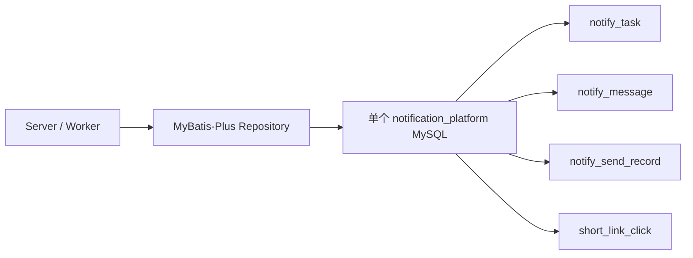
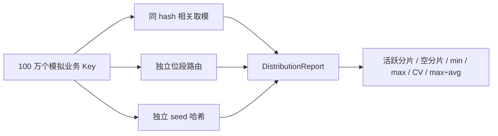

# Day22：分片路由数学与容量阈值（完整教学版）

> 真实代码基线：`9759b33dc8303cf4048032bbf0a68e3f37150361`
>
> 学习计划已对齐：原 30 天计划在 Day15～Day20 教学文档中保留的进度说明，以及《多租户统一通知平台-补充学习计划》Day22。Day21 暂时后移；Day22 只做容量证明和纯 Java 路由模拟，Day23 才接入 ShardingSphere。
>
> 本文只新增教学文档，不修改 `notification-platform` 或知识星球 `short_link` 的业务源码。文中的代码是你学习 Day22 时手动加入通知平台的完整增量，代码注释解释设计原因。

## 一、原理

### 1.1 分库分表的第一步不是选中间件，而是证明单表会成为瓶颈

“数据量大”不能直接推出“必须分片”。在决定分片前，至少要回答四个问题：

1. 每天新增多少行？
2. 数据保留多久？
3. 单行连同索引平均占多少字节？
4. 当前单表的写入、查询、DDL、备份和恢复是否已经无法满足 SLA？

保留期内的行数估算：

```text
保留行数 = 日新增行数 × 保留天数
```

存储量估算：

```text
表与索引空间 ≈ 保留行数 × 单行综合字节数
```

所需物理分片数不能只看行数：

```text
行数维度 = ceil(保留行数 / 单分片行数阈值)
空间维度 = ceil(总空间 / 单分片空间阈值)
吞吐维度 = ceil(峰值写 QPS / 单分片安全写 QPS)

所需分片数 = max(行数维度, 空间维度, 吞吐维度)
```

单表没有一个放之四海皆准的“2000 万行必分片”标准。字段宽度、索引数量、查询模式、磁盘、Buffer Pool、归档策略和 SLA 都会改变阈值。Day22 为通知平台采用一个**容量预警口径**，不是 MySQL 的物理极限：

```text
单表行数预警：5000 万行
单表+索引空间预警：50 GiB
```

达到预警线表示必须开始压测、归档或分片设计，不表示数据库会在这一刻突然不可用。

### 1.2 基于真实表结构建立容量模型

当前迁移脚本中的四类目标表是：

| 业务对象 | 真实表 | 增长关系 | 主要宽字段/索引 |
|---|---|---|---|
| 通知任务 | `notify_task` | 每个请求约 1 行 | requestId 唯一键、状态索引 |
| 消息明细 | `notify_message` | 每个接收人 1 行 | receiver、JSON 参数、渲染内容、多个索引 |
| 发送记录 | `notify_send_record` | 每次发送 attempt 1 行 | 幂等键、失败原因、两个唯一键 |
| 短链点击 | `short_link_click` | 每次点击 1 行 | eventId、visitorKey、链接时间查询索引 |

下面给出一套**容量演练口径**。这些数字是规划假设，不是当前训练项目的真实流量：

```text
通知任务：10 万/天
平均接收人：10 个/任务
消息明细：100 万/天
平均发送 attempt：1.2 次/消息
发送记录：120 万/天
短链点击：300 万/天
```

| 表 | 日增量 | 保留期 | 保留行数 | 综合行宽假设 | 估算空间 | 初步判断 |
|---|---:|---:|---:|---:|---:|---|
| `notify_task` | 10 万 | 365 天 | 3650 万 | 256 B | 约 8.7 GiB | 未越过预警线，优先归档 |
| `notify_message` | 100 万 | 180 天 | 1.8 亿 | 1.5 KiB | 约 257 GiB | 高增长候选 |
| `notify_send_record` | 120 万 | 180 天 | 2.16 亿 | 512 B | 约 103 GiB | 高增长附属表候选 |
| `short_link_click` | 300 万 | 30 天 | 9000 万 | 320 B | 约 26.8 GiB | 高写入，先考虑时间归档/分区 |

这个模型告诉我们：真正需要关注的是消息明细、发送记录和点击事实，不是把所有表一起分片。

### 1.3 为什么当前项目仍不应该直接上 32 × 256

`32 × 256` 代表：

```text
32 个数据库 × 每库 256 张表 = 8192 个物理数据节点
```

即使按上面的压力模型，`notify_message` 保留 1.8 亿行：

```text
1.8 亿 / 8192 ≈ 21973 行/表
```

每张表只有约 2.2 万行，却要承担 8192 个节点的建表、监控、DDL、连接池、备份、路由、扩容和故障排查成本，明显过度设计。

如果先用 Day23 的 `2 库 × 4 表 = 8 分片` 做 PoC：

```text
1.8 亿 / 8 = 2250 万行/分片
```

这更接近“每个分片仍有足够数据密度，同时低于 5000 万行预警线”的学习口径。生产分片数仍必须由真实流量、行宽和压测决定。

### 1.4 分片键不是“哪个字段均匀就选哪个”

好的分片键要同时考虑：

- 基数是否足够高；
- 写入是否均匀；
- 是否出现在高频等值查询中；
- 关联数据能否落在同一分片；
- 大租户或热点对象会不会独占单个分片；
- 扩容时能否稳定计算新旧路由。

结合当前真实查询语义：

| 表 | 候选分片键 | 优点 | 风险/结论 |
|---|---|---|---|
| `notify_task` | `tenant_id` | 租户查询直达 | 大租户热点，基数不足；当前不分片 |
| `notify_message` | `task_id` | 同任务消息聚合查询单分片 | 超大任务形成写热点 |
| `notify_message` | `id` | 全局唯一、写入容易打散 | 按 taskId 查询会跨分片 |
| `notify_send_record` | `message_id` | 同一消息的 attempts 同分片，点查直达 | 需要路由条件始终带 messageId；Day23 优先候选 |
| `short_link_click` | `short_link_id` | 单链接统计查询单分片 | 爆款链接会成为热点，需时间分区或热点拆分 |
| `short_link_click` | `event_id/id` | 写入均匀 | 按链接聚合会广播扫描 |

Day22 的结论不是一次性决定所有表，而是先选择 `notify_send_record.message_id` 作为 Day23 的高增长附属表候选；它与当前按 `messageId + attemptNo` 查询发送记录的代码一致。

### 1.5 同一个 hash 分别取库模和表模，为什么会相关

知识星球 `short_link/src/main/resources/sharding.yaml` 中保留了一组旧规则：

```text
dbIndex    = abs(shortCode.hashCode()) % 16
tableIndex = abs(shortCode.hashCode()) % 64
```

因为 `16` 可以整除 `64`：

```text
tableIndex % 16 == dbIndex
```

于是：

```text
db_0 只能命中 table_0、16、32、48
db_1 只能命中 table_1、17、33、49
...
```

理论上有：

```text
16 × 64 = 1024 个物理节点
```

实际上只有 64 个组合可达，另外 960 个节点永远是空的。这不是普通随机波动，而是路由公式从数学上限制了可达集合。

同理，若使用 4 库 × 16 表：

```text
dbIndex = h % 4
tableIndex = h % 16
```

只会命中 16/64 个节点。

### 1.6 修正方式一：从混合 hash 中取独立位段

当库数和表数都是 2 的幂时，可以先对业务键做 64 位混合，再用不重叠的位段：

```text
mixedHash = mix64(routingKey)

tableIndex = mixedHash 的低 tableBits 位
dbIndex    = mixedHash 再右移 tableBits 后的低 dbBits 位
```

以 16 库、64 表为例：

```text
tableBits = log2(64) = 6
dbBits = log2(16) = 4

tableIndex = mixedHash & 0b11_1111
dbIndex = (mixedHash >>> 6) & 0b1111
```

数据库和表使用不同位段，所有 1024 个组合都可达。

知识星球项目当前激活的 32×256 配置也采用类似思想：表取低 8 位，库先右移 8 位再取模。Day22 不复制它的规模，只验证这种拆位数学。

### 1.7 同一个 hash 不是绝对不能用：可以先映射统一物理槽号

问题不在“使用同一个 hash”，而在“对存在倍数关系的库数、表数分别取模”。另一种正确映射是：

```text
slot = floorMod(mixedHash, databaseCount × tableCount)
dbIndex = slot / tableCount
tableIndex = slot % tableCount
```

`slot` 在 `[0, 物理节点总数)` 内一一对应一个库表组合，因此所有节点都可达。它适合固定规模的简单路由，但扩容改变总槽数后会导致大量 Key 重映射；Day24/25 仍需要版本化路由和迁移流程。

### 1.8 修正方式二：使用带不同 seed 的独立 hash

如果库数或表数不是 2 的幂，或者不希望绑定固定 bit 数，可以分别计算：

```text
dbHash = mix64(key XOR DB_SEED)
tableHash = mix64(key XOR TABLE_SEED)

dbIndex = floorMod(dbHash, dbCount)
tableIndex = floorMod(tableHash, tableCount)
```

两个 seed 让库路由与表路由不再共享完全相同的低位。

不要使用：

```java
Math.abs(hash) % count
```

因为 `Math.abs(Integer.MIN_VALUE)` 和 `Math.abs(Long.MIN_VALUE)` 仍然是负数。应使用 `Math.floorMod(hash, count)` 或位掩码。

### 1.9 哈希均匀不等于业务负载均匀

100 万个不同 Key 分布均匀，只能证明路由算法没有明显数学倾斜。下面情况仍会热点：

- 1 个租户贡献 80% 流量；
- 1 个通知任务包含几百万接收人；
- 1 条爆款短链贡献大部分点击；
- 某些 Key 被反复更新，而其他 Key 只写一次。

所以 Day22 同时看两个层面：

```text
Key 数量分布：每个物理分片有多少不同 Key
业务流量分布：每个物理分片承受多少读写请求
```

本日模拟器证明第一层；热点隔离、时间分区和真实压测属于后续容量治理。

---

## 二、现有数据流

### 2.1 当前通知平台仍是单库单表



当前没有 ShardingSphere，也没有真实分片数据源。Day22 不改变这条业务数据流。

### 2.2 当前主键来源

- `NotificationTaskDO`、`NotificationMessageDO`、`SendRecordDO` 使用 `@TableId(type = IdType.ASSIGN_ID)`；
- `ShortLinkClickRepositoryImpl` 使用 MyBatis-Plus `IdWorker.getId()`；
- 这些主键是全局唯一的长整型 ID，适合作为路由输入；
- Snowflake 类 ID 的时间、节点和序列位有结构，不能未经混合就随意取某一段低位。

### 2.3 当前访问路径

```text
通知任务 taskId
    -> notify_message 按 task_id 查询/归属
    -> 每条 message 以 messageId 推进状态
    -> notify_send_record 按 messageId + attemptNo 查询

短链 shortLinkId
    -> short_link_click 按 tenantId + shortLinkId + clickedAt 查询
    -> short_link_click_stat_daily 保存日聚合
```

这说明分片键必须从真实查询条件中选择。只追求“随机”会把原本的单点查询变成全路由扫描。

### 2.4 知识星球项目的参考价值与边界

真实目录 `/Users/hingfaattam/workspace/learn_workspace/short_link` 中存在：

```text
旧规则：16 库 × 64 表，同一个 hash 分别取模
新规则：32 库 × 256 表，表取低 8 位、库取更高位
```

但项目中还同时存在注释配置、旧新配置并存、双写配置未完整启用等情况。它能提供“错误公式”和“拆位修正”的真实样本，不能作为通知平台直接采用 8192 个节点的容量证据。

---

## 三、本次需要改动的数据流

### 3.1 本次不改变线上读写链路

Day22 的增量全部位于测试目录：



生产数据流仍然是单库单表。这样可以先证明算法，再在 Day23 接入真实分片中间件。

### 3.2 容量决策数据流

```text
information_schema 获取实际行数和空间
    +
业务峰值与保留期
    ↓
计算未来 6/12/18 个月容量
    ↓
与 5000 万行 / 50 GiB 预警线比较
    ↓
不超阈值：保留单表、归档、索引治理
超过阈值：计算最小合理分片数并压测
```

### 3.3 路由验证数据流

```text
同一个 mixedHash 分别 %16、%64
    -> 只有 64/1024 节点可达

mixedHash 低 6 位给表、再往上 4 位给库
    -> 1024/1024 节点可达

不同 seed 计算 dbHash、tableHash
    -> 1024/1024 节点可达
```

---

## 四、文件位置（复用 / 新增 / 修改）

| 类型 | 文件 | 作用 |
|---|---|---|
| 复用 | `notification-infrastructure/src/main/resources/db/migration/V2__init_notification_task.sql` | 任务、消息真实字段和索引 |
| 复用 | `notification-infrastructure/src/main/resources/db/migration/V5__init_send_record.sql` | 发送记录真实字段、attempt 与幂等唯一键 |
| 复用 | `notification-infrastructure/src/main/resources/db/migration/V7__init_short_link_click.sql` | 点击事实、UV 和日聚合真实结构 |
| 复用 | `notification-infrastructure/src/main/java/com/tam/notification/persistence/entity/NotificationMessageDO.java` | 确认消息主键为 `ASSIGN_ID` |
| 复用 | `notification-infrastructure/src/main/java/com/tam/notification/persistence/entity/SendRecordDO.java` | 确认发送记录使用 messageId 访问 |
| 复用 | `notification-infrastructure/src/main/java/com/tam/notification/persistence/repository/ShortLinkClickRepositoryImpl.java` | 确认点击主键来自 `IdWorker` |
| 只读参考 | `/Users/hingfaattam/workspace/learn_workspace/short_link/src/main/resources/sharding.yaml` | 复现同 hash 取模相关和高低位拆分 |
| 新增 | `notification-infrastructure/src/test/java/com/tam/notification/sharding/ShardRoutingSimulator.java` | 100 万 Key 路由与分布统计器 |
| 新增 | `notification-infrastructure/src/test/java/com/tam/notification/sharding/ShardRoutingSimulatorTest.java` | 自动证明错误路由倾斜和修正后均匀 |
| 不修改 | 生产 Repository、Mapper、数据源和迁移脚本 | Day22 不接入真实分片 |
| 不修改 | `pom.xml` | 只使用 JDK 17 和现有 JUnit 5 |

---

## 五、基于现有代码的完整增量代码

### 5.1 新增 100 万 Key 路由模拟器

文件：`notification-infrastructure/src/test/java/com/tam/notification/sharding/ShardRoutingSimulator.java`

```java
package com.tam.notification.sharding;

import java.util.Arrays;
import java.util.Locale;

/**
 * 分片路由纯 Java 模拟器。
 *
 * 只放在 test 目录，不接管生产数据源。Day22 先用数学和统计证明路由特性，
 * Day23 再把选定算法接入 ShardingSphere，避免“配置写完才发现算法有问题”。
 */
public final class ShardRoutingSimulator {

    public static final int ONE_MILLION = 1_000_000;

    /**
     * 使用两个不同 seed，避免库路由与表路由共享同一组低位。
     */
    private static final long DATABASE_SEED = 0x9E3779B97F4A7C15L;
    private static final long TABLE_SEED = 0xC2B2AE3D27D4EB4FL;

    private ShardRoutingSimulator() {
    }

    /**
     * 错误示范：同一个 hash 分别对库数和表数取模。
     *
     * 当 databaseCount 能整除 tableCount 时，dbIndex 与 tableIndex 相关，
     * 大量 db/table 组合从数学上永远不可达。
     */
    public static Router correlatedModulo(
            int databaseCount,
            int tableCount
    ) {
        validatePositiveCounts(databaseCount, tableCount);

        return key -> {
            long hash = mix64(key);
            return new ShardRoute(
                    floorMod(hash, databaseCount),
                    floorMod(hash, tableCount)
            );
        };
    }

    /**
     * 修正方案一：使用同一个混合 hash 的不重叠位段。
     *
     * table 使用低 tableBits 位，database 使用更高的 dbBits 位。
     * 该方案要求库数、表数都是 2 的幂。
     */
    public static Router independentBitSegments(
            int databaseCount,
            int tableCount
    ) {
        validatePowerOfTwo(databaseCount, "databaseCount");
        validatePowerOfTwo(tableCount, "tableCount");

        int tableBits = Integer.numberOfTrailingZeros(tableCount);
        long databaseMask = databaseCount - 1L;
        long tableMask = tableCount - 1L;

        return key -> {
            long hash = mix64(key);
            int tableIndex = (int) (hash & tableMask);
            int databaseIndex = (int) ((hash >>> tableBits) & databaseMask);
            return new ShardRoute(databaseIndex, tableIndex);
        };
    }

    /**
     * 修正方案二：库、表使用不同 seed 计算独立 hash。
     *
     * 它不要求库数、表数是 2 的幂；floorMod 还能正确处理负数和 MIN_VALUE。
     */
    public static Router independentHashes(
            int databaseCount,
            int tableCount
    ) {
        validatePositiveCounts(databaseCount, tableCount);

        return key -> {
            long databaseHash = mix64(key ^ DATABASE_SEED);
            long tableHash = mix64(key ^ TABLE_SEED);
            return new ShardRoute(
                    floorMod(databaseHash, databaseCount),
                    floorMod(tableHash, tableCount)
            );
        };
    }

    /**
     * 把连续的一百万个全局 ID 交给指定路由器，并统计每个物理节点的 Key 数。
     *
     * 这里使用连续 long 模拟 MyBatis-Plus/Snowflake 一类结构化 ID。
     * 路由前必须 mix64，避免直接依赖 Snowflake 的时间位、节点位和序列位。
     */
    public static DistributionReport simulate(
            long firstKey,
            int keyCount,
            int databaseCount,
            int tableCount,
            Router router
    ) {
        validatePositiveCounts(databaseCount, tableCount);
        if (keyCount <= 0) {
            throw new IllegalArgumentException("keyCount 必须大于 0");
        }
        if (router == null) {
            throw new IllegalArgumentException("router 不能为空");
        }

        int physicalShardCount = Math.multiplyExact(
                databaseCount,
                tableCount
        );
        long[] counts = new long[physicalShardCount];

        for (int offset = 0; offset < keyCount; offset++) {
            long key = Math.addExact(firstKey, offset);
            ShardRoute route = router.route(key);
            validateRoute(route, databaseCount, tableCount);

            int flatIndex = route.databaseIndex() * tableCount
                    + route.tableIndex();
            counts[flatIndex]++;
        }

        return buildReport(
                keyCount,
                databaseCount,
                tableCount,
                counts
        );
    }

    private static DistributionReport buildReport(
            int keyCount,
            int databaseCount,
            int tableCount,
            long[] counts
    ) {
        int activeShardCount = 0;
        long min = Long.MAX_VALUE;
        long max = Long.MIN_VALUE;

        for (long count : counts) {
            if (count > 0) {
                activeShardCount++;
            }
            min = Math.min(min, count);
            max = Math.max(max, count);
        }

        int physicalShardCount = counts.length;
        double average = (double) keyCount / physicalShardCount;
        double squaredDeviationSum = 0.0D;

        for (long count : counts) {
            double deviation = count - average;
            squaredDeviationSum += deviation * deviation;
        }

        double standardDeviation = Math.sqrt(
                squaredDeviationSum / physicalShardCount
        );
        double coefficientOfVariation = standardDeviation / average;

        return new DistributionReport(
                keyCount,
                databaseCount,
                tableCount,
                physicalShardCount,
                activeShardCount,
                physicalShardCount - activeShardCount,
                min,
                max,
                average,
                max / average,
                coefficientOfVariation,
                Arrays.copyOf(counts, counts.length)
        );
    }

    /**
     * MurmurHash3 的 64 位 finalizer。
     *
     * 它不是加密哈希，只用于把结构化 long ID 的各个位充分混合。
     */
    static long mix64(long value) {
        value ^= value >>> 33;
        value *= 0xff51afd7ed558ccdL;
        value ^= value >>> 33;
        value *= 0xc4ceb9fe1a85ec53L;
        return value ^ (value >>> 33);
    }

    private static int floorMod(long value, int modulus) {
        return (int) Math.floorMod(value, (long) modulus);
    }

    private static void validateRoute(
            ShardRoute route,
            int databaseCount,
            int tableCount
    ) {
        if (route == null) {
            throw new IllegalStateException("路由结果不能为空");
        }
        if (route.databaseIndex() < 0
                || route.databaseIndex() >= databaseCount) {
            throw new IllegalStateException(
                    "databaseIndex 越界：" + route.databaseIndex()
            );
        }
        if (route.tableIndex() < 0
                || route.tableIndex() >= tableCount) {
            throw new IllegalStateException(
                    "tableIndex 越界：" + route.tableIndex()
            );
        }
    }

    private static void validatePositiveCounts(
            int databaseCount,
            int tableCount
    ) {
        if (databaseCount <= 0 || tableCount <= 0) {
            throw new IllegalArgumentException("库数和表数必须大于 0");
        }
    }

    private static void validatePowerOfTwo(int value, String name) {
        if (value <= 0 || (value & (value - 1)) != 0) {
            throw new IllegalArgumentException(
                    name + " 必须是 2 的幂，实际值=" + value
            );
        }
    }

    /**
     * 直接运行 main 可得到三种算法的一百万 Key 摘要。
     */
    public static void main(String[] args) {
        int databaseCount = 16;
        int tableCount = 64;
        long firstKey = 1_900_000_000_000_000_000L;

        print(
                "同 hash 相关取模",
                simulate(
                        firstKey,
                        ONE_MILLION,
                        databaseCount,
                        tableCount,
                        correlatedModulo(databaseCount, tableCount)
                )
        );
        print(
                "独立位段",
                simulate(
                        firstKey,
                        ONE_MILLION,
                        databaseCount,
                        tableCount,
                        independentBitSegments(databaseCount, tableCount)
                )
        );
        print(
                "独立 seed 哈希",
                simulate(
                        firstKey,
                        ONE_MILLION,
                        databaseCount,
                        tableCount,
                        independentHashes(databaseCount, tableCount)
                )
        );
    }

    private static void print(String name, DistributionReport report) {
        System.out.println(name + " -> " + report.summary());
    }

    @FunctionalInterface
    public interface Router {
        ShardRoute route(long key);
    }

    public record ShardRoute(
            int databaseIndex,
            int tableIndex
    ) {
    }

    /**
     * CV（变异系数）越接近 0 越均匀；max/avg 越接近 1 越均匀。
     */
    public record DistributionReport(
            int keyCount,
            int databaseCount,
            int tableCount,
            int physicalShardCount,
            int activeShardCount,
            int emptyShardCount,
            long min,
            long max,
            double average,
            double maxToAverage,
            double coefficientOfVariation,
            long[] counts
    ) {
        public DistributionReport {
            // 防止调用方通过传入数组修改报告内部统计。
            counts = Arrays.copyOf(counts, counts.length);
        }

        @Override
        public long[] counts() {
            return Arrays.copyOf(counts, counts.length);
        }

        public String summary() {
            return String.format(
                    Locale.ROOT,
                    "keys=%d, nodes=%d, active=%d, empty=%d, "
                            + "min=%d, max=%d, avg=%.2f, max/avg=%.4f, CV=%.4f",
                    keyCount,
                    physicalShardCount,
                    activeShardCount,
                    emptyShardCount,
                    min,
                    max,
                    average,
                    maxToAverage,
                    coefficientOfVariation
            );
        }
    }
}
```

### 5.2 新增自动验收测试

文件：`notification-infrastructure/src/test/java/com/tam/notification/sharding/ShardRoutingSimulatorTest.java`

```java
package com.tam.notification.sharding;

import org.junit.jupiter.api.Test;

import static org.junit.jupiter.api.Assertions.assertAll;
import static org.junit.jupiter.api.Assertions.assertEquals;
import static org.junit.jupiter.api.Assertions.assertThrows;
import static org.junit.jupiter.api.Assertions.assertTrue;

class ShardRoutingSimulatorTest {

    private static final int DATABASE_COUNT = 16;
    private static final int TABLE_COUNT = 64;
    private static final int KEY_COUNT = 1_000_000;
    private static final long FIRST_KEY = 1_900_000_000_000_000_000L;

    @Test
    void sameHashModuloShouldLeaveMostPhysicalNodesEmpty() {
        var report = ShardRoutingSimulator.simulate(
                FIRST_KEY,
                KEY_COUNT,
                DATABASE_COUNT,
                TABLE_COUNT,
                ShardRoutingSimulator.correlatedModulo(
                        DATABASE_COUNT,
                        TABLE_COUNT
                )
        );

        System.out.println("相关取模：" + report.summary());

        assertAll(
                () -> assertEquals(1_024, report.physicalShardCount()),
                // 16 库 × 64 表理论 1024 个节点，实际上只有 64 个可达。
                () -> assertEquals(64, report.activeShardCount()),
                () -> assertEquals(960, report.emptyShardCount()),
                () -> assertEquals(0, report.min()),
                () -> assertTrue(report.maxToAverage() > 16.0D),
                () -> assertTrue(
                        report.coefficientOfVariation() > 3.8D
                )
        );
    }

    @Test
    void independentBitSegmentsShouldUseAllPhysicalNodes() {
        var report = ShardRoutingSimulator.simulate(
                FIRST_KEY,
                KEY_COUNT,
                DATABASE_COUNT,
                TABLE_COUNT,
                ShardRoutingSimulator.independentBitSegments(
                        DATABASE_COUNT,
                        TABLE_COUNT
                )
        );

        System.out.println("独立位段：" + report.summary());

        assertAll(
                () -> assertEquals(1_024, report.activeShardCount()),
                () -> assertEquals(0, report.emptyShardCount()),
                // 一百万 Key 的随机波动允许存在，但最大节点不应偏离平均值太多。
                () -> assertTrue(report.maxToAverage() < 1.15D),
                () -> assertTrue(
                        report.coefficientOfVariation() < 0.05D
                )
        );
    }

    @Test
    void independentHashesShouldSupportNonPowerOfTwoCounts() {
        int databaseCount = 3;
        int tableCount = 10;

        var report = ShardRoutingSimulator.simulate(
                FIRST_KEY,
                KEY_COUNT,
                databaseCount,
                tableCount,
                ShardRoutingSimulator.independentHashes(
                        databaseCount,
                        tableCount
                )
        );

        System.out.println("独立 seed 哈希：" + report.summary());

        assertAll(
                () -> assertEquals(30, report.activeShardCount()),
                () -> assertEquals(0, report.emptyShardCount()),
                () -> assertTrue(report.maxToAverage() < 1.03D),
                () -> assertTrue(
                        report.coefficientOfVariation() < 0.02D
                )
        );
    }

    @Test
    void bitSegmentRouterShouldRejectNonPowerOfTwoCounts() {
        var exception = assertThrows(
                IllegalArgumentException.class,
                () -> ShardRoutingSimulator.independentBitSegments(3, 10)
        );

        assertTrue(exception.getMessage().contains("2 的幂"));
    }

    @Test
    void floorModBasedRouterShouldNeverReturnNegativeIndex() {
        var router = ShardRoutingSimulator.independentHashes(3, 10);

        var route = router.route(Long.MIN_VALUE);

        assertAll(
                () -> assertTrue(route.databaseIndex() >= 0),
                () -> assertTrue(route.databaseIndex() < 3),
                () -> assertTrue(route.tableIndex() >= 0),
                () -> assertTrue(route.tableIndex() < 10)
        );
    }
}
```

### 5.3 为什么没有增加 ShardingSphere 配置

Day22 不新增：

```text
sharding.yaml
DataSource Bean
真实物理库表
双写代码
数据迁移脚本
```

原因不是“分片没用”，而是当前还只完成了容量假设和算法证明。Day23 会用 `2 库 × 4 表` 验证真实 SQL 路由、分页、聚合、事务和租户隔离；如果 Day22 就接入中间件，会把“算法问题”和“框架配置问题”混在一起。

---

## 六、实验验证

### 6.1 实验一：读取当前数据库的真实行数与空间

先启动 MySQL，然后查询目标表：

```bash
docker exec notification-mysql mysql \
  -unotification -pnotification123 notification_platform \
  -e "SELECT table_name, table_rows, avg_row_length, ROUND(data_length / 1024 / 1024, 2) AS data_mb, ROUND(index_length / 1024 / 1024, 2) AS index_mb, ROUND((data_length + index_length) / 1024 / 1024, 2) AS total_mb FROM information_schema.tables WHERE table_schema = 'notification_platform' AND table_name IN ('notify_task', 'notify_message', 'notify_send_record', 'short_link_click') ORDER BY table_name;"
```

注意：InnoDB 的 `table_rows` 是统计估算值，适合容量观察，不是精确计数。生产大表不要为了报表频繁执行无条件 `COUNT(*)`。

再查询最近 7 天每天的真实增量：

```bash
docker exec notification-mysql mysql \
  -unotification -pnotification123 notification_platform \
  -e "SELECT 'notify_task' AS table_name, DATE(created_at) AS stat_date, COUNT(*) AS daily_rows FROM notify_task WHERE created_at >= CURRENT_DATE - INTERVAL 7 DAY GROUP BY DATE(created_at) UNION ALL SELECT 'notify_message', DATE(created_at), COUNT(*) FROM notify_message WHERE created_at >= CURRENT_DATE - INTERVAL 7 DAY GROUP BY DATE(created_at) UNION ALL SELECT 'notify_send_record', DATE(created_at), COUNT(*) FROM notify_send_record WHERE created_at >= CURRENT_DATE - INTERVAL 7 DAY GROUP BY DATE(created_at) UNION ALL SELECT 'short_link_click', DATE(clicked_at), COUNT(*) FROM short_link_click WHERE clicked_at >= CURRENT_DATE - INTERVAL 7 DAY GROUP BY DATE(clicked_at) ORDER BY table_name, stat_date;"
```

本地训练库可能只有少量数据，所以这一步的目的不是证明已经需要分片，而是学会取得容量模型的真实输入。

### 6.2 实验二：完成数据增长表

为每张表填写以下字段：

| 字段 | 来源/公式 |
|---|---|
| 当前行数 | `information_schema.tables.table_rows` |
| 近 7 天峰值日增量 | 上一步 SQL 的最大值 |
| 规划峰值日增量 | 产品与压测口径，不能只使用当前训练数据 |
| 保留期 | 业务合规与归档规则 |
| 保留行数 | 峰值日增量 × 保留天数 |
| 综合行宽 | `(data_length + index_length) / table_rows` |
| 预计空间 | 保留行数 × 综合行宽 |
| 是否越过阈值 | 行数 ≥ 5000 万或空间 ≥ 50 GiB |

综合行宽查询：

```sql
SELECT
    table_name,
    table_rows,
    CASE
        WHEN table_rows = 0 THEN 0
        ELSE ROUND((data_length + index_length) / table_rows, 2)
    END AS bytes_per_row_with_indexes
FROM information_schema.tables
WHERE table_schema = 'notification_platform'
  AND table_name IN (
      'notify_task',
      'notify_message',
      'notify_send_record',
      'short_link_click'
  );
```

小样本的行宽会受页填充和统计误差影响。正式容量评估应导入接近生产字段长度的数据，再执行 `ANALYZE TABLE` 后测量。

### 6.3 实验三：编译并运行 100 万 Key 自动测试

```bash
mvn -pl notification-infrastructure -am \
  -Dtest=ShardRoutingSimulatorTest \
  -Dsurefire.failIfNoSpecifiedTests=false \
  test
```

预期所有 5 个测试通过。

核心结果应接近：

| 算法 | 理论节点 | 活跃节点 | 空节点 | max/avg | CV |
|---|---:|---:|---:|---:|---:|
| 同 hash `%16`、`%64` | 1024 | 64 | 960 | 约 16.3 | 约 3.87 |
| 独立位段 | 1024 | 1024 | 0 | 小于 1.15 | 小于 0.05 |
| 独立 seed（3×10） | 30 | 30 | 0 | 小于 1.03 | 小于 0.02 |

`max/avg` 的含义：最拥挤分片是平均值的多少倍；CV 是标准差除以平均值，越接近 0 越均匀。

### 6.4 实验四：直接输出模拟报告

先编译测试代码：

```bash
mvn -pl notification-infrastructure -am test-compile -DskipTests
```

再运行纯 Java 主类：

```bash
java -cp notification-infrastructure/target/test-classes \
  com.tam.notification.sharding.ShardRoutingSimulator
```

输出应包含三行：

```text
同 hash 相关取模 -> keys=1000000, nodes=1024, active=64, empty=960, ...
独立位段 -> keys=1000000, nodes=1024, active=1024, empty=0, ...
独立 seed 哈希 -> keys=1000000, nodes=1024, active=1024, empty=0, ...
```

如果相关取模的 960 个空节点没有出现，优先检查是否不小心给库、表使用了不同 hash，导致没有真正复现旧问题。

### 6.5 实验五：手算为什么只命中 64 个组合

随便取一个整数 hash，例如：

```text
h = 77

dbIndex = 77 % 16 = 13
tableIndex = 77 % 64 = 13
```

再加一个表周期：

```text
h = 141

dbIndex = 141 % 16 = 13
tableIndex = 141 % 64 = 13
```

或者：

```text
h = 93

dbIndex = 93 % 16 = 13
tableIndex = 93 % 64 = 29
29 % 16 = 13
```

无论 hash 是多少，总有：

```text
tableIndex % 16 == dbIndex
```

所以每个 tableIndex 只能与一个 dbIndex 组合，最终只有 64 个组合，而不是 1024 个。

### 6.6 实验六：验证 32 × 256 为什么过度

把自己的容量数字代入：

```text
每物理表行数 = 保留总行数 / 8192
```

以 1.8 亿消息明细为例：

```text
180000000 / 8192 ≈ 21973 行/表
```

然后回答：

- 2.2 万行的表是否真的需要分片？
- 8192 个数据节点的 DDL 如何执行？
- 一条缺少分片键的 SQL 要访问多少张表？
- 扩容时需要迁移多少路由？
- 连接池是否可能为每个数据源建立连接？
- 监控和告警如何展示 8192 个节点？

如果这些运维成本远大于单表收益，就不能因为参考项目写了 32×256 而照搬。

### 6.7 实验七：为 Day23 形成明确输入

Day22 最终应输出一页决策记录：

```text
当前生产数据流：继续单库单表

容量预警：5000 万行或 50 GiB，达到后以压测结果决策

Day23 PoC：2 库 × 4 表

候选表：notify_send_record

候选分片键：message_id

理由：高增长；按 messageId + attemptNo 等值查询；同一消息 attempts 可落同一分片

暂不选择 tenant_id：大租户会形成热点

暂不采用 32 × 256：缺少容量证据，8192 节点运维成本过高
```

这份输出会成为 Day23 ShardingSphere 配置的输入，而不是重新拍脑袋选表和分片键。

### 6.8 最终验收清单

- [ ] 能从真实迁移脚本说明四张表为什么增长速度不同；
- [ ] 已输出日增量、保留期、保留行数、综合行宽和空间估算；
- [ ] 明确单表 `5000 万行或 50 GiB` 只是课程预警线，不是 MySQL 极限；
- [ ] 100 万 Key 模拟测试通过；
- [ ] 相关取模只激活 64/1024 个物理节点；
- [ ] 独立位段激活 1024/1024 个物理节点；
- [ ] 能解释 `Math.abs(MIN_VALUE)` 风险并使用 `floorMod`；
- [ ] 能说明 Key 均匀不等于访问流量均匀；
- [ ] 已选择 `notify_send_record.message_id` 作为 Day23 候选；
- [ ] 能用容量数字说明当前为什么不需要 32×256；
- [ ] Day22 没有修改生产数据源或引入 ShardingSphere。

---

## 七、面试追问

### 7.1 分库和分表为什么不能随便对同一个 hash 取模？

如果库数和表数存在倍数关系，例如 16 库、64 表，同时使用 `h % 16` 和 `h % 64`，就必然有 `tableIndex % 16 == dbIndex`。理论上的 1024 个库表组合只有 64 个可达，导致大量空分片和严重倾斜。可以使用不重叠位段、不同 seed 的独立 hash，或先映射统一物理槽号再拆成库表索引。

### 7.2 使用同一个 hash 一定错误吗？

不一定。错误的是对相关模数独立取模。若先计算 `slot = hash % (dbCount × tableCount)`，再令 `db = slot / tableCount`、`table = slot % tableCount`，每个 slot 都唯一对应一个物理节点，所有组合都可达。

### 7.3 为什么路由前还要 mix64？

Snowflake/MyBatis-Plus ID 有时间位、节点位和序列位结构。直接截取低位可能受节点号或同毫秒序列影响。`mix64` 把输入位扩散到整个 64 位空间，使连续 ID 也能得到更均匀的路由分布。

### 7.4 为什么不能使用 `Math.abs(hash) % count`？

整数最小值没有对应的正数表示，`Math.abs(Integer.MIN_VALUE)` 仍为负数，可能得到负分片下标。应使用 `Math.floorMod`，或在 2 的幂场景使用经过验证的位掩码。

### 7.5 如何判断是否真的需要分库分表？

先测量日增量、保留期、行宽、索引空间、峰值 QPS、慢查询、DDL 时间、备份恢复时间和 SLA。能通过索引治理、归档、冷热分离、读写分离或时间分区解决时，不应优先引入分片复杂度。

### 7.6 单表多少行必须分片？

没有固定答案。同样 5000 万行，窄表点查与宽表多索引范围扫描的表现完全不同。Day22 的 5000 万行/50 GiB 是启动专项压测和设计的预警线，不是 MySQL 的硬限制。

### 7.7 为什么不直接按 tenantId 分片？

租户数量可能不够多，而且不同租户流量差异巨大。大租户会把单个分片打满，小租户分片却很空。tenantId 仍必须作为隔离条件，但不一定适合作为唯一分片键。

### 7.8 `notify_send_record` 为什么选择 messageId？

当前代码按 `messageId + attemptNo` 查询某次发送，同一消息的所有 attempts 也适合放在一起。messageId 基数高且全局唯一，混合后写入分布较均匀。代价是没有 messageId 的统计查询可能跨分片，接口和索引必须围绕路由条件设计。

### 7.9 为什么 shortLinkId 均匀，点击流量仍可能倾斜？

分片算法只保证不同 shortLinkId 的数量均匀；爆款链接可能贡献绝大多数请求。所有点击仍落在它对应的分片，形成访问热点。需要结合时间分区、热点 Key 拆分、缓存聚合或异步汇总处理。

### 7.10 为什么分片数常选择 2 的幂？

2 的幂便于位掩码和独立位段路由，也方便按倍数扩容。但它不是强制规则；分片数仍应由容量决定，且扩容必须处理旧数据迁移，不能只改一个掩码。

### 7.11 取模扩容为什么代价大？

从 `N` 改成 `2N` 后，大量 Key 的 `hash % N` 与 `hash % 2N` 结果不同。只修改路由会导致新路由查不到旧数据，因此必须版本化路由、双写、回填、对账、切流和回滚，这正是 Day24/25 的内容。

### 7.12 CV、max/avg 和空分片率分别说明什么？

- 空分片率说明有多少物理节点完全没有被使用；
- `max/avg` 说明最拥挤节点相对平均值放大多少倍；
- CV 是标准差与平均值之比，便于比较不同节点规模的离散程度。

三者要一起看：没有空分片不代表足够均匀，平均值也可能掩盖局部热点。

### 7.13 ShardingSphere 能自动替你选择分片键和容量吗？

不能。它可以根据配置改写和路由 SQL，但无法替业务决定分片键、数据保留期、热点治理、跨分片查询成本和扩容方案。错误的数学公式放进 ShardingSphere，只会被更稳定地执行。

### 7.14 当前项目为什么不需要 32 × 256？

当前训练项目没有证明达到需要 8192 个物理节点的行数、空间或吞吐；即使使用课程压力模型，1.8 亿消息也只有约 2.2 万行/表。过多节点会放大 DDL、连接、监控、跨分片查询和迁移成本。Day23 用 2×4 就足以学习真实路由行为。

---

完成 Day22 后应形成的核心判断是：**先用容量模型证明为什么要分，再用数学和模拟证明怎么分；分片中间件只是执行已经被证明正确的路由决策。**
